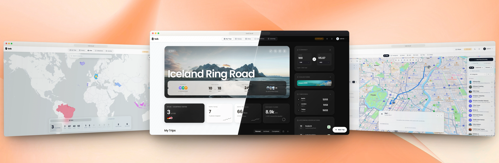
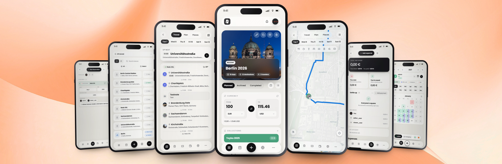
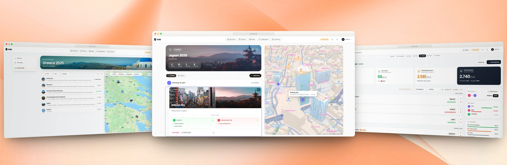

<div align="center">

<picture>
  <source media="(prefers-color-scheme: dark)" srcset="docs/logo-trek-light.svg" />
  <source media="(prefers-color-scheme: light)" srcset="docs/logo-trek-dark.svg" />
  
</picture>

<br />
<picture>
  <source media="(prefers-color-scheme: dark)" srcset="docs/subtitle-light.png" />
  <source media="(prefers-color-scheme: light)" srcset="docs/subtitle-dark.png" />
  
</picture>

A self-hosted, real-time collaborative travel planner — with maps, budgets, packing lists, a journal, and AI built in.

<br />

<a href="https://demo.liketrek.com"></a>
&nbsp;
<a href="https://hub.docker.com/r/mauriceboe/trek"></a>
&nbsp;
<a href="https://sonarcloud.io/project/overview?id=liketrek_TREK"></a>
&nbsp;

&nbsp;
<a href="https://discord.gg/NhZBDSd4qW"></a>
&nbsp;
<a href="https://kanban.pakulat.org/shared/I4wxF6inOOMB0C6hH6kQm3efyNxFjwyI"></a>
&nbsp;
<a href="https://ko-fi.com/mauriceboe"></a>
&nbsp;
<a href="https://www.buymeacoffee.com/mauriceboe"></a>
<br />
<a href="LICENSE"></a>
<a href="https://github.com/liketrek/TREK/releases"></a>
<a href="https://hub.docker.com/r/mauriceboe/trek"></a>
<a href="https://github.com/liketrek/TREK"></a>
</div>

---

<div align="center">


</div>

<br />

## What you get

<picture>
  <source media="(max-width: 700px)" srcset="docs/tiles/grid-mobile.svg" />
  <source media="(prefers-color-scheme: dark)" srcset="docs/tiles/grid-desktop-dark.svg" />
  
</picture>

<details>
<summary><b>See all features</b></summary>

<br />

Most of what follows is an addon an admin switches on or off. Lists, Costs, Documents, Collab, Vacay and Atlas ship on; Journey, Collections, MCP, AI Parsing and AirTrail ship off and are marked below.

<table>
<tr>
<td width="50%" valign="top">

#### 🧭 Planning

- **Day plans**: drag places between days and reorder inside a day, with undo. Notes and bookings drag the same way, and a map marker drops straight onto a day
- **Maps**: Leaflet, Mapbox GL or MapLibre GL (OpenFreeMap, no token), with clustering, photo markers and route lines. 3D buildings and terrain are Mapbox only
- **Place search**: Google Places when a key is set (photos, ratings, opening hours), otherwise OpenStreetMap with no key
- **Place enrichment**: descriptions, facts, hours and photo candidates from OpenStreetMap, Wikipedia, Wikidata and Wikimedia Commons
- **POI explore**: pull OpenStreetMap POIs by category for the current viewport over Overpass
- **Import**: shared Google Maps and Naver Maps lists, plus GPX, KML and KMZ files
- **Export**: GPX of a trip's places and tracks, and an ICS feed per trip or across all of them
- **Routes**: auto-sort a day (nearest neighbour then 2-opt, locked stops and hotel anchors stay put), driving, walking or cycling profiles over OSRM, then open it in Google Maps or CoMaps
- **Public transport**: door-to-door itineraries over Transitous
- **Weather**: 16-day forecast from Open-Meteo, no key. Dates outside that window read the archive for the same date instead
- **Day notes**: markdown body with an icon and a colour, reordered by drag and drop or moved to another day
- **Trip dates**: move a trip and the days re-date themselves, either dragging the bookings along or re-anchoring them. Trips also copy and archive

</td>
<td width="50%" valign="top">

#### 🧳 Bookings and money

- **Reservations**: 16 booking types with status, confirmation code, travellers and attached files
- **Flights and trains**: several legs with stopovers, per-leg times and endpoint timezones, against 4,045 bundled airports so local times resolve without a key
- **Accommodation**: a stay spans a range of days with a check-in window, and shows on every night it covers
- **Booking import**: EML, PDF, PKPass, HTML and TXT confirmations through [KItinerary](https://invent.kde.org/pim/kitinerary). Needs the `kitinerary-extractor` binary, which ships in the Docker image
- **AirTrail** (off by default): link a self-hosted AirTrail instance to import flights as reservations and keep them in sync
- **Costs**: split expenses in integer cents with equal or custom shares, several payers per expense, settle-up suggestions, a settlement log, and CSV export
- **Currencies**: a currency per expense with the rate frozen at entry. Rates come from Frankfurter, no key
- **Packing lists**: categories, admin-managed templates, assignees, three visibility tiers, and a packed-of-total line. Bags with weight roll-up are a separate admin switch, off by default
- **To-dos**: assignee, due date, priority, and a reminder before one falls due
- **Files**: attach to a trip, place, day entry or reservation. 50 MB each, 500 MB for video, with trash and restore
- **PDF export**: cover page, place photos, day notes, bookings and costs, with an optional page break per day

</td>
</tr>
<tr>
<td width="50%" valign="top">

#### 👥 Collaboration

- **Real-time sync** (WebSocket): edits land live for everyone who has that trip open
- **Members**: add by email or username, hand ownership to someone else, or add guests who have no login at all
- **Permissions**: an admin maps each of 16 trip actions to admin, trip owner, trip member or everybody
- **Invite links**: one reusable link per trip with an optional expiry. Admins can also issue signup invites with a use limit that drop the new account straight into a trip
- **Public share**: a read-only trip page anyone can open without an account
- **Collab**: group chat with replies, reactions and link previews, shared notes with attachments, polls, and a What's Next list of upcoming activities. Each of the four switches on its own

#### 📔 Journal, Atlas and Vacay

- **Journey** (off by default): dated entries with story, mood, weather and tags, photos and video from uploads or a linked [Immich](https://immich.app) or Synology Photos library, map views, co-authors, and a public share link
- **Atlas**: mark countries and sub-national regions visited on [geoBoundaries](https://www.geoboundaries.org/) outlines, plus a bucket list, travel stats and a consecutive-years-travelled count
- **Vacay**: leave calendar with half days, public holidays from date.nager.at, school holiday overlays for 16 European countries, carry-over between years, and joint or read-only sharing of a plan
- **Collections** (off by default): a place library outside any trip, with labels, ratings, a custom image per place, copy-into-a-trip, and sharing by invite

</td>
<td width="50%" valign="top">

#### 🧩 Plugins

- **Third-party plugins**: install from the TREK registry or sideload a zip, switch on per instance, with their own pages under `/plugins/<id>`
- **Sandboxed**: one child process per plugin, 63 grantable permissions, an admin-edited outbound host allowlist, memory and RPC caps, and daily caps on AI and notification calls
- **Trust**: registry downloads are pinned by sha256 and checked against the author's minisign key. A sideloaded zip is marked unverified, and `TREK_PLUGINS_ENABLED=false` turns the whole system off
- **Extension points**: map markers and layers, place details, day schedules, PDF sections, Atlas layers, journal rows, trip warnings, calendar sources, route profiles and notification channels. Plugin pages run in an opaque-origin iframe
- **SDK**: [`trek-plugin-sdk`](https://www.npmjs.com/package/trek-plugin-sdk) on npm, with a manifest validator, a mock host, and a dev-link mode that runs a local build against real data

#### 🤖 AI and MCP

- **MCP server** (off by default): OAuth 2.1 with mandatory PKCE and dynamic client registration. 199 tools, 30 resources, 4 prompts
- **Scopes**: 29 scopes in 14 groups, each one tickable on the consent screen. Tokens are bound to the `/mcp` resource, and every tool call lands in the audit log
- **Reach**: create trips and days, edit places, packing lists, to-dos, costs, reservations, collections and journeys, mark countries visited, all inside the scopes the token holds
- **Prompts**: `trip-summary`, plus `packing-list` and `budget-overview` when those addons are on
- **Addon-aware**: seven addon gates decide which tools and resources a session sees. Flipping one drops live sessions so the surface re-registers
- **Booking extraction** (off by default): read a confirmation with a local Ollama server, any OpenAI-compatible endpoint, or Anthropic, configured instance-wide or per user

</td>
</tr>
<tr>
<td width="50%" valign="top">

#### 📱 Mobile and offline

- **Installable**: iOS and Android straight from the browser, no App Store. Runs standalone without browser chrome, with the status bar tinted per theme
- **Phone layouts**: a separate shell below 768px with its own tokens, a bottom bar and safe-area insets. Which items sit in that bar is up to the user
- **Offline reads**: the app shell and every route chunk are precached, and trips, places and file blobs live in a per-user IndexedDB store, so a trip opens with no network
- **Offline writes**: mutations queue and replay with an `X-Idempotency-Key`, so a reconnect cannot double-apply. A stale edit is parked for a keep-mine or keep-theirs choice
- **Offline maps**: pre-download a trip's raster tiles, and clear them again
- **API responses are never cached** by the service worker. They vary per session, so they always come from the network

</td>
<td width="50%" valign="top">

#### ⚙️ Admin, accounts and security

- **Login methods**: password login, password registration, OIDC login, OIDC registration and passkey login each switch on and off on their own. `OIDC_ONLY` leaves SSO as the only way in
- **SSO (OIDC)**: one provider by discovery, with PKCE and `id_token` verification (Authentik, Keycloak, Google and the like)
- **2FA**: TOTP with ten single-use backup codes, and an admin can require it instance-wide
- **Passkeys**: WebAuthn login by fingerprint, face, PIN or security key, off until an admin enables it. A passkey also satisfies the 2FA requirement
- **Hardening**: per-IP limits on login, password reset and 2FA attempts, a password policy, secrets encrypted at rest and masked on read, and an SSRF guard on every URL you configure
- **Admin panel**: users and invites, the permission matrix, packing templates, categories, addons, plugins, API keys, MCP tokens and OAuth sessions, backups, storage, audit log, and GitHub releases
- **Backups**: manual or scheduled hourly, daily, weekly or monthly, with retention in days. The zip carries the at-rest key, so a restore can decrypt its own secrets
- **Storage**: pluggable storage backends per content category — keep everything on local disk, or add S3-compatible backends and replicate any category to them, configured entirely from the admin panel
- **Notifications**: a per-user matrix of events against in-app, email (SMTP), webhook and ntfy, plus any channel a plugin registers
- **Appearance**: light, dark or follow the OS, seven colour schemes plus a custom accent, transparency, compact density, reduce motion, and text size per tier
- **23 languages**: en, de, es, fr, it, nl, hu, ru, zh, zh-TW, pl, cs, ar (right to left), br, id, tr, ja, ko, uk, gr, sv, vi, ca
- **In-app help**: the wiki ships inside the image and is served from disk at `/help`, so the docs match the version you are running

</td>
</tr>
</table>

</details>

<br />

<div align="center">
  <a href="docs/screenshots/showcase-desktop-1.webp"></a>
  <a href="docs/screenshots/showcase-mobile.webp"></a>
  <a href="docs/screenshots/showcase-desktop-2.webp"></a>
</div>

<br />

## AI usage

We use LLM-assisted coding tools across parts of this codebase. Nothing ships that a
maintainer has not read and understood: every change goes through a pull request, is
reviewed and tested, and has a human who can answer for it. "The AI wrote that" is not
an answer any of us would accept from ourselves.

See [**How we use AI in TREK**](https://github.com/liketrek/TREK/discussions/1851) for
the details.

<br />

## Get started in 30 seconds

```bash
ENCRYPTION_KEY=$(openssl rand -hex 32) docker run -d -p 3000:3000 \
  -e ENCRYPTION_KEY=$ENCRYPTION_KEY \
  -v ./data:/app/data -v ./uploads:/app/uploads mauriceboe/trek
```

Open `http://localhost:3000`. On first boot TREK seeds an admin account — if you set `ADMIN_EMAIL`/`ADMIN_PASSWORD` those are used, otherwise the credentials are printed to the container log (`docker logs trek`).

<div align="center">

<a href="#docker-compose-production">Docker Compose</a>&nbsp;&nbsp;·&nbsp;&nbsp;<a href="#helm-kubernetes">Helm / Kubernetes</a>&nbsp;&nbsp;·&nbsp;&nbsp;<a href="#install-as-app-pwa">Install as PWA</a>&nbsp;&nbsp;·&nbsp;&nbsp;<a href="#reverse-proxy">Reverse Proxy</a>

</div>

<br />

## Tech stack

<div align="center">


</div>

Real-time sync via WebSocket (`ws`). Backend on NestJS 11. State with Zustand. Auth via JWT + OAuth 2.1 + OIDC + Passkeys (WebAuthn) + TOTP MFA. Weather via Open-Meteo (no key required). Maps with Leaflet and Mapbox GL.

<br />

<h2 id="docker-compose-production">Docker Compose (production)</h2>

The repository ships a ready-to-use [`docker-compose.yml`](docker-compose.yml)
with secure defaults and every option documented inline. Download it, then:

```bash
docker compose up -d
```

See [Install with Docker Compose](https://github.com/liketrek/TREK/wiki/Install-Docker-Compose)
for the full walkthrough.

<br />

<h2 id="helm-kubernetes">Helm (Kubernetes)</h2>

```bash
helm repo add trek https://chart.liketrek.com
helm repo update
helm install trek trek/trek
```

See [`charts/README.md`](https://github.com/liketrek/TREK/blob/main/charts/README.md) for values.

<br />

<h2 id="install-as-app-pwa">Install as App (PWA)</h2>

TREK works as a Progressive Web App — no App Store needed.

1. Open TREK in the browser (HTTPS required)
2. **iOS**: Share ▸ *Add to Home Screen*
3. **Android**: Menu ▸ *Install app* (or *Add to Home Screen*)

TREK then launches fullscreen with its own icon, just like a native app.

<br />

## Updating

See [Updating](https://github.com/liketrek/TREK/wiki/Updating) — Docker Compose,
Docker run, Helm, Portainer, Unraid and Proxmox, plus the encryption-key note.

<br />

<h2 id="reverse-proxy">Reverse Proxy</h2>

For production, put TREK behind a TLS-terminating reverse proxy. TREK uses WebSockets for real-time sync, so the proxy **must** support WebSocket upgrades on `/ws`.

If you use the MCP addon, the proxy must also pass the `Mcp-Session-Id` header through in both directions on `/mcp` — Nginx and Caddy do this by default, but a proxy that strips it makes every tool call open a new session instead of reusing one. See the [Reverse Proxy wiki page](https://github.com/liketrek/TREK/wiki/Reverse-Proxy) for details.

<details>
<summary>Nginx</summary>

```nginx
server {
    listen 80;
    server_name trek.yourdomain.com;
    return 301 https://$host$request_uri;
}

server {
    listen 443 ssl http2;
    server_name trek.yourdomain.com;

    ssl_certificate     /etc/ssl/fullchain.pem;
    ssl_certificate_key /etc/ssl/privkey.pem;

    # 500 MB covers backup-restore uploads (capped at 500 MB server-side).
    client_max_body_size 500m;

    location / {
        proxy_pass http://localhost:3000;
        proxy_http_version 1.1;
        proxy_set_header Host $host;
        proxy_set_header X-Real-IP $remote_addr;
        proxy_set_header X-Forwarded-For $proxy_add_x_forwarded_for;
        proxy_set_header X-Forwarded-Proto $scheme;
    }

    location /ws {
        proxy_pass http://localhost:3000;
        proxy_http_version 1.1;
        proxy_set_header Upgrade $http_upgrade;
        proxy_set_header Connection "upgrade";
        proxy_set_header Host $host;
        proxy_read_timeout 86400;
    }

    # Only needed if you use the MCP addon. Responses are Server-Sent Events,
    # so buffering must be off or tool results arrive late.
    location /mcp {
        proxy_pass http://localhost:3000;
        proxy_http_version 1.1;
        proxy_set_header Host $host;
        proxy_set_header X-Real-IP $remote_addr;
        proxy_set_header X-Forwarded-For $proxy_add_x_forwarded_for;
        proxy_set_header X-Forwarded-Proto $scheme;
        proxy_buffering off;
        proxy_read_timeout 3600s;
    }
}
```

</details>

<details>
<summary>Caddy</summary>

```caddy
trek.yourdomain.com {
    reverse_proxy localhost:3000
}
```

Caddy handles TLS and WebSockets automatically.

</details>

<br />

## Environment variables

Every variable, its default and what it does: see
[Environment Variables](https://github.com/liketrek/TREK/wiki/Environment-Variables).

## Star History

<a href="https://www.star-history.com/?repos=liketrek%2FTREK&type=date&legend=bottom-right">
 <picture>
   <source media="(prefers-color-scheme: dark)" srcset="https://api.star-history.com/chart?repos=liketrek/TREK&type=date&theme=dark&legend=bottom-right&sealed_token=tW9agibKugOyPk0yPURgSdnizM7K72zbJENGD9iyk24ZcwYHtCUn-hk9jh1gdacO0O7xJ3Io7LaNrwYD3mChzcpzZIqDC8_HevYG1qnT0XNTmN6Ez4UZrQ" />
   <source media="(prefers-color-scheme: light)" srcset="https://api.star-history.com/chart?repos=liketrek/TREK&type=date&legend=bottom-right&sealed_token=tW9agibKugOyPk0yPURgSdnizM7K72zbJENGD9iyk24ZcwYHtCUn-hk9jh1gdacO0O7xJ3Io7LaNrwYD3mChzcpzZIqDC8_HevYG1qnT0XNTmN6Ez4UZrQ" />
   
 </picture>
</a>

## Data sources

The Atlas map's country and sub-national (province/county) boundaries come from
[**geoBoundaries**](https://www.geoboundaries.org/) (Runfola et al., 2020), licensed
[CC BY 4.0](https://creativecommons.org/licenses/by/4.0/). See [NOTICE.md](NOTICE.md)
for full third-party attributions.

<br />

## License

TREK is [AGPL v3](LICENSE). Self-host freely for personal or internal company use. If you modify and offer TREK as a network service to third parties, your modifications must be open-sourced under the same licence.
