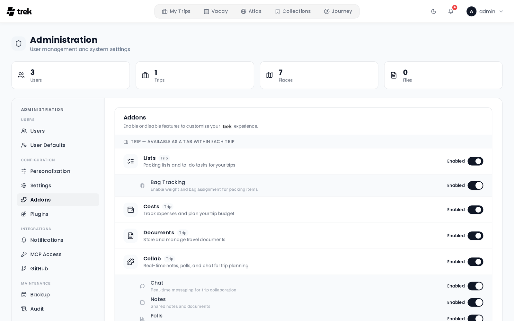

# Admin — Addons

The **Addons** tab lets you enable or disable optional features for the entire TREK instance. Toggling an addon affects all users immediately — disabling one hides its UI elements and blocks its API routes instance-wide.

## What addons control

Each addon toggle controls a feature set. When you disable an addon, users lose access to that feature everywhere in the app. No data is deleted; re-enabling the addon restores access to existing data.

## Addon categories

Addons are grouped into three categories, shown as labeled sections.

### Trip addons

Trip addons add per-trip feature panels. They appear in every trip where the addon is enabled.

The default trip addons are: **Lists**, **Costs**, **Documents**, **Collab**, and **Naver List Import** (all enabled by default). The exact list is determined by what is registered in your TREK database.

**Sub-toggles on trip addons:**

- **Lists** — when enabled, a nested **Bag Tracking** toggle appears. Bag Tracking lets users assign packed items to specific bags.
- **Collab** — when enabled, four sub-toggles appear for individual collaboration features:
  - **Chat** — in-trip real-time chat
  - **Notes** — shared trip notes
  - **Polls** — trip polls
  - **What's Next** — the "what's next" widget

Each sub-toggle can be disabled independently while the parent addon remains enabled.

### Global addons

Global addons add features that are not tied to a single trip. The default global addons are **Vacay**, **Atlas**, **Collections**, and **Journey**.

- **Vacay** — personal vacation day planner with calendar view. Enabled by default.
- **Atlas** — world map of visited countries with travel stats. Enabled by default.
- **Collections** — personal place library: save places across trips into named lists, copy them into any trip, and share them. **Disabled by default.** See [Collections](Collections).
- **Journey** — trip tracking and travel journal (check-ins, photos, daily stories). **Disabled by default.**

**Sub-items on global addons:**

- The **Journey** addon shows photo provider toggles underneath it. Each photo provider (e.g., Immich, Synology Photos) can be enabled or disabled independently.

### Integration addons

Integration addons connect TREK to external services. Most of them need additional configuration (API keys, URLs) once enabled, but not in the admin **Settings** tab — each one has its own place.

- The **MCP** addon requires `APP_URL` to be set in your environment. When enabled, the **MCP Access** tab appears in the Admin Panel. **Disabled by default.** See [MCP-Overview](MCP-Overview) for full details.
- The **AirTrail** addon syncs flights from a self-hosted AirTrail instance. **Disabled by default.** The toggle here is the instance-wide switch only; each user connects their own instance (URL + API key) in **Settings → Integrations**.
- The **AI Parsing** addon is the LLM fallback for booking imports KItinerary cannot read. **Disabled by default.** When enabled, its provider, base URL, API key, and model fields appear inline underneath the addon row. Filling them in sets the instance-wide config for all users; leaving them blank lets each user configure their own provider in **Settings → Integrations**. See [AI-Booking-Import](AI-Booking-Import).

## Enabling or disabling an addon

Click the toggle switch on any addon row. The change is applied immediately — no save button is needed. A brief success toast confirms the update.

If a toggle fails (e.g., network error), it rolls back to its previous state.

## Additional configuration

Some addons require credentials or environment variables before they are functional:

- **Journey** — works without any external integration. To embed photos from Immich or Synology Photos, enable the corresponding photo-provider toggle listed under Journey, then configure credentials per-user in **Settings → Integrations**. See [Photo-Providers](Photo-Providers).
- **MCP** — requires `APP_URL` to be set so OAuth redirect URIs resolve correctly.

## Related pages

- [Admin-Panel-Overview](Admin-Panel-Overview)
- [Admin-MCP-Tokens](Admin-MCP-Tokens)
- [MCP-Overview](MCP-Overview)
- [Addons-Overview](Addons-Overview)
