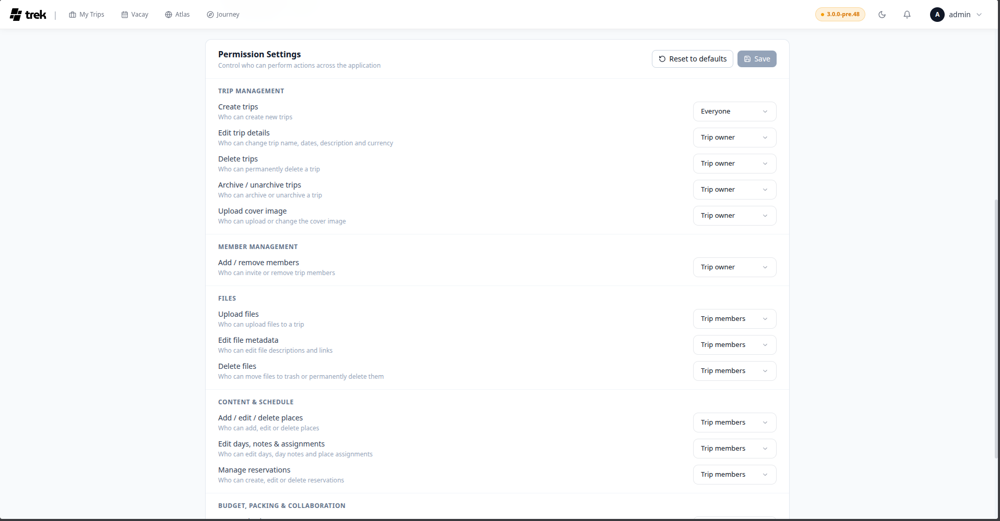

# Admin — Permissions

The Permissions panel, located at the bottom of the **Users** tab, controls which role level is required to perform each action. Changes apply immediately across the entire instance.

## Role model

TREK uses four permission levels, ordered from most to least privileged:

| Level | Who it includes |
|-------|----------------|
| `admin` | Instance administrators only |
| `trip_owner` | The user who created the trip |
| `trip_member` | Any user who is a member of the trip |
| `everybody` | Any authenticated user (for `trip_create`: no trip context required; for all other actions: any authenticated user with trip access) |

Each action is assigned a minimum required level. A user whose role is at or above that level can perform the action. Not every level is available for every action — each action exposes only the levels that make sense for it. For example, `trip_create` only allows `everybody` or `admin`, while `trip_edit` only allows `trip_owner` or `trip_member`.

## Action categories

Actions are grouped into five categories:

### Trip

| Action key | What it controls |
|------------|-----------------|
| `trip_create` | Create a new trip |
| `trip_edit` | Edit trip name, dates, description, and currency |
| `trip_delete` | Permanently delete a trip |
| `trip_archive` | Archive or unarchive a trip |
| `trip_cover_upload` | Upload or change the cover image for a trip |

### Members

| Action key | What it controls |
|------------|-----------------|
| `member_manage` | Invite or remove trip members |

### Files

| Action key | What it controls |
|------------|-----------------|
| `file_upload` | Upload files to a trip |
| `file_edit` | Edit file descriptions and links |
| `file_delete` | Move files to trash or permanently delete them |

### Content & Schedule

| Action key | What it controls |
|------------|-----------------|
| `place_edit` | Add, edit, or delete places |
| `day_edit` | Edit days, day notes, and place assignments |
| `reservation_edit` | Create, edit, or delete reservations |

### Budget, Packing & Collaboration

| Action key | What it controls |
|------------|-----------------|
| `budget_edit` | Create, edit, or delete budget items |
| `packing_edit` | Manage packing items and bags |
| `collab_edit` | Create notes, polls, and send messages |
| `share_manage` | Read, create or delete public share links and calendar feed links |

## Changing permissions

Each action row has a dropdown. Select the minimum role level required. A **customized** badge appears next to any action that has been changed from its default.

Click **Save** (top-right of the panel) to persist your changes. Use the **Reset to defaults** button (circular arrow icon) to revert all actions to their shipped defaults without saving — you still need to click **Save** after resetting if you want to persist the reset state.

## Related pages

- [Admin-Panel-Overview](Admin-Panel-Overview)
- [Admin-Users-and-Invites](Admin-Users-and-Invites)
