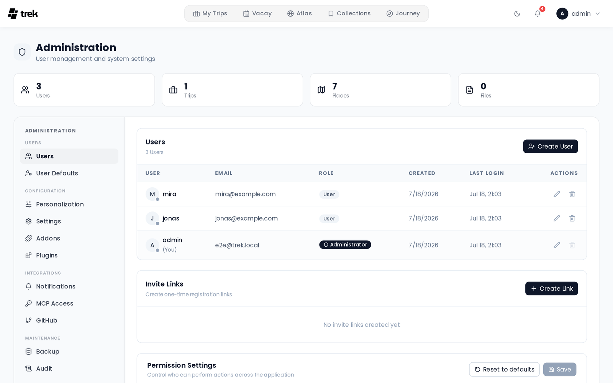
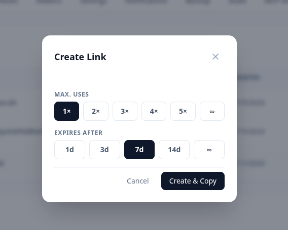

# Admin — Users and Invites

The **Users** tab in the Admin Panel lets you view all registered users, manage their accounts, and create invite links so new people can register without open registration.



## User list

The user table shows every registered account with the following columns:

| Column | Description |
|--------|-------------|
| **User** | Avatar, username, and an always-visible presence dot (green = online, grey = offline) |
| **Email** | Account email address |
| **Role** | Badge showing **Administrator** or **User** |
| **Created** | Account creation date |
| **Last Login** | Date and time of most recent login |
| **Actions** | Edit and delete buttons |

Your own account row is highlighted. You cannot delete your own account.

## User actions

### Edit a user

Click the pencil icon on any row to open the edit form. You can change:

- **Username**
- **Email address**
- **Role** — a dropdown with **User** and **Administrator**
- **Password** — set a new password. It must be at least 8 characters and contain an uppercase letter, a lowercase letter, a number and a special character; commonly used passwords and strings made of a single repeated character are rejected. The same rules apply to the password you set under [Creating a user directly](#creating-a-user-directly). See [Login and Registration](Login-and-Registration#password-requirements).

Click **Save** to apply changes.

Below the fields sits **Reset passkeys**, which removes every passkey that user has registered — the recovery path when someone loses their authenticator. It asks for confirmation, reports how many passkeys it removed, and takes effect immediately rather than on **Save**. The user can still sign in with their password. See [Passkeys](Passkeys).

### Delete a user

Click the trash icon and confirm. Deletion is permanent. The user's account is removed from the database along with their data (cascade behavior is enforced at the database level).

You cannot delete your own account while logged in as that user.

## Creating a user directly

Click **Create User** (top-right of the Users tab) to create an account without an invite link. You set the username, email, password, and role at creation time.

## Invite links

Invite links let a specific number of people register themselves. This is useful when open registration is disabled.



### Creating an invite

Click **Create Link** (invite links section, below the user table). Configure:

- **Max uses** — how many times the link can be used before it expires: `1×`, `2×`, `3×`, `4×`, `5×`, or `∞` (unlimited). Defaults to `1×`.
- **Expiry** — how long the link remains valid: `1d`, `3d`, `7d`, `14d`, or `∞` (no expiry). Defaults to `7d`.
- **Add to trip** (optional) — bind the invite to a trip. Anyone who registers through the link is automatically added to that trip as a member. Defaults to **No trip** (a plain registration invite). The selector only appears when at least one trip exists.

After creation the link is copied to your clipboard automatically. Share it with the intended recipient. The URL format is:

```
<APP_URL>/register?invite=<token>
```

### Invite list

Existing invites are listed below the creation button. Each row shows:

- The invite token (truncated, monospace)
- A status badge — `active`, `used up`, or `expired`
- **Usage** — `used / max` (or `used / ∞` for unlimited)
- **Expiry** date, if set
- **Adds to** — the bound trip, if the invite is trip-bound
- **Created by** — the admin who generated the link
- A **copy link** button (only shown for active invites)
- A **delete** (revoke) button

Revoking an invite immediately invalidates it; anyone following the link after revocation will receive an error.

## Permissions

The **Users** tab also hosts the Permissions panel at the bottom, which controls what roles can perform which actions. See [Admin-Permissions](Admin-Permissions) for details.

## Related pages

- [Login-and-Registration](Login-and-Registration)
- [Invite-Links](Invite-Links)
- [Admin-Permissions](Admin-Permissions)
- [Two-Factor-Authentication](Two-Factor-Authentication)
- [Passkeys](Passkeys)
- [Admin-Panel-Overview](Admin-Panel-Overview)
