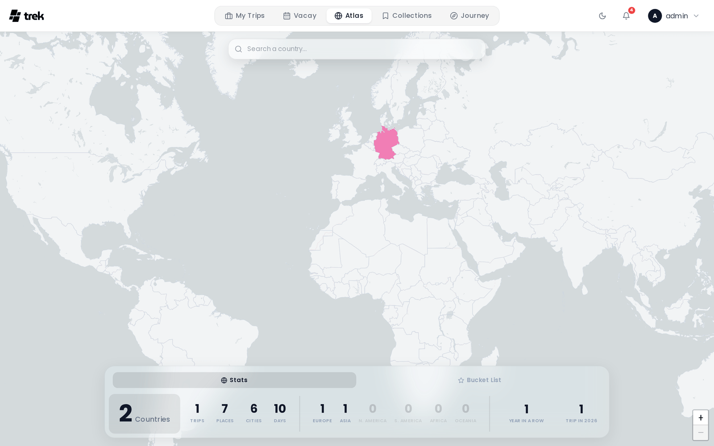

# Atlas

Atlas is an interactive world map that shows countries and regions you have visited across all your trips, together with a bucket list of places you want to go.

> **Admin:** enable Atlas in [Admin-Addons](Admin-Addons).

## What Atlas is

Atlas gives you a visual overview of your travel footprint. Visited countries are highlighted on the map. You can also mark individual sub-national regions and maintain a personal bucket list of future destinations.

## Accessing Atlas

When the admin has enabled the Atlas addon, an **Atlas** entry appears in the main navigation. Your visited countries are populated automatically from your existing trips.

## Visited and planned countries

A country only counts as visited once the trip that takes you there has started. A trip currently under way counts too — you are there. Countries from trips that begin in the future are **planned**, and trips saved without any dates are treated as ideas that stay out of your statistics entirely.

Planned countries are hidden from the map by default. Use the **Show planned countries** switch above the map to bring them in; they appear with a dashed outline so they never look like somewhere you have already been. The switch only appears when you actually have upcoming trips, and it remembers your choice.

Countries you mark by hand always count as visited, whatever the dates of any trip going there.

Countries on your bucket list that you have not been to yet are drawn with a diagonal hatch, in the colour that country would carry once you get there. That keeps a wishlist entry easy to tell apart from a visited country and from the plain grey of everywhere else. Every country keeps its colour permanently: marking one more country as visited never reshuffles the rest of the map.

## Marking countries as visited

Click any country on the map to open an action popup where you can mark it as visited or add it to your bucket list. Use the search bar at the top of the map to find and fly to a country — pressing Enter or selecting a result from the dropdown opens the same action popup.

The search box also finds **places**, not just countries. Type a city, a landmark or an address and the matches appear under a **Places** heading below the country hits. Picking one flies there and works out which sub-national region the coordinate falls in, so you can mark Lombardy as visited by searching for Milan, without knowing that Milan is in Lombardy. Countries with no region data in the map bundle fall back to the country itself.

To remove a manually-marked country (one with no trips or places recorded in it), click it on the map and confirm removal in the popup.

If the country is already on your bucket list, the same popup offers **Remove from wishlist**, which takes every entry for that country off the list without the detour through the Bucket List tab.

Visits detected automatically from your trips are shown in addition to any countries you mark manually.

### Sub-national regions

At zoom level 5 and above, the map switches to a sub-national region view (states, provinces, etc.). You can mark individual regions as visited or add them to your bucket list. Marking a region also counts the parent country as visited if it was not already.

## Bucket list

The bucket list is separate from "visited". Use it to track countries or places you want to visit in the future. Each bucket list item can have a name, coordinates, country code, optional notes, and a target date.

## Statistics

Your Atlas statistics panel shows:

- **Countries visited** — total number of distinct countries you have actually been to. Countries from upcoming trips are counted separately and shown next to this number.
- **Trips** — total number of trips across all time.
- **Places** — total number of individual places logged in trips.
- **Cities** — total number of distinct cities visited, derived from the addresses of your places. TREK drops the last comma-separated part (the country), then walks back through the remaining parts and takes the first one that is still non-empty once digits, hyphens and postal marks are stripped, lower-cased so spelling variants collapse into a single entry. This is a heuristic over a formatted address string rather than a lookup, so the figure is approximate: a short address such as `Osteria Francescana, Italy` leaves nothing but the place's own name, and an address whose administrative tail ends on a state or prefecture (`…, Shibuya, Tokyo, 150-0002, Japan`) counts that region rather than the city.
- **Travel days** — total days spent travelling.
- **Continent breakdown** — number of countries visited per continent (Europe, Asia, North America, South America, Africa, Oceania). Antarctica joins the row once you have been.
- **Travel streak** — number of consecutive years in which you have taken at least one trip.
- **Trips this year** — number of trips in the current calendar year.

## Visual effect

The desktop glass panel at the bottom of the map uses a liquid-glass visual effect — a dynamic inner glow and border highlight that follows your cursor across the panel.

## Plugin country layers

Installed plugins can tint countries on the Atlas map with their own layers — for example wishlists or travel advisories. A plugin implements the `atlasLayerProvider` hook and returns one or more layers, each a set of ISO country codes with a tone; TREK validates the codes and tints them itself. Layers are per-user and additive: a plugin never touches the map canvas, and one that errors or is slow contributes nothing.

> **Plugins:** requires the `hook:atlas-layer-provider` permission. See [Plugin-Development](Plugin-Development) for the hook contract.

## See also

- [Addons-Overview](Addons-Overview)
- [Admin-Addons](Admin-Addons)
