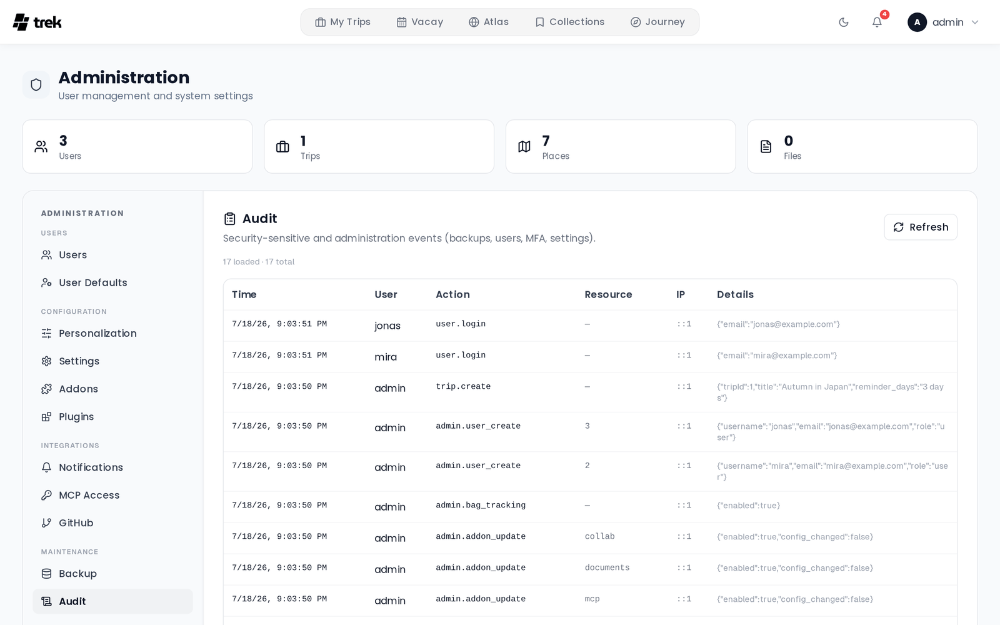

# Audit Log

The audit log records significant actions taken on your TREK instance. Use it to monitor logins, admin changes, and integration configuration.

## Where to find it

**Admin Panel → Audit** tab.

## What the log captures

Actions are grouped by area below. The **Action key** is the raw value stored in the log.

### Authentication

| Action key | Description |
|---|---|
| `user.register` | User registered |
| `user.login` | User logged in |
| `user.login_failed` | Login attempt failed |
| `user.password_change` | User changed their password |
| `user.account_delete` | User deleted their account |
| `user.password_reset_request` | Password reset requested |
| `user.password_reset_success` | Password reset completed |
| `user.password_reset_fail` | Password reset attempt rejected (`reason` in details) |

A request for an account that can actually be reset writes **two** rows: one with `delivered: "pending"` when the mail is handed off, one with the delivery result. Every other outcome writes a single row carrying a `reason` instead — `no_user`, `oidc_only`, `throttled_per_email` or `password_login_disabled`. Passkey logins are not a separate key: they land as `user.login` with `method: passkey` in the details.

### MFA

| Action key | Description |
|---|---|
| `user.mfa_enable` | MFA enabled on an account |
| `user.mfa_disable` | MFA disabled on an account |

### Passkeys

| Action key | Description |
|---|---|
| `user.passkey_register` | Passkey enrolled |
| `user.passkey_delete` | Passkey removed (resource = the passkey's numeric ID) |
| `user.passkey_clone_suspected` | A passkey presented a signature counter that did not advance — a possible cloned authenticator. That assertion is rejected, the credential stays enabled |

### Trips

| Action key | Description |
|---|---|
| `trip.create` | Trip created (includes title) |
| `trip.update` | Trip updated (includes changed fields) |
| `trip.copy` | Trip duplicated (includes source and new trip IDs) |
| `trip.delete` | Trip deleted (includes trip ID and title) |
| `trip.transfer_ownership` | Trip ownership transferred (includes the trip title and both owner emails) |
| `trip.invite_link_create` | Trip invite link created or rotated (a trip has one link, so creating it again replaces the previous token) |
| `trip.invite_link_delete` | Trip invite link revoked |
| `trip.invite_link_join` | An invite link was accepted (`joined` in details). The row is written even when nobody was added — the trip owner or an existing member opening the link logs `joined: false` |

### Admin actions

| Action key | Description |
|---|---|
| `admin.user_create` | User created by admin |
| `admin.user_update` | User edited by admin (role, email, username, etc.) |
| `admin.user_delete` | User deleted by admin |
| `admin.user_mfa_reset` | A user's MFA reset by admin |
| `admin.user_passkeys_reset` | All of a user's passkeys removed by admin |
| `admin.invite_create` | Invite link created |
| `admin.invite_delete` | Invite link deleted |
| `admin.permissions_update` | Instance permissions updated |
| `admin.oidc_update` | OIDC/SSO settings updated |
| `admin.addon_update` | Addon enabled, disabled, or configured |
| `admin.oauth_session_revoke` | OAuth session revoked by admin |
| `admin.mcp_token_delete` | MCP token revoked by admin |
| `admin.rotate_jwt_secret` | JWT secret rotated |
| `admin.bag_tracking` | Bag tracking feature toggled |
| `admin.places_photos` | Places photos feature toggled |
| `admin.places_autocomplete` | Places autocomplete feature toggled |
| `admin.places_details` | Places details feature toggled |
| `admin.places_enrich` | Place enrichment feature toggled |
| `admin.collab_features` | Collaboration features updated |
| `admin.packing_template_create` | Packing template created |
| `admin.packing_template_delete` | Packing template deleted |
| `admin.plugin_retrust` | Plugin signing key re-trusted (records the old and the new key fingerprint) |
| `admin.storage_update` | Storage configuration saved (secrets redacted in the details) |
| `admin.storage_test` | Storage backend probed (the probe writes and deletes one test object) |
| `admin.storage_backfill` | Replica catch-up started |
| `admin.storage_backfill_cancel` | Replica catch-up cancelled |
| `admin.storage_migration` | Category migration started |
| `admin.storage_migration_cancel` | Category migration cancelled |
| `admin.storage_stats_refresh` | Storage usage stats recomputed |
| `admin.default_user_settings_update` | Default user settings updated |
| `admin.demo_baseline_save` | Demo baseline snapshot saved |

### Settings

| Action key | Description |
|---|---|
| `settings.app_update` | App settings updated (SMTP, webhooks, MFA policy, etc.) |
| `settings.api_keys_update` | Maps / OpenWeather / Unsplash API keys changed. Written for any user saving their own keys; an admin's save also updates the instance-wide ones. Records the changed key **names** only, never the values |

### Backups

| Action key | Description |
|---|---|
| `backup.create` | Manual backup created |
| `backup.restore` | Restore from stored backup |
| `backup.upload_restore` | Restore from uploaded ZIP |
| `backup.delete` | Backup deleted |
| `backup.auto_settings` | Auto-backup schedule saved |

### MCP

| Action key | Description |
|---|---|
| `mcp.tool_call` | MCP tool invoked (resource = tool name) |

### OAuth

| Action key | Description |
|---|---|
| `oauth.client.create` | OAuth client application created |
| `oauth.client.rotate_secret` | OAuth client secret rotated |
| `oauth.client.delete` | OAuth client application deleted |
| `oauth.consent.grant` | User granted OAuth consent |
| `oauth.token.issue` | OAuth access token issued |
| `oauth.token.refresh` | OAuth access token refreshed |
| `oauth.token.revoke` | OAuth token revoked |
| `oauth.token.grant_failed` | OAuth token grant attempt failed |
| `oauth.token.client_auth_failed` | OAuth client authentication failed |
| `oauth.token.replay_detected` | An already-revoked refresh token was replayed. The whole token chain and the user's OAuth sessions for that client are revoked. Two clients racing on the same token do **not** land here: that is logged as `oauth.token.refresh` with `concurrent: true` |

### Integrations

| Action key | Description |
|---|---|
| `immich.private_ip_configured` | Immich URL saved that resolves to a private IP |
| `airtrail.private_ip_configured` | AirTrail URL saved that resolves to a private IP |

## Log columns

| Column | Description |
|---|---|
| Time | Timestamp of the action |
| User | Username of the acting user, falling back to their email, then `#<user id>`. Unauthenticated events show `—` (the plain-text log file writes `anonymous` for those instead) |
| Action | Action key (see tables above) |
| Resource | Affected resource (filename, trip ID, tool name, etc.) where applicable |
| IP | Client IP address |
| Details | Additional context in JSON format |

## Pagination

The panel loads 100 entries at a time by default. Click **Load more** at the bottom to fetch the next page. The total count is shown above the table.

## IP addresses

The client IP is the one Express resolves after applying `TRUST_PROXY`, not whatever the `X-Forwarded-For` header happens to say. That distinction matters: the header is written by the caller, and an audit row an attacker can address to someone else's IP is worse than no row at all.

`TRUST_PROXY` is **the number of proxy hops in front of TREK**, and it has to be accurate. With `TRUST_PROXY=1` (the default) TREK trusts exactly one hop, so a request that passed through two proxies is recorded as coming from the *outer* one — the Cloudflare edge in the example below, not nginx and not the real client. If your setup is Cloudflare in front of nginx in front of TREK, set `TRUST_PROXY=2`. Set it to `0` to trust nothing and always record the socket address.

See [Environment-Variables](Environment-Variables).

## Log file

In addition to the database, audit events are written to a plain-text log file:

- **Path:** `./data/logs/trek.log`
- **Rotation:** rotated when the file reaches 10 MB
- **Retention:** the 4 most recent rotated files are kept (`trek.log.1` through `trek.log.4`)

## Database retention

Audit entries in the database are never automatically deleted. They accumulate and are paginated in the UI.

## Plugin capability audit

Separate from the instance audit log above, TREK keeps a dedicated **hash-chained capability audit** for installed plugins. Every host-mediated action a plugin takes — core-data reads, WebSocket broadcasts, notifications, AI calls, cross-plugin calls — is recorded at the point the plugin cannot reach, together with the acting user (bound by the host, never supplied by the plugin), the resource touched, and the outcome.

Each plugin's entries form a per-plugin hash chain (`hash = sha256(previous_hash + row)`), so the log is tamper-evident: any altered or removed entry breaks the chain. Older rows are pruned per plugin once the row cap is reached (default 20,000 rows/plugin, tunable via `TREK_PLUGIN_AUDIT_MAX_ROWS`; `0` disables pruning). Pruning keeps the retained window verifiable.

Two views read this log:

| View | Who | Where | Shows |
|---|---|---|---|
| Per-plugin audit | Admins | Admin plugin management (`GET /api/admin/plugins/:id/audit`) | Every action **one plugin** took, across all users |
| My plugin activity | Any user | Settings → Plugins (`GET /api/plugin-activity`) | Every action **any plugin** took **in that user's name** |

The user-facing view is what makes broad read grants accountable to the person whose data a plugin reads, without needing admin access.

## See also

- [Admin-Panel-Overview](Admin-Panel-Overview)
- [Security-Hardening](Security-Hardening)
- [Environment-Variables](Environment-Variables)
