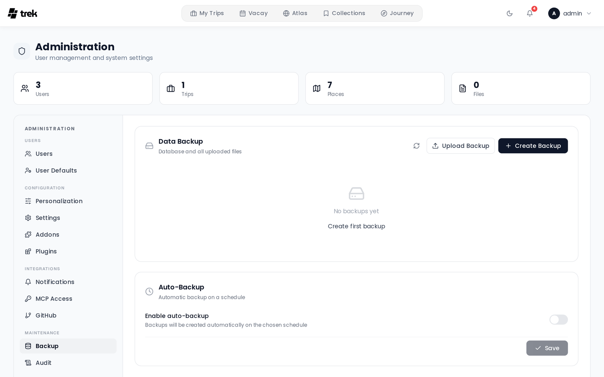

# Backups

TREK stores all data in a single SQLite database (`travel.db`) plus an `uploads/` directory of attachments, cover photos, and avatars — by default; storage backends and replication are configured in [[Admin: Storage|Admin-Storage]]. The Backup panel lets you create, download, restore, and schedule backups of both.

## Where to find it

**Admin Panel → Backup** tab.

## What a backup contains

A backup is a ZIP archive with these entries:

| Entry | Contents |
|---|---|
| `travel.db` | The full SQLite database |
| `uploads/` | All uploaded attachments, covers, and avatars (default location — see [Admin: Storage](Admin-Storage)) |
| `plugins-data/` | Each installed plugin's own database + files (present only if plugins are installed) |
| `plugins-code/` | The installed plugin code, so a restore is self-contained (dev-linked plugins are skipped) |

**Also included:** the at-rest encryption key, unless you supply it through the `ENCRYPTION_KEY` environment variable — in that case the file is not the source of truth and is left out. Bundling it is what makes a backup restorable onto a different install, and it makes the ZIP as sensitive as the key itself: store and transfer it accordingly. See [Encryption-Key-Rotation](Encryption-Key-Rotation).

## Manual backup

Click **Create Backup** in the Backup tab. The server creates the ZIP and makes it available for download. Up to 3 manual backups can be created per hour per IP address (rate-limit window: 1 hour).

You can also download or delete any existing backup from the list.

## Restoring a backup

You can restore from:

- **A stored backup** — click **Restore** next to any backup in the list.
- **An uploaded ZIP** — click **Upload Backup** and select a backup file from your computer (maximum upload size: 500 MB by default, configurable with the `BACKUP_UPLOAD_LIMIT_MB` environment variable — see [Environment-Variables](Environment-Variables)).

A second limit caps the **decompressed** size of a restore archive at 5 GB by default (`BACKUP_MAX_DECOMPRESSED_MB`). It applies to both routes — a stored backup as well as an uploaded ZIP — and a restore that exceeds it is refused with `Backup exceeds the maximum decompressed size.` Raise it if your own backups legitimately grow past the default, otherwise they become unrestorable.

Before restoring, TREK runs integrity checks on the uploaded database:

1. **SQLite `PRAGMA integrity_check`** — verifies the database file is not corrupt.
2. **Required tables present** — confirms the file contains `users`, `trips`, `trip_members`, `places`, and `days`. Files missing any of these are rejected as not being a valid TREK backup.

> **Warning:** Restoring replaces all current data. Back up your current state first if you want to keep it.

> **Plugins & restart:** `travel.db` and `uploads/` are swapped in immediately. Plugin data and code are **staged** beside the live trees and applied right away: the running plugins hold their databases open, so the restore asks the plugin runtime to shut them down and swaps the trees in the moment the handles are closed. If the runtime isn't up (plugins switched off, or a restore that happens during startup), the staged trees are applied at the next boot instead. Restart the server after restoring an instance that uses plugins — the plugins are stopped for the swap and stay down until the process restarts, and the bundled encryption key is only read at startup.

## Auto-backup

Enable scheduled backups in the **Auto-Backup** section of the Backup tab.

**Interval** options:

- Hourly
- Daily
- Weekly
- Monthly

**Retention** (`Delete old backups after`) — pick one of the preset windows: 1 day, 3 days, 7 days, 14 days, 30 days, or **Keep forever**. Auto-backups older than the chosen window are pruned after each auto-backup run; **Keep forever** (stored as `keep_days = 0`) keeps all backups indefinitely.

**Schedule** options (depend on interval):

- **Hour** — time of day for daily, weekly, and monthly backups (0–23).
- **Day of week** — Sunday through Saturday (for weekly backups).
- **Day of month** — 1–28 (for monthly backups). Day 29–31 is excluded to avoid months with fewer days.

Auto-backup files are named `auto-backup-<timestamp>.zip` (manual backups use `backup-<timestamp>.zip`).

After each auto-backup run, **auto-backup files** older than `keep_days` are pruned. Manual backups are never pruned — delete those yourself when you no longer need them. Set `keep_days` to `0` to disable pruning entirely.

## Before updating TREK

Always create a manual backup before updating. See [Updating](Updating).

## Audit log

The following actions are recorded in the [Audit-Log](Audit-Log):

| Action key | When |
|---|---|
| `backup.create` | Manual backup created |
| `backup.restore` | Restore from stored backup |
| `backup.upload_restore` | Restore from uploaded ZIP |
| `backup.delete` | Backup deleted |
| `backup.auto_settings` | Auto-backup settings saved |

## See also

- [Admin: Storage](Admin-Storage) — replicate backups to S3-compatible storage
- [Encryption-Key-Rotation](Encryption-Key-Rotation)
- [Admin-Panel-Overview](Admin-Panel-Overview)
- [Security-Hardening](Security-Hardening)
- [Updating](Updating)
