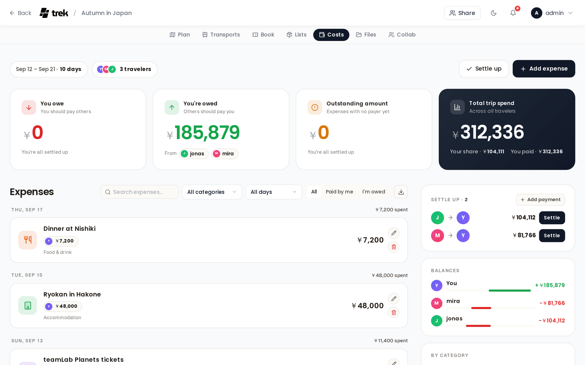
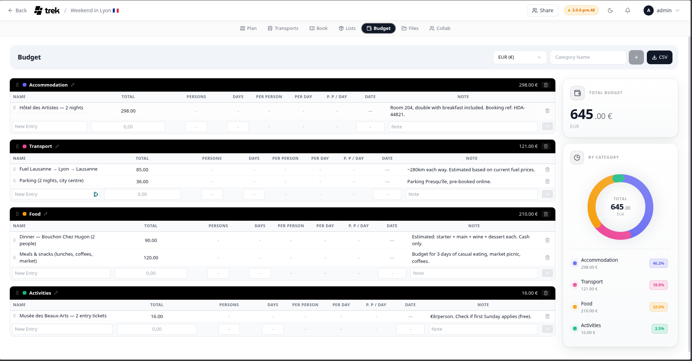
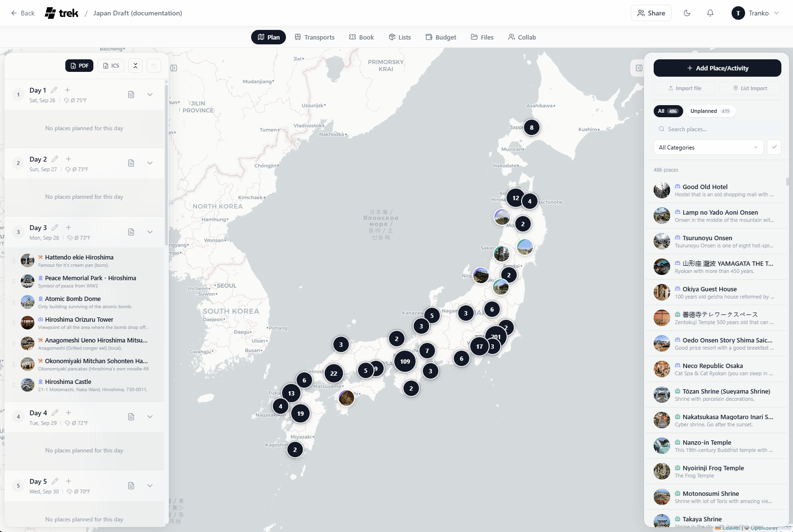
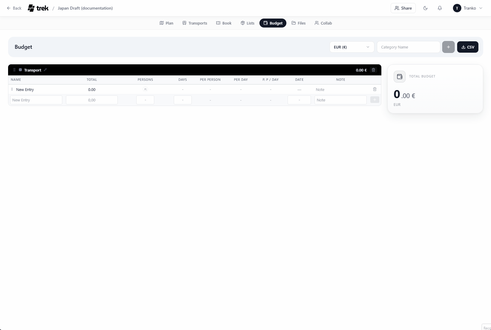
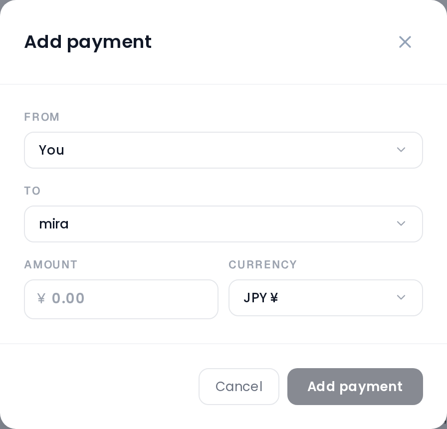
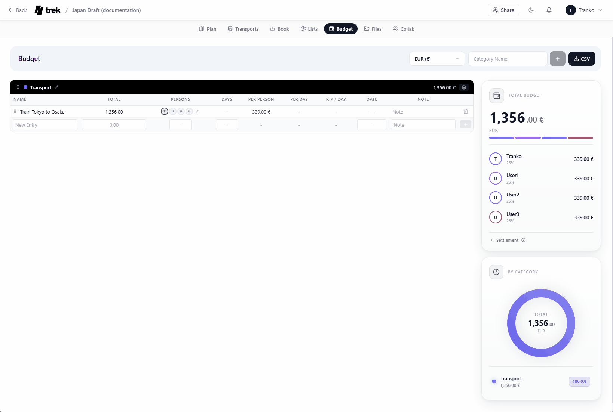

# Costs (Budget Tracking)

Track trip expenses by category, split costs between members, and visualize spending.

> **Renamed to Costs (v3.3.0, #1464):** This feature is now called **Costs** everywhere in the UI — the planner tab reads **Costs** and it is listed as **Costs** in Admin → Addons. Its internal addon id stays `budget`, which is why the permission is `budget_edit` and the MCP scopes are `budget:read` / `budget:write`.

## Where to find it

Open the **Costs** tab inside the trip planner. The tab is only visible when the Costs addon is enabled.

> **Admin:** Costs is an addon. Enable it in [Admin-Addons](Admin-Addons).

## Currency

Costs is **multi-currency** (#551). Three settings are involved, and they do different jobs:

- The **trip currency** (Trip → Edit trip) is the trip's accounting base. Every balance and settle-up is calculated in it.
- Each **expense** carries **its own currency** — pick it in the expense modal and enter what the receipt says (a $100 dinner on a rouble trip is `100 USD`). It is converted into the trip currency at a rate **frozen when you save it**, so a settled debt doesn't reopen when the market moves.
- Your **display currency** (Settings → General) converts what you *read* — totals, chart, balances — into one currency. It changes nothing that is stored. Left on **Trip currency** (the default), each trip is shown in its own currency.

165 currencies are supported, with rates from [Frankfurter](https://frankfurter.dev) (no API key needed). When an item's currency differs from the display currency, the modal shows the original next to the converted amount (`$100.00 ≈ 7 668,71 ₽ · live rate`), and the ledger row shows both (`$100.00 → 7 668,71 ₽`).

> **Read [Currencies](Currencies) for the full picture** — how the three interact, what happens when you change a trip's currency, and which currency a public share link is shown in.

## Categories

Every expense sits in one of **14 fixed categories**. You cannot add, rename, reorder or delete them — you pick one from a row of pills in the expense modal. Each category carries its own icon and colour, which is what the coloured tab on an expense row and the swatches in the sidebar breakdown are showing:

**Accommodation**, **Food & drink**, **Groceries**, **Transport**, **Flights**, **Activities**, **Sightseeing**, **Shopping**, **Fees & tickets**, **Health**, **Tips**, **Fuel**, **Parking**, **Other**.

Expenses written before the Costs rework carried free-text categories. Those are matched onto the fixed keys where the stored label is recognisable (a booking saved as `Flight` reads as **Flights**, `gas` as **Fuel**) and fall back to **Other** otherwise. Nothing is rewritten in the database, only how the row is displayed.

## Expense items

Expenses are listed as a ledger grouped by **day**, newest day first, with the day's total on the right of each group header. Recorded settle-up payments sit in the same list, so the ledger reads as everything that happened on the trip's money in order. A row shows the category as a coloured tab, the name, the payer chips with what each of them put in, the note, and the total in your display currency — plus a green **you lent** / red **you borrowed** chip under the amount when the split leaves you up or down on it. An expense entered in another currency shows the original and the converted amount under the name.

Above the list are a search box, a category filter, a day filter, an **All / Paid by me / I'm owed** switch and the CSV export button.

Click **Add expense**, or the pencil beside a row, to open the expense editor:

| Field | Notes |
|---|---|
| What was it for? | The expense name. Required — the dialog will not save without it. |
| Total amount | What the receipt says. In Ticket mode it is summed from the items instead and cannot be typed. |
| Currency | The expense's own currency. |
| Day | Optional expense date. Undated expenses group under **No date**. |
| Category | One of the 14 fixed categories. |
| Who paid? | Who actually put the money down — see [Who paid](#who-paid). |
| Split | How the total is shared out — see [Splitting costs](#splitting-costs). |
| Note | Free-text note, shown on the row. |

### Expenses linked to a booking or a place

An expense can hang off a **booking** (reservation or transport) or off a **place** — both offer a **Create expense** button in their form, which saves the record first and then opens the expense editor for it. A linked expense is an ordinary expense: it takes a payer, a split, a date and a currency like any other, and it shows up in the settlement.

Deleting the booking or the place deletes its linked expense with it. Removing the expense from the record's Costs block deletes only the expense and leaves the record standing.

## Who paid

**Who paid?** in the expense editor records who actually put the money down. It is the other half of the settlement maths — the split says who owes for the expense, this says who is out of pocket for it:

- **One person paid** — pick a member from the dropdown. This is the default.
- **Multiple people paid** — switch with the link beside the label, include each payer and type what each of them put in. The amounts have to add up to the total; until they do, the dialog reads *Payer amounts must add up to …* and refuses to save.
- **No one paid yet** — the first entry in the single-payer dropdown, for an expense you are only planning. The amount still counts toward **Total trip spend**, and everyone on its split is still charged their share in **Balances** — what is missing is the credit side, so nobody is recorded as having covered it.

An expense with no payer is flagged **Unfinished** on its row and counted into the **Outstanding amount** card, which is where to look when the balances show money owed that nobody is down as having paid.

## Splitting costs

**Split** decides who owes for the expense. Every trip member is listed and can be included or excluded, and there are three modes:

- **Equally** — Splits the cost equally among selected members. Remainder cents (from rounding errors) are distributed deterministically and rotated using the item ID to ensure everyone is charged equally over the course of the trip.
- **Custom** — Enter specific custom amounts for each traveler. The sum of the custom splits must balance exactly to the total price.
- **Ticket** — Build an itemized list of expenses (e.g. Apples: $10, cake: $50, Milk: $40) and assign specific trip participants to split each individual item. Individual shares are calculated cent-perfectly, the total expense price is automatically summed, and the list of itemized splits is saved/restored across edits.

## Settlement calculator

Costs works out the minimum number of transfers needed to settle all debts (using a greedy matching algorithm) and keeps the answer in the right-hand column, split across two cards:

- **Settle up** — the transfer flows: who pays whom and how much. The number of open flows sits in the card header, and each flow has a **Settle** button that records it as done.
- **Balances** — net balances: each member's overall surplus or deficit.

**Settle up** in the panel header records every open flow at once. **Add payment** on the card records a single transfer by hand, for a repayment that did not follow a suggested flow. Recorded payments then appear in the expense ledger as their own rows, with edit and undo beside them.

Balances are always netted in the **trip currency** and converted to your display currency once, at the end — so they stay stable even when the trip mixes currencies.

A recorded payment carries **its own currency** too: settling a rouble debt with a euro transfer is normal, so the payment modal has a currency picker, and its rate is frozen when you record it. A payment made in another currency shows both amounts in the ledger (`$30.00 → 27,00 €`).

## Costs summary

Four cards sit above the expense list:

- **You owe** — what you still have to transfer, with the members you owe it to.
- **You're owed** — the same in the other direction.
- **Outstanding amount** — the total of the expenses that have no payer yet, and how many of them there are.
- **Total trip spend** — the grand total in large type, with your share and what you paid underneath.

Below the settle-up and balances cards, the right-hand column ends with **By category**: spending per category as a ranked list of bars in the category colours. Only categories with spend on them appear, sorted by amount, and the bars are scaled against the biggest category rather than the trip total, so the ranking stays readable.

## Exporting

Click **Export CSV** in the toolbar to download all expenses as a spreadsheet (restored in v3.3.0, #1500). The file is semicolon-delimited with a UTF-8 byte-order mark (so Excel opens it cleanly), rows sorted by date, and is named `costs-<trip>.csv`. The columns are: **Date, Name, Category, Amount, Currency, Amount (<display currency>), Note** — each expense shows both its original amount in its own currency and the converted amount in your display currency.

## Permissions

All write operations (adding/editing/deleting expenses and settle-up payments, and an expense's currency) require the `budget_edit` permission. The **trip** currency lives on the trip itself, so changing that requires `trip_edit` instead.

## See also

- [Currencies](Currencies)
- [Admin-Addons](Admin-Addons)
- [Reservations-and-Bookings](Reservations-and-Bookings)
- [Trip-Planner-Overview](Trip-Planner-Overview)
