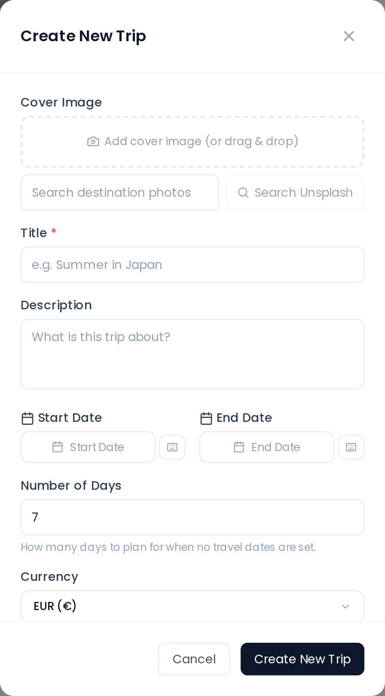

# Creating a Trip

## Opening the Dialog

On desktop, click the floating **New Trip** button in the bottom-right corner of the dashboard, or the dashed **New Trip** tile at the end of the trip grid, to open the Create New Trip dialog. On mobile the floating button is replaced by the **+** in the centre of the bottom tab bar, and an empty dashboard also offers a **Create First Trip** button.

You can also open it directly via a deep link: navigate to `/dashboard?create=1`. This is the URL used by system notices that prompt you to create a trip.

## Fields

### Title (required)

The trip name. Cannot be empty — saving is blocked until a title is entered.

### Description (optional)

A short free-text description. It is not shown on the trip card or on the Spotlight card. It appears on a [public share page](Public-Share-Links), on the cover of a [PDF export](PDF-Export), and as the notes of the trip's all-day event in [calendar feeds and .ics exports](Calendar-Feeds).

### Dates

Set a **Start date** and **End date** using the date picker. The day count is calculated automatically when both are set.

On desktop, if you leave **both** dates empty, a separate **Day count** field appears. Enter a number between **1 and 365** to create a date-less itinerary with a fixed number of days. The mobile sheet has no such field: a date-less trip created there always starts with 7 days.

Only the **start** date is linked to the other one. Picking a start date fills the end date to match it, and moving the start date of an already-dated trip shifts the end date so the previous duration is kept. Nothing links them the other way round: you can pick an end date on its own, and the picker's **✕** button clears either field afterwards. A trip can therefore be saved with both dates, with only a start date, with only an end date, or with neither. A trip left with exactly one date gets an undated day grid (7 days by default), just like a date-less one.

### Currency

The trip's currency — its **accounting base**. Every expense in the Costs tab is converted into it, and every balance and settle-up suggestion is calculated in it. The dialog pre-fills your own display currency (Settings → General → *Display currency*); if you left that on **Trip currency**, it falls back to **EUR**. An administrator can preset the instance-wide value under Admin → **User Defaults**, which new users inherit until they pick their own. 165 currencies are available.

Pick the currency you will actually settle up in. It is not a cosmetic label, but it is not a one-way door either: you can change it later from the same dialog (with the `trip_edit` permission), and TREK re-bases the existing expenses so no money moves — see [Currencies → Changing the trip currency](Currencies#changing-the-trip-currency).

> This is **not** the same as the display currency in Settings → General, which changes what *you* read on trips that already exist. See [Currencies](Currencies).

### Cover Image

The cover image is displayed on the trip card and as the background of the Spotlight card. You can add one in four ways:

- **Drag and drop** an image file onto the dashed upload area.
- **Paste from clipboard** — if you have an image in your clipboard, paste it anywhere in the dialog.
- **File picker** — click the upload area to browse for a file.
- **Search Unsplash** — type a query to pick a stock photo. If this returns *"Unsplash search unavailable"* (common on VPS/datacenter IPs), configure a free Unsplash Access Key — see [Environment-Variables → Image Search (Unsplash)](Environment-Variables#image-search-unsplash).

When **creating** a new trip the cover image field is always visible. When **editing** an existing trip it is only shown if you have the `trip_cover_upload` permission. For a new trip, the image is uploaded immediately after the trip is created.

### Reminder

A push notification sent before the trip departs. The field shows a set of preset options:

| Option | Days before departure |
|---|---|
| None | 0 |
| 1 day | 1 |
| 3 days | 3 |
| 9 days | 9 |
| Custom | 1–30 (you enter the number) |

When **creating** a new trip the reminder field is always visible. When **editing** an existing trip it is only shown to the **trip owner** or **admin** users.

If reminders are disabled on your instance (`trip_reminders_enabled = false`), the reminder section is shown at reduced opacity with an informational message in place of the preset buttons.

> **Admin:** Trip reminders are controlled by a server-side feature flag (`trip_reminders_enabled`). Contact your administrator to enable them.

### Members

Add initial trip members from the members selector. On a **new** trip, selected members are queued locally and added to the trip immediately after it is saved. The selector shows all registered users on your instance except yourself.

## Saving

Click **Create New Trip**. The trip is saved, the dialog closes and a *"Trip created successfully!"* toast confirms it — you stay on the dashboard. The new trip is sorted into the trip list by its dates; click its card (or the Spotlight card, if it is the trip that earns that spot) to open the [Trip-Planner-Overview](Trip-Planner-Overview).

## Related Pages

- [Trip-Members-and-Sharing](Trip-Members-and-Sharing)
- [Trip-Planner-Overview](Trip-Planner-Overview)
- [My-Trips-Dashboard](My-Trips-Dashboard)
