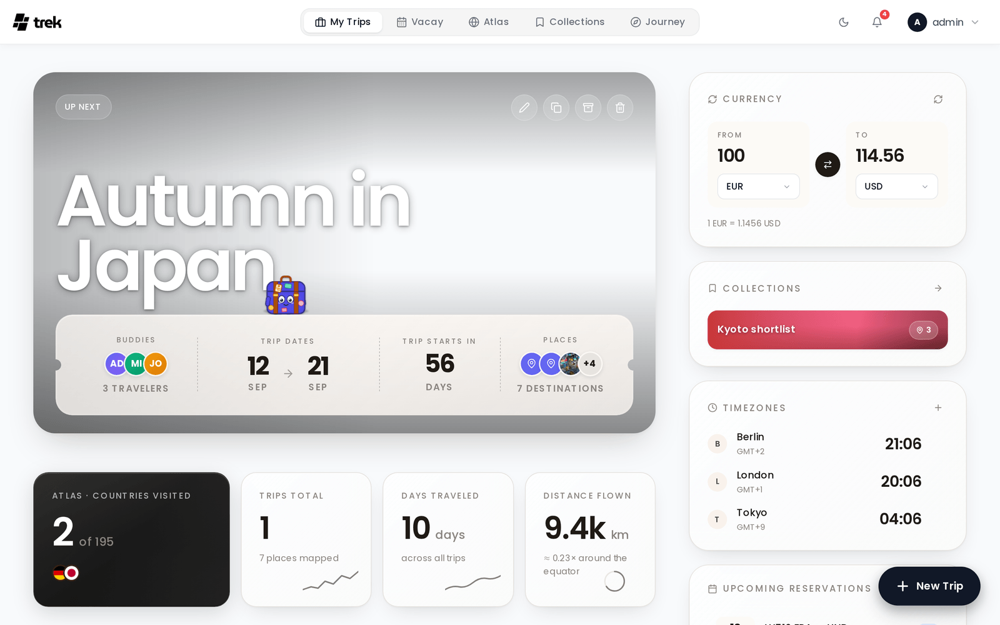

# Dashboard Widgets

The My Trips dashboard has a widget sidebar holding a currency converter, a timezone clock and a list of upcoming reservations, plus a Collections shortcut when the [Collections](Collections) addon is enabled (it ships disabled). Installed plugins can contribute further widgets to the same sidebar. This page covers the currency converter and the timezone clock.

## Where they appear

On large screens (desktop/wide tablet), the widgets appear in a sticky right-hand sidebar of the [My-Trips-Dashboard](My-Trips-Dashboard). At 1280px and below that column stops being sticky and reflows underneath the trip grid as a wrapping row of cards. On a phone (under 768px) the mobile dashboard takes over and renders each enabled widget inline as its own panel, interleaved with the trip list in an order you can rearrange under Settings → Appearance. There is no bottom sheet for the widgets on any screen size.

Each user configures their own widgets independently. Whether each widget is shown or hidden is saved to your account on the server (synced across devices). The selected currency pair and the saved timezone list live on your account as well, so they follow you to every device you sign in on.

### Showing and hiding widgets

Widget visibility lives in **Settings → Appearance**, under **Dashboard widgets** — there is no gear icon on the dashboard itself. Desktop and mobile are configured independently:

- **Desktop → Right sidebar** has a master switch for the whole column (turn it off and the dashboard centers) plus one switch each for Currency, Collections, Timezones and Upcoming reservations.
- **Desktop → Below the hero** switches the Atlas / countries, Trips total, Days traveled and Distance flown tiles.
- **Mobile → Bottom of page** switches Currency, Collections, Timezones and Upcoming reservations; **Mobile → Below the hero** switches Trips total and Days traveled.

Turning a widget off removes it from the dashboard; the preference is saved to your account.

---

## Currency Converter

The currency converter lets you quickly convert an amount between two currencies.

**How to use:**

1. Enter an amount in the input field.
2. Select a source currency from the left selector.
3. Select a target currency from the right selector.
4. The converted amount appears in the right-hand ("To") field, directly opposite the amount you entered and above the target-currency selector — shown to two decimals, without a currency symbol. Below the row, the current rate is printed as `1 EUR = 1.0850 USD`; if no rate could be fetched, the field shows `—` and the line reads "Rate unavailable".

You can also click the swap arrow to reverse source and target.

**Exchange rates** are fetched from [Frankfurter](https://frankfurter.dev) using the `https://api.frankfurter.dev/v2/rates?base={from}` endpoint. One request returns every quote for the source currency, so rates are re-fetched when you change the source currency (including via the swap arrow) or click the refresh icon; changing only the target currency re-uses the rates already loaded.

**Supported currencies:** 165 currencies are available in the selector — the full set Frankfurter v2 supports, including all major fiat currencies (USD, EUR, GBP, JPY, etc.) and many minor ones.

---

## Timezone Clock

The timezone clock displays live clocks for multiple time zones simultaneously.

**How to use:**

- Until you change the list, the widget starts with your local zone plus London and Tokyo. Your local zone is an ordinary row and can be removed like any other.
- Each row shows the zone's current time and its short timezone name or UTC offset (for example `GMT+9`), not an offset relative to your own zone.
- Click **+** to add a zone. A searchable dropdown lists every IANA timezone your browser knows (e.g. `America/Denver`); type to filter and pick one. The row is labelled with the city part of the identifier — there is no custom label.
- Hover over a zone row and click **×** to remove it.

Clocks refresh every 30 seconds and are always shown in 24-hour time — the 12-hour display setting does not apply to this widget.

---

## See also

- [My-Trips-Dashboard](My-Trips-Dashboard)
- [Addons-Overview](Addons-Overview)
