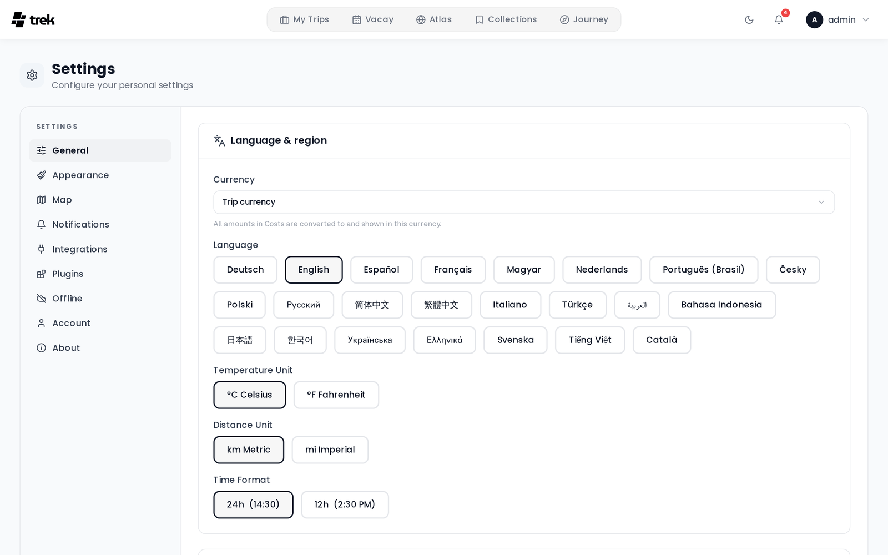

# General Settings

The General tab (Settings → General) controls your locale preferences and a few map-related display options. All changes save immediately to your account and persist across devices.



## Where to find it

Open the user menu in the top navigation bar, select **Settings**, and stay on the **General** tab — it is the tab the page opens on.

The tab is split into three sections: **Startup** (where opening TREK lands), **Language & region** (currency, language, temperature, distance, time format) and **Travel & map** (booking route labels, always show booking routes, explore places on the map, blur booking codes, optimize route from accommodation).

> Color mode (Light / Dark / Auto) is **not** here — it lives on the **Appearance** tab. See [Appearance-Settings](Appearance-Settings).

## Start page

Where TREK goes when you open it — the app root (`/`), which is also what the installed PWA and any home-screen shortcut launch.

| Option | Behaviour |
|--------|-----------|
| **Dashboard** (default) | The trip overview, exactly as before. |
| **Active trip** | Straight into your active trip, skipping the dashboard. |

Your **active trip** is the one running today; if none is, the next one starting; if you have only past trips, the most recent one. That is the same trip the dashboard features in its hero, so the two never disagree. Archived trips are never picked, and if you have no trip at all, TREK opens the dashboard as usual.

The dashboard stays reachable at `/dashboard` — only the root redirects.

## Start tab

Shown once **Active trip** is selected: which tab of the trip planner to open on. Handy when you mostly reach for one thing on the road, for example entering expenses on the Costs tab.

If the tab you picked belongs to an addon that is switched off, the trip opens on **Plan** instead.

### Linking to a tab directly

Any trip URL accepts a `tab` parameter, which is what the start-tab setting uses internally. It works for bookmarks, home-screen shortcuts and wrapper apps too:

```
/trips/42?tab=finanzplan
```

The parameter takes the planner's internal tab ids, which are historic German names:

| Tab | Id |
|-----|-----|
| Plan | `plan` |
| Transports | `transports` |
| Bookings | `buchungen` |
| Lists | `listen` |
| Costs | `finanzplan` |
| Files | `dateien` |
| Collab | `collab` |
| A trip-page plugin | `plugin:<plugin-id>` |

The parameter is consumed on arrival and disappears from the address bar; switching tabs afterwards works normally, and a reload keeps whatever tab you were last on.

## Currency

Your **display currency** — the currency you want to *read* amounts in on the Costs tab (totals, the category chart, balances, settle-up). It is presentation only: it never changes what is stored, and two members of the same trip can read it in different currencies and both see correct balances.

| Option | Behaviour |
|--------|-----------|
| **Trip currency** (default) | Each trip is shown in **its own** currency — a Tokyo trip in yen, a Moscow trip in roubles. |
| A specific currency (e.g. `USD`) | **Every** trip is converted into that currency for you, whatever its own currency is. |

165 currencies are available. Conversion uses live rates, so a converted total can shift slightly from day to day while the trip's actual balances stay fixed.

> This is **not** the trip's currency, which is set on the trip itself and is the base its balances are calculated in. The distinction matters — see [Currencies](Currencies).

An administrator can set an instance-wide default in Admin → Default User Settings. It is not only a starting value for new accounts: it is merged in every time your settings are loaded, so it applies to anyone whose own display currency is empty. Picking a specific currency of your own overrides it. **Trip currency** does not, because it stores an empty value that counts as "not set", so the admin default takes effect again on your next reload.

## Language

Select your preferred language from the button grid (desktop) or dropdown (mobile). The change takes effect immediately without a page reload. See [Languages](Languages) for the full list of supported languages.

## Temperature unit

Affects the weather widget on trip days.

| Option | Display |
|--------|---------|
| °C Celsius | Metric |
| °F Fahrenheit | Imperial |

## Distance unit

| Option | Display |
|--------|---------|
| km Metric | Kilometres |
| mi Imperial | Miles |

## Time format

Affects all time displays throughout the app.

| Option | Example |
|--------|---------|
| 24h | 14:30 |
| 12h | 2:30 PM |

## Booking route labels

Shows or hides station / airport names on the endpoint markers of booking routes on the map. When off, only the icon is shown. Set to **On** or **Off**.

## Explore places on the map

Shows a category pill on the trip map for finding nearby restaurants, hotels and more from OpenStreetMap. Set to **On** or **Off**.

## Always show booking routes

When **On**, every booking that has a route (flight, train, car leg, etc.) shows its route line on the map automatically, on every trip, without needing the per-booking toggle. Set to **On** or **Off** — off by default.

This only sets the *default* for a trip you haven't touched before. If you've already used the per-booking toggle or the trip's "show all / hide all" button (in the day-plan toolbar) on a given trip, that choice is remembered for that trip and isn't overridden by changing this setting afterwards.

## Blur booking codes

When enabled, confirmation codes and reference numbers are blurred until you hover or tap. Set to **On** or **Off**.

## Optimize route from accommodation

When **On** (the default), the **Optimize** button in the day's route tools anchors the route on that day's accommodation instead of only reordering the places among themselves: an ordinary day becomes a loop out from the hotel and back to it, a transfer day a run from the hotel you check out of to the one you check into that evening. Set to **On** or **Off**.

A day without an accommodation, or one whose hotel has no coordinates, is optimized from its first place as before. Locked and timed places keep their slots either way. See [Route-Optimization](Route-Optimization).

## See also

- [Currencies](Currencies)
- [Languages](Languages)
- [Appearance-Settings](Appearance-Settings)
- [User-Settings](User-Settings)
