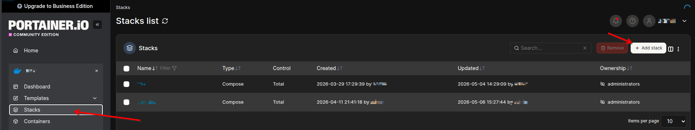
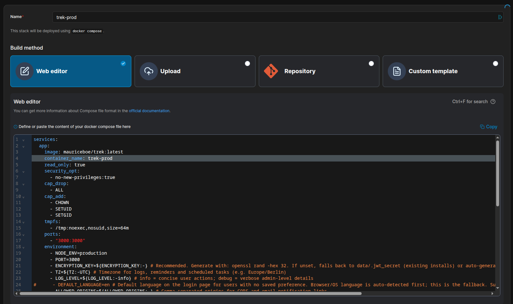
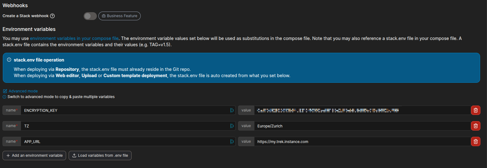
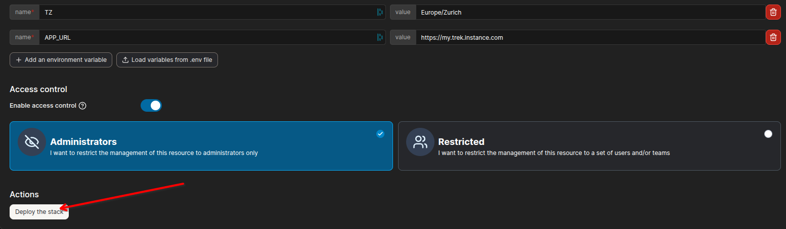
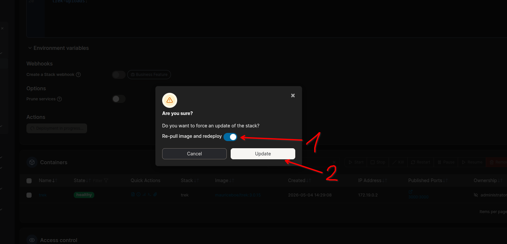
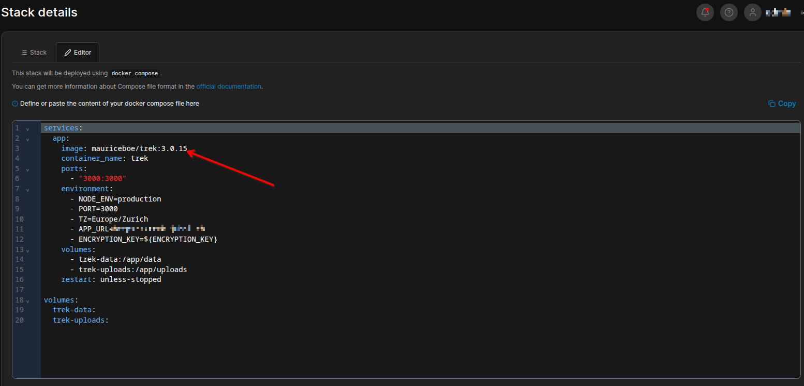
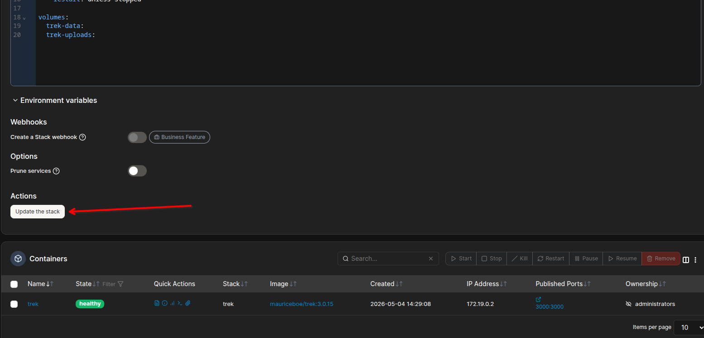

# Install: Portainer

Install TREK on Portainer using a Stack (Docker Compose).

## Prerequisite

Portainer must be installed and connected to your Docker environment. Use **Stacks** — it supports Docker Compose and gives you the full compose syntax including environment variables, volumes, and restart policies.

## Create a Stack



1. In Portainer, go to **Stacks → Add stack**.
2. Give the stack a name (e.g. `trek`).
3. Select **Web editor** and paste the compose file from [docker-compose.yml](https://github.com/liketrek/TREK/blob/main/docker-compose.yml).



4. Fill in the environment variables at the bottom of the page.



5. Click **Deploy the stack**.



## Compose Content

See https://github.com/liketrek/TREK/blob/main/docker-compose.yml

Set at minimum `ENCRYPTION_KEY`, `TZ`, and `ALLOWED_ORIGINS` in the **Environment variables** section of the stack editor. Portainer's stack variables are only substituted into `${...}` placeholders in the compose file, they are not injected into the container, and the shipped compose file interpolates exactly four: `ENCRYPTION_KEY`, `TZ`, `LOG_LEVEL`, and `ALLOWED_ORIGINS`.

Every other variable ships commented out, so setting it here does nothing. To use one — `APP_URL`, for example, which OIDC needs and which email notification links are built from — uncomment its line in the **Web editor** and put the value there directly, or change it to `- APP_URL=${APP_URL:-}` so the stack variable is picked up.

Generate an encryption key with:

```bash
openssl rand -hex 32
```

## Image Tags

Three tag strategies are available:

| Tag | Example | Behavior |
|---|---|---|
| `latest` | `mauriceboe/trek:latest` | Always the newest release across all major versions |
| Major version | `mauriceboe/trek:4` | Latest release pinned to that major version |
| Full version | `mauriceboe/trek:4.0.0` | Exact release; never changes |

Use `latest` or a major-version tag (e.g. `4`) if you want automatic updates on redeploy. Use a full version tag (e.g. `4.0.0`) if you want explicit control over which release runs.

## Updating

How you update depends on the tag you chose:

**`latest` or major-version tag** — In Portainer, open the stack, click **Redeploy**, enable the **Re-pull image and redeploy** switch, then confirm. Portainer will pull the newest matching image and recreate the container.



**Pinned full-version tag** — Edit the stack, change the tag in the `image:` line (e.g. `4.0.0` → `4.0.1`), then click **Update the stack**. No need to toggle the re-pull switch — a tag change forces a fresh pull.





> Back up your data before any update. Go to **Admin Panel → Backup** or copy your `./data` and `./uploads` directories. See [Backups](Backups).

## Volumes

| Stack-relative path | Container path | Contents |
|---|---|---|
| `./data` | `/app/data` | SQLite database, logs, encryption key |
| `./uploads` | `/app/uploads` | Uploaded files (photos, documents, covers, avatars) |

Portainer resolves `./` relative to the stack's working directory. Confirm the paths under **Stack details** after deploying.

### Named Volumes

You can use Docker named volumes instead of bind mounts. Named volumes are fully managed by Docker and not tied to a host path — a good fit for Portainer where the working directory can vary. See the [Docker Compose volumes reference](https://docs.docker.com/reference/compose-file/volumes/) for all options.

Replace the `volumes:` block in the service and add a top-level declaration:

```yaml
services:
  app:
    # ... (rest of service config unchanged)
    volumes:
      - trek_data:/app/data
      - trek_uploads:/app/uploads

volumes:
  trek_data:
  trek_uploads:
```

Portainer lists named volumes under **Volumes** in the sidebar, where you can inspect or back them up.

## Next Steps

- [Environment-Variables](Environment-Variables) — full variable reference
- [Reverse-Proxy](Reverse-Proxy) — HTTPS configuration
- [Updating](Updating) — update strategies across all install methods
