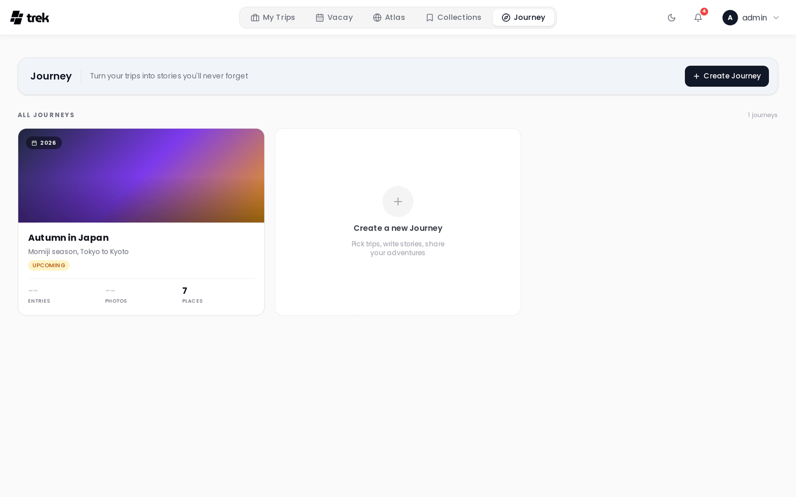
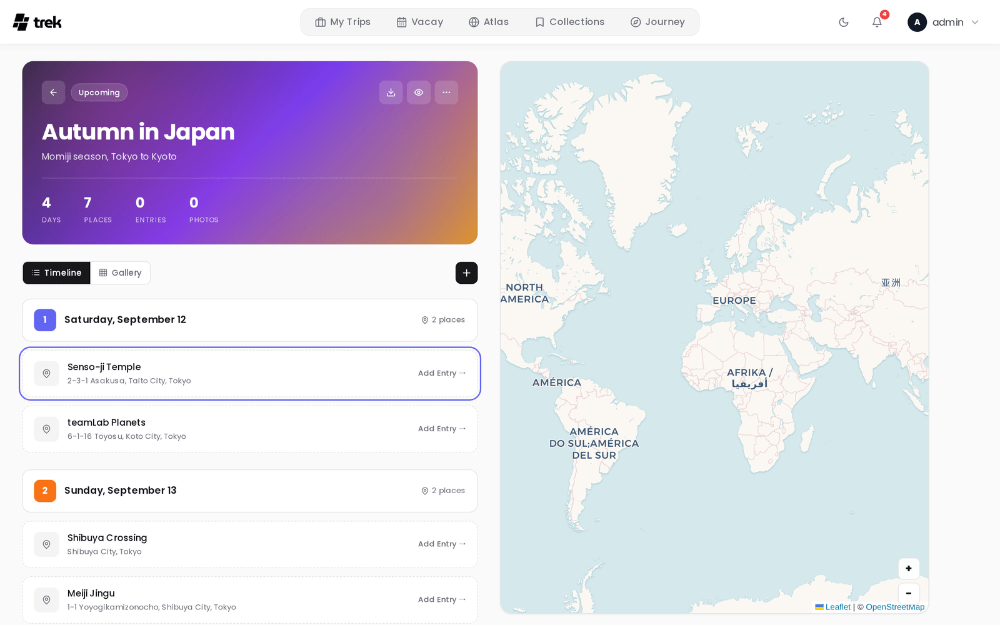
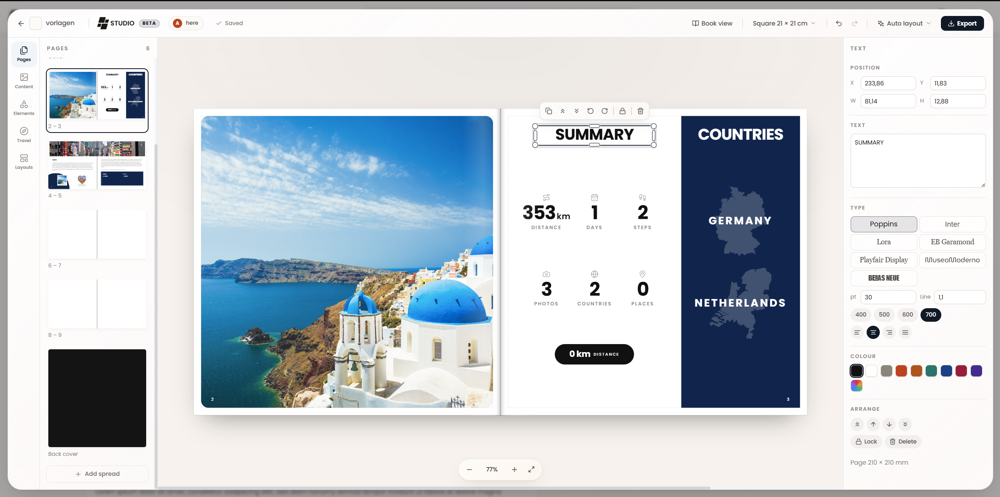
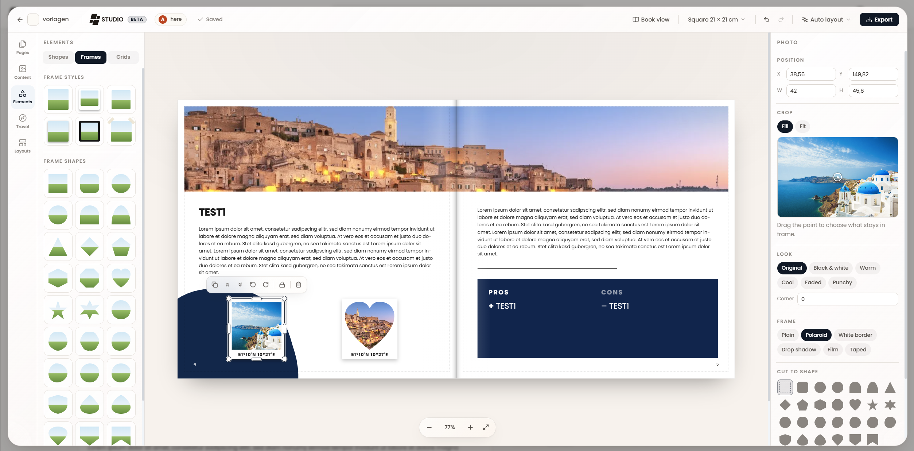

# Journey Journal

Journey is a photo-first travel journal. Each journey is linked to one or more of your trips and contains per-day entries with text, photos, mood, and weather.

> **Admin:** enable Journey in [Admin-Addons](Admin-Addons).

## What Journey is

Journey lets you write a narrative account of your travels alongside your trip plan. Entries are tied to specific days and can include prose, photos, a mood rating, weather conditions, and verdict cards. Completed journeys can be shared publicly with a read-only link.

## Accessing Journey

When the admin has enabled the Journey addon, a **Journey** entry appears in the main navigation. The Journey list page shows all your journals as cards with cover images, entry counts, photo counts, and place counts.

## Creating a journey

From the Journey list, click **Create journey**. Give it a title and optional subtitle, then select one or more existing trips to link. Linking a trip imports the trip's places as location anchors for your entries. You can link additional trips later from the journal settings.

## Journal entries

Each entry corresponds to a day in your journey. The entry editor provides:

- **Title** — a short heading for the day.
- **Story** — free-form text that supports Markdown formatting.
- **Mood** — choose one of four values:

  | ID | Label | Color |
  |---|---|---|
  | `amazing` | Amazing | Pink |
  | `good` | Good | Amber |
  | `neutral` | Neutral | Grey |
  | `rough` | Rough | Violet |

- **Weather** — choose one of six values: Sunny, Partly cloudy, Cloudy, Rainy, Stormy, Snowy. (Snowy is stored under the id `cold`.)
- **Photos** — attach photos to the entry. The first photo becomes the card thumbnail in list views.
  > **Note on HEIC files:** HEIC is an Apple-only format that many browsers and platforms do not recognise as an image. To ensure broad compatibility, HEIC/HEIF files are automatically converted to JPEG before upload. This conversion may result in the loss of embedded metadata (EXIF data such as GPS coordinates, camera information, etc.).
- **Pros / Cons** — optional verdict cards. Add items to a **Pros** list (thumbs-up) or a **Cons** list (thumbs-down) to summarise what you loved or what could have been better. These are stored in the `pros_cons.pros` and `pros_cons.cons` arrays on the entry.
- **Tags** — free-form labels (e.g. "hidden gem", "best meal").
- **Location** — pin the entry to a map location.
- **Time** — optionally record a time of day for the entry.

### Getting around a long journal

Everything that adds to a journal sits at the top of the page — the **Add Entry** button, the gallery upload — while what you were last reading sits at the bottom. On desktop, two small round buttons float centred over the timeline, just above its bottom edge, once there is more than 400 px of scroll to travel: one jumps back to the top, the other to the last entry. Each appears only when there is somewhere to go in that direction.

### External photos

The entry editor includes an **External photos** tab for connected Immich and Synology Photos libraries. It searches the selected calendar day automatically. When the entry has a pinned location, photos with GPS metadata are shown nearest to that location first. Photos without GPS, and photos taken farther away on the same day, remain available below the nearby results; no distance cutoff is applied.

External selections are queued with the other editor changes and saved only when you click **Save**. If a provider is unavailable or its metadata has no GPS coordinates, Journey falls back to the normal date-based photo list.

## Mobile timeline

On mobile, entries are displayed in a horizontal scrolling timeline of card thumbnails. Tap a card to open the full entry view in a modal sheet. Each card shows the entry's first photo (or a placeholder pin), date, day number, mood icon, and weather icon.

## Map view

The journey detail page includes a map on the right (desktop) or an integrated map-timeline (mobile) showing all entry locations alongside the places from linked trips.

**GPX tracks are drawn too.** Any route you imported into one of the journey's linked trips, from a `.gpx`, `.kml` or `.kmz` file, appears on the journey map as well, in the same colour it has in the trip planner and with a white casing so it stays readable on satellite tiles. Nothing to switch on: the tracks belong to the trips your entries came from, so importing the file while planning is all it takes. Hovering a track shows its name.

The thin dashed line connecting entries in date order is something else and stays as it is: that one is drawn by TREK, while a track is the route you actually recorded.

## TREK Studio

A journey can also be laid out as a printable photo book. Open a journey and click **Studio** in the header. The designer opens on top of the journey at `/journey/:id/studio`, so the journey stays open underneath and **Back to the journey** drops you straight back into it. Studio is marked **Beta**.

- **Page format** — Square 21 × 21 cm (the default), Square 30 × 30 cm, A4 landscape, A4 portrait, A5 landscape, or a custom width × height in millimetres. Everything is drawn as a spread (two pages side by side) with 3 mm bleed and a 5 mm safe margin.
- **Auto layout** has two entries. **This spread** builds the spread on screen again from the journal entry it came from, and is only offered on a spread that came from one. **The whole book** replaces every page, keeping your title and page setup. Both are ordinary undo steps, so you can press one, look at it, and undo.
- **Pages, Content, Elements, Travel and Layouts** are the sections of the left rail. Content holds the journey's own photos and entries; Layouts has thirteen spread layouts (Hero and story, Four up, Strip and text, Mosaic and so on) plus a separate set of five for the cover and back; Elements has text styles, shapes, lines, grids, empty frames with their frame styles, and a searchable icon library; Travel builds figures out of the journey itself — route maps, country outlines and lists, flags, date, day and distance marks, and a trip summary.
- **Properties** on the right edits whatever is selected: position and size, crop and focal point, fill or fit, a look filter, corner radius, frame style, stacking order, lock. An element that auto layout tied to a journal entry follows that entry until you edit it here, which breaks the link.
- **Export** opens a print view that your browser turns into a PDF. Pick **Single pages** (one leaf per sheet, what a printer wants) or **Spreads** (two pages at a time, the way the book opens), with optional crop marks that add the bleed on every edge and mark where to cut.
- **Spreads travel between books.** Download the spread you are on as a design file and import it into another book. The file carries the design only, not the photographs.
- **Several people can design at once.** Everyone in the same book sees the others' pointers with their names on them, and a save is pushed to the rest live. A save that lands on a version somebody else has already changed comes back as a conflict, with the other version alongside it, rather than quietly overwriting their work.

The book belongs to its journey and inherits its access exactly: anyone who may read the journey may open its book, and only those who may edit the journey may save or delete it. There is no second set of permissions to keep in step.

Studio is desktop only: it needs a viewport at least 1024 px wide. Below that — a tablet, or a narrowed browser window — it opens over the journey and shows a "Studio needs a bigger screen" notice with a way back. On a phone the journey opens in its mobile view as usual and Studio is not offered at all. Making the PDF is desktop only too.

## Plugin entry rows

Installed plugins can add extra rows to a journal entry card via the `journalEntryProvider` hook. A plugin returns rows (`label`, optional `value`, optional `url`) and TREK renders them natively under the entry — no iframe. Rows are additive and fail-safe: they require the Journey addon, the entry's journey is access-checked the same way as reading it, only http/https/mailto links are allowed, and a provider that errors or is slow is simply skipped.

> **Plugins:** requires the `hook:journal-entry-provider` permission. See [Plugin-Development](Plugin-Development) for the hook contract.

## Public sharing

You can share a journey with a read-only public link. When creating the link you can independently toggle which sections are visible to visitors: **Timeline** (entries and stories), **Gallery** (photos), and **Map**. Visitors can only see the sections you have enabled, and no TREK account is required. See [Public-Share-Links](Public-Share-Links) for details on the separate journey share token mechanism.

**Photos appear on the public map too**, as long as **Gallery** and **Map** are both on. A gallery photo that knows where it was taken becomes a thumbnail pin, clustered into one pin where several were taken close together, and sitting below the entry pins so the itinerary stays the point of the map. The location comes from the file's own EXIF for uploads and from Immich or Synology for provider photos, and a photo that carries none simply stays off the map (see the HEIC note above — that conversion drops GPS, so iPhone uploads usually arrive without a location).

Both toggles matter. A photo's coordinates follow the **Map** switch: with Map off the gallery is still shared, but every photo's coordinates are stripped before they leave the server. With Gallery off no photos are sent at all, so a map-only share shows the entry pins and nothing else.

## See also

- [Addons-Overview](Addons-Overview)
- [Admin-Addons](Admin-Addons)
- [Public-Share-Links](Public-Share-Links)
