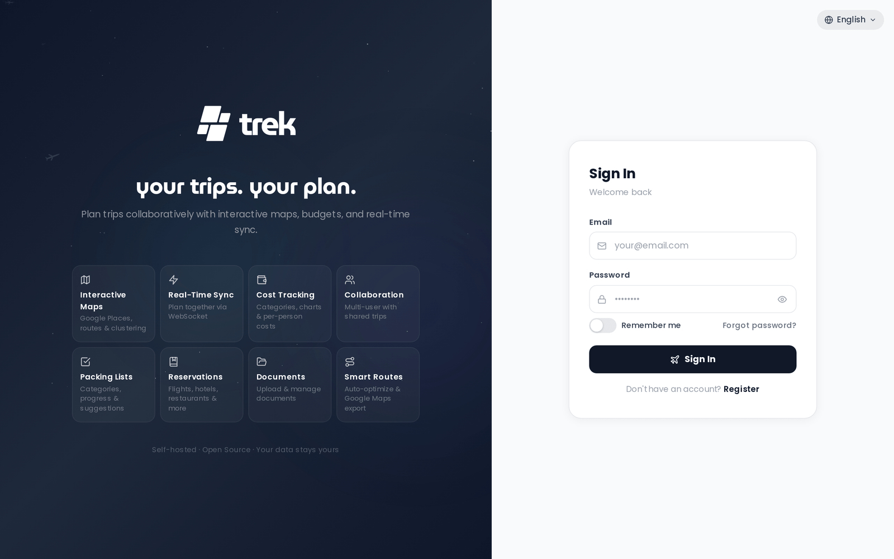

# Login and Registration

## Signing in

Navigate to `/login` and enter your email and password. On success, the server sets a `trek_session` cookie — httpOnly, sameSite=`lax`, and secure in production — that keeps you signed in across page reloads. How long it survives depends on the **Remember me** switch, described below. You do not need to sign in again until the session expires or you explicitly log out.

> **Note:** The `secure` flag on the cookie can be overridden by setting `COOKIE_SECURE=false` in the server environment (useful for plain-HTTP dev setups), or force-enabled with `FORCE_HTTPS=true`.

If your account has two-factor authentication enabled, you are prompted for a TOTP code (or backup code) after the password step before the session cookie is issued.

If you have forgotten your password, click the **"Forgot password?"** link below the password field to start the self-service reset flow. See [Password-Reset](Password-Reset) for details.

### Remember me

The **Remember me** switch below the password field decides how long the session lives:

- **Off** (the default) — a browser-session cookie with no `maxAge`, cleared when you close the browser, backed by a token valid for `SESSION_DURATION` (default `24h`).
- **On** — a persistent cookie matching a token valid for `SESSION_DURATION_REMEMBER` (default `30d`), so the session survives browser restarts.

Both durations are configurable per instance, see [Environment-Variables](Environment-Variables). Your choice is carried through the MFA step, through a password change, and through SSO sign-in. While you keep using TREK the cookie is silently re-issued once the token is past half its lifetime, with the same Remember me semantics, so an active session never expires mid-use. Only cookie sessions are renewed this way — API and MCP clients authenticating with a bearer token are not.

Sign-ins that never pass through this switch — registration, the demo button and passkey sign-in — get the historical default instead: a persistent cookie lasting `SESSION_DURATION`.

### Forced password change

Some accounts are flagged as needing a new password: the admin account TREK seeds on first boot always is, and so is an account restored with the `reset-admin.js` recovery script (see [Troubleshooting](Troubleshooting)). For those accounts a **Set new password** form is shown immediately after a successful login (or after the MFA step). The session cookie has already been issued at that point — the app simply keeps you on the form until the new password is saved, and saving it re-issues the cookie and signs your other sessions out.

There is no control in the Admin Panel that flags an existing account. An admin-set password (see [Admin-Users-and-Invites](Admin-Users-and-Invites)) neither raises the flag nor clears it, so a user who already carries it is still asked to choose their own password at the next sign-in.

## Registering

The Register form appears under one of these conditions:

- **Open registration** — the admin has enabled password registration for the instance (`password_registration` setting).
- **Valid invite link** — you visited `/register?invite=TOKEN` with a valid token (see below).
- **No accounts at all** — nobody has signed up yet; the registration form is shown automatically and the first account created becomes an admin. On a normal install this never happens, because TREK seeds an admin on first boot (see [First run](#first-run) below).

Registration fields: **username**, **email**, and **password**.

### Password requirements

Passwords must meet all of the following rules:

- Minimum **8 characters**
- At least one **uppercase letter**
- At least one **lowercase letter**
- At least one **number**
- At least one **special character**
- Must not be a commonly used password
- Must not consist of a single repeated character

> **Admin:** You can disable open registration so only invite links work. See [Admin-Users-and-Invites](Admin-Users-and-Invites).

### Invite link flow

When an admin shares an invite link (`/register?invite=TOKEN`), visiting it:

1. Validates the token against the server.
2. Switches the login page to Register mode automatically.
3. Passes the token during registration so it counts against the invite's use limit.

If the token is invalid, expired, or exhausted, an error is shown.

## First run

On a normal install TREK seeds an admin account on first boot, before anyone can register, so the login page opens in Sign In mode and the Register link is hidden. The credentials depend on how you start the container:

- With **both** `ADMIN_EMAIL` and `ADMIN_PASSWORD` set, those values are used.
- With only one of the two set, both are ignored (a warning is logged) and the generated credentials below are used instead.
- Otherwise the account is `admin@trek.local`, username `admin`, with a randomly generated password printed to the container log — run `docker logs trek` to retrieve it.

The seeded admin is flagged as requiring a password change, so you are forced to set a new password on first sign-in. Until that happens the Register link stays hidden even though password registration is enabled by default; once the password is changed the link appears normally.

Two setups skip the seeder entirely. `DEMO_MODE=true` seeds the demo data instead (see [Demo-Mode](Demo-Mode)), and on an **OIDC-only** install no local account is created at all — there the first user who signs in through the identity provider is assigned the **admin** role.

See [Quick-Start](Quick-Start) for the full first-boot walkthrough.

## Rate limiting

Requests to the login endpoint are rate-limited to **10 per 15-minute window** per IP address. The counter is incremented before the credentials are checked, so successful sign-ins count against it too, not only failed ones. After exceeding the limit, further requests return HTTP 429 until the window resets. The window is fixed from the first counted request, and blocked requests do not extend it.

That counter is shared rather than per-endpoint. `POST /api/auth/login`, `POST /api/auth/register`, `GET /api/auth/invite/:token` and the passkey sign-in ceremony each allow 10 requests from it; `PUT /api/auth/me/password`, `POST /api/auth/mfa/disable`, `POST /api/auth/mcp-tokens` and passkey deletion draw on the same counter but are rejected once it reaches 5. Unrelated activity from the same IP therefore eats into the allowance — ten registration attempts will 429 the next login, and five requests of any kind will 429 a password change.

MFA verification attempts are rate-limited separately to **5 attempts per 15-minute window** per IP address.

Forgot-password requests are rate-limited to **3 attempts per 15-minute window** per IP. Reset-password submissions are limited to **5 attempts per 15-minute window** per IP.

## Demo mode

When the server is started with `DEMO_MODE=true`, a **"Try the demo — no registration needed"** button appears below the login form. Clicking it signs you in as the demo user without entering credentials. The demo credentials (`demo@trek.app` / `demo12345`) are also displayed in the app config for reference, but the one-click button is the intended entry point.

## SSO

If the admin has configured OpenID Connect, a **"Sign in with SSO"** button (labelled with the configured `OIDC_DISPLAY_NAME`, defaulting to `SSO`) appears below the login form. See [OIDC-SSO](OIDC-SSO) for details on setup and the sign-in flow.

When OIDC-only mode is active (password login disabled), visiting `/login` automatically redirects the browser to the identity provider. The email/password form is not shown. The automatic redirect is suppressed only when you have explicitly logged out, in which case the SSO button is shown instead so you can choose to sign back in.

---

**See also:** [OIDC-SSO](OIDC-SSO) · [Admin-Users-and-Invites](Admin-Users-and-Invites) · [Password-Reset](Password-Reset)
