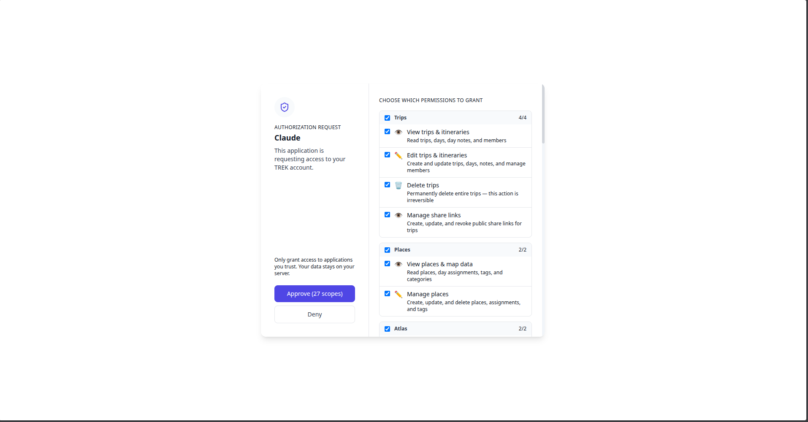

# MCP Scopes

OAuth scopes control exactly which data your AI client can read or write in TREK. You select scopes during the OAuth consent screen or when pre-creating an OAuth client. You can revoke access at any time by deleting the OAuth client or token from **Settings → Integrations → MCP**.

## All scopes

TREK defines 35 scopes across 17 groups.

| Group | Scope | Permission |
|---|---|---|
| **Trips** | `trips:read` | View trips, days, day notes, and members |
| | `trips:write` | Create and update trips; create, update, and delete days, day notes, and accommodations; manage members; duplicate trips |
| | `trips:delete` | Permanently delete entire trips (irreversible) |
| | `trips:share` | Create, update, and revoke public share links for trips |
| **Places** | `places:read` | Read places, day assignments, tags, and categories |
| | `places:write` | Create, update, and delete places, assignments, and tags |
| **Collections** | `collections:read` | Read saved-place collections, their places, ratings, labels, and members |
| | `collections:write` | Create and edit collections, save, rate, label and copy places, and share lists |
| **Atlas** | `atlas:read` | Read visited countries, regions, and bucket list |
| | `atlas:write` | Mark countries and regions visited, manage bucket list |
| **Packing** | `packing:read` | Read packing items, bags, and category assignees |
| | `packing:write` | Add, update, delete, toggle, and reorder packing items and bags |
| **To-dos** | `todos:read` | Read trip to-do items and category assignees |
| | `todos:write` | Create, update, toggle, delete, and reorder to-do items |
| **Budget** | `budget:read` | Read budget items and expense breakdown |
| | `budget:write` | Create, update, and delete budget items |
| **Reservations** | `reservations:read` | Read reservations and accommodation details |
| | `reservations:write` | Create, update, delete, and reorder reservations |
| **Collaboration** | `collab:read` | Read collab notes, polls, and messages |
| | `collab:write` | Create, update, and delete collab notes, polls, and messages |
| **Notifications** | `notifications:read` | Read in-app notifications and unread counts |
| | `notifications:write` | Mark notifications as read or unread (individually or all at once) |
| **Vacation** | `vacay:read` | Read vacation planning data, entries, and stats |
| | `vacay:write` | Create and manage vacation entries, holidays, and team plans |
| **Geo** | `geo:read` | Search locations and public transit routes, resolve map URLs, and reverse-geocode coordinates |
| **Weather** | `weather:read` | Fetch weather forecasts for trip locations and dates |
| **Journey** | `journey:read` | Read journeys, entries, and contributor list |
| | `journey:write` | Create, update, and delete journeys and their entries |
| | `journey:share` | Create, update, and revoke public share links for journeys |
| **Files** | `files:read` | List the documents on a trip: names, sizes, who uploaded them, what they link to |
| | `files:write` | Rename and describe files, link them to bookings and places, star and trash them |
| | `files:content` | Read what is inside an uploaded document, such as a booking PDF or a ticket |
| **Settings** | `settings:read` | Read units, time format, language, default currency, and start page |
| | `settings:write` | Change units, time format, language, default currency, and start page |
| **Plugins** | `plugins:use` | Call tools published by plugins an administrator installed and approved |

## Scope rules

- A `:write` scope implies `:read` access for the same group (e.g. `budget:write` also grants read access to budget data).
- Any `trips:*` scope (`trips:read`, `trips:write`, `trips:delete`, or `trips:share`) grants trip read access.
- `journey:read` or `journey:write` grants journey read access. `journey:share` alone does **not** grant read access, it only enables managing public share links.
- `files:content` is a **separate** scope from `files:read` and is not implied by `files:write`. A token can list a trip's documents without being allowed to read what is inside them. Content reads are capped at 10 MB per file.
- `settings:write` never reaches a stored credential. The API keys, tokens and webhook URLs kept in settings are refused by the same allow-list the REST route uses, so an assistant can switch you to Fahrenheit but cannot read or replace your Mapbox key.
- `list_trips` and `get_trip_summary` are always available regardless of scope — they are navigation tools.
- `plugins:use` grants no data access of its own. It lets a client call tools published by plugins your administrator installed and approved, and each plugin acts with the permissions the administrator granted it — which can reach further than the scopes on your token. The admin's `mcp:tools` grant is the real boundary, not this scope. No client preset selects it for you: a client has to ask for it by name.
- Static tokens and web session JWTs have full access equivalent to all scopes, `plugins:use` included.
- Addon-gated tools (Packing, To-dos, Budget, Collections, Atlas, Collab, Vacay, Journey) require both the relevant scope **and** the corresponding addon to be enabled by an admin. The to-do tools ride the **Packing** addon, not an addon of their own.

## Choosing the right scopes

Grant only what you need. Some examples:

| Use case | Minimum scopes |
|---|---|
| Read-only AI assistant | All `:read` scopes relevant to your data |
| Full trip planner | All scopes except `:delete` (use the Claude.ai or Claude Desktop preset) |
| Budget review only | `trips:read` + `budget:read` |
| Packing list assistant | `trips:read` + `packing:read` + `packing:write` |
| Journey writer | `trips:read` + `journey:read` + `journey:write` |

The preset buttons in **Settings → Integrations → MCP → OAuth Clients** fill in a reasonable scope set for common clients. VS Code defaults to read-only scopes; Claude.ai and Claude Desktop default to all scopes except `:delete`.

## Related

- [MCP-Setup](MCP-Setup)
- [MCP-Tools-and-Resources](MCP-Tools-and-Resources)
