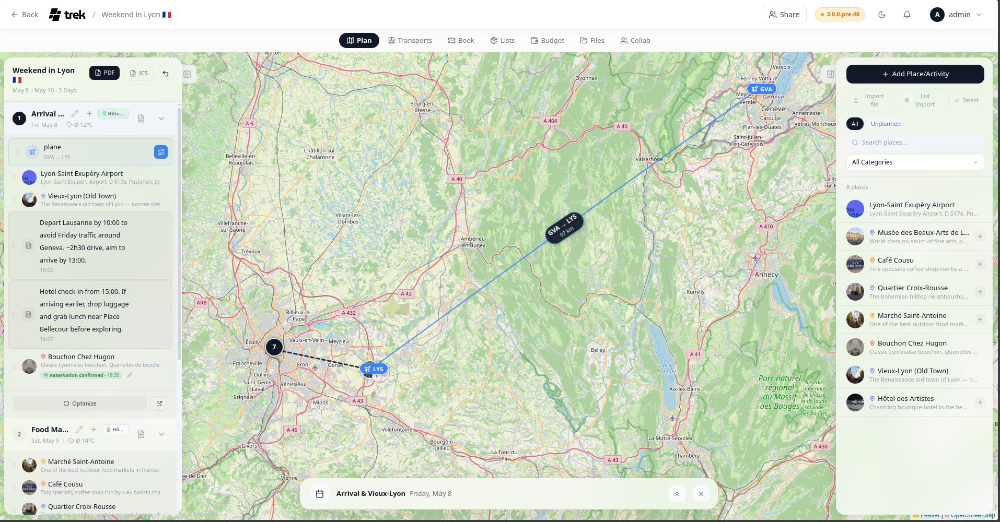

# Map Features

The trip planner map shows your places, route lines, transport overlays, and your current location in real time.

## Map renderer

TREK uses **Leaflet** by default. The renderer is picked in Settings → Map under **Map provider**: **Leaflet** for raster tiles, **MapLibre GL** for OpenFreeMap vector tiles (no token required), or **Mapbox GL** for vector tiles with 3D buildings and terrain, which additionally needs a Mapbox access token. If Mapbox GL is selected but no access token is present, TREK falls back to Leaflet automatically so the map is never blank.

The scopes required for Mapbox GL are:
- STYLES:TILES
- STYLES:READ
- FONTS:READ
- DATASETS:READ
- VISION:READ

## Satellite view

A round button in the bottom-left corner of the Leaflet map flips the base layer between the normal map tiles and **satellite** imagery (ESRI World Imagery — no API key needed, usable up to zoom 19). The icon always shows the layer it switches to. Your choice is stored on your account (`map_base_layer`), so it carries over to every trip and survives a reload. Markers, route lines, tracks and booking overlays are drawn on top of either layer.

## Place markers

Each place is shown as a circular marker:

- **Photo marker** — if the place has a photo (proxied from Google or another provider), that image appears in the circle.
- **Icon marker** — if no photo is available, a category-colored icon is shown instead.
- **Selected place** — the active place has a larger marker.
- **Order badge** — a small badge at the bottom-right of each marker shows the order number(s) of that place within the day's itinerary. If the place appears on multiple days, all order positions are shown separated by `·`.

When zoomed out, nearby markers are grouped into clusters. Clicking a cluster zooms the map to fit its members; at maximum zoom the cluster spiderfies to show individual markers.

## Route lines

A day's route is drawn as a solid blue line — a bright core over a darker casing, the look Apple Maps uses — through that day's stops in the order you arranged them. It is not on automatically: switch it on with the **Route** toggle on the day, in the day-plan sidebar on desktop or in the day sheet on mobile. The choice is remembered per trip in your browser, and the mobile map turns it on by default the first time you open a trip you have not decided on.

A straight line is drawn immediately, then upgraded to real road geometry from a public OSRM router (or from a plugin route profile), each leg routed in the transport mode that leg carries. If routing fails, that leg stays a straight line between the two stops.

## GPX tracks

Tracks and routes imported from a `.gpx`, `.kml`, or `.kmz` file are drawn as lines on the map. Each track imported into a trip is given its own colour automatically, so several walks in the same area stay distinguishable without any setup.

To change a track's colour, open the place and use the **Track color** row: pick one of the presets, choose your own with the colour picker, or hit the dashed cell to go back to the automatic colour — the category colour if the place has one, otherwise the default blue.

Any track that carries a colour — assigned at import or picked by you — is drawn with a thin white casing so it stays readable on satellite imagery and dark basemaps. Tracks imported before this version keep their previous look until you give them a colour.

Clicking a line on the map selects that track and opens its details — useful when the start markers are still clustered together. In the places list, each track shows a short stroke in the colour it is drawn in, which is how you tell which line belongs to which entry.

### Exporting a trip as GPX

The **Export** button in the day sidebar's toolbar opens one dialog with every way a trip leaves TREK: the day plan as a PDF, the bookings as a calendar, and under **Maps & GPS · GPX** the trip as a `.gpx` file for offline maps such as Organic Maps, for a handheld GPS, or for any other tool that reads the format. On a phone the same downloads sit in the trip's **Export** sheet, under "More".

Three scopes:

- **Whole trip** — every place as a waypoint, every imported track as a track, and every planned day as a route.
- **Places only** — the same without the day routes, for when you just want the pins on an offline map.
- **Days as routes** — only the planned days, each one a route through its stops in the order you arranged them. This is the one that puts a day's plan on a device you can follow.

Places carry their description and address, and their category travels along as the GPX symbol, so devices that support it can show a different icon per kind of stop. Elevation is written back for tracks that were imported with it. Exporting is a read, so every trip member can do it, not only those who may edit.

## Travel times between stops

Travel times are not drawn on the map — they sit in the day plan. Switch a day's route on and a slim connector row appears between each pair of consecutive stops with that leg's travel time and distance, and an icon for the mode it was routed in: a car for driving, a foot for walking, a bolt for a plugin route profile. On a phone the same rows sit in the day's plan timeline, where they are always shown and need no toggle. If the day has an accommodation and "optimize from accommodation" is on, two extra connectors bookend the day, naming the hotel with the drive out in the morning and back in the evening.

Each leg carries its own mode, so a day routed by car can still have one leg you walk. If you may edit the day, clicking a connector opens the transport-mode menu for that leg alone.

Car and foot times come from a public OSRM router, so they follow real roads and footpaths instead of straight-line estimates. A plugin route profile is answered by the plugin's own route provider instead, which is what lets it fold in things like charging stops; those legs can add a short note next to the distance. When routing is unavailable the leg falls back to a straight line and shows no time.

## Reservation and transport overlay

Flights, trains, cars, and cruises can be drawn as overlays between their endpoint places. Overlays are **off by default** — activate each reservation individually by clicking the small **Route** icon next to the booking row in the day sidebar, or use one of the bulk options below (automated public-transit journeys are the exception — see the transit bullet). The selection is remembered per trip in your browser. Click the icon again to hide it.

- **Flights, cruises and ferries** — geodesic great-circle arcs
- **Cars, buses, taxis and bicycles** — real routed lines that follow actual roads, fetched on demand from a public OSRM router (driving for car/bus/taxi, cycling for bicycle). A straight line is shown while the route loads and kept if routing fails or the trip is very long (~2000 km+)
- **Trains** — a straight line between the endpoints; a multi-leg train draws its whole station chain (from → stop → to)
- **Automated public transit** — a journey added from the transit search draws its real rail and bus alignment instead of a straight line: each ride leg in its line's own colour over a white casing, walking transfers as a dotted grey line. A journey whose provider sent no shape falls back to a straight line. Unlike every other type it has no per-booking **Route** icon in the day sidebar — it is drawn when the day's own **Route** toggle is on and the journey runs on that day, and independently of that by the bulk button, the account-wide default, or the **On map** button in the journey's detail sheet on a phone. Because those are two separate gates, **hide all** does not clear a transit journey while that day's **Route** toggle is still on
- **Antimeridian crossings** — routes that cross the date line now draw as one continuous arc instead of splitting into disconnected segments at the map edges
- **Endpoint markers** — pill-shaped labels with the transport icon and the endpoint code (e.g. IATA airport code) or location name
- **Confirmed reservations** — solid line; **Pending** — dashed line

**Bulk options**, alongside the per-booking toggle:

- **Show all / hide all** — a route icon button in the day-plan toolbar (next to Undo/Reorder) flips the whole trip between showing every routable booking and showing none. It is a clean slate rather than a layer on top: whatever you had set with the per-booking **Route** icons is discarded, so pressing it twice leaves you with all routes on or all off, not back where you started. (Automated public-transit journeys have a second gate of their own — see the transit bullet.)
- **Always show booking routes** (Settings → General → Travel & map) — an account-wide default that shows every booking's route automatically on any trip you haven't touched before. It sets the *default* only — a trip where you've already used the per-booking toggle or the bulk button keeps its own choice even if you change this setting afterwards.

> **Tip:** Whether endpoint text labels appear on the endpoint markers is your own choice — the **Booking route labels** setting in Settings → General → Travel & map (`map_booking_labels`). It is off by default; with it off, the endpoint markers show only the transport icon.

## Plugin map markers

Installed plugins can add their own markers to the trip map — for example to show bookings on the map (#587). A plugin implements the `mapMarkerProvider` hook and returns marker specs (`id`, `lat`, `lng`, and optional `label`, `popupText`, `url`, `icon`, `tone`); TREK range-checks the coordinates, length-caps the text, allows only http/https/mailto links, and draws them itself. Markers are additive and fail-safe: a plugin never runs code on the map canvas, and one that errors or is slow simply contributes nothing.

Plugins can also draw bounded vector overlays — a computed route, a reachable-range corridor, a zone — via the `mapLayerProvider` hook (polylines, polygons and metric circles, styled with the same tone palette). TREK clamps every styling value, enforces per-plugin vertex budgets, and always draws its own day route on top. Both hooks work on the Leaflet and the Mapbox/MapLibre GL renderer, on desktop and mobile.

> **Plugins:** requires the `hook:map-marker-provider` permission (markers) or `hook:map-layer-provider` (overlays). See [Plugin-Development](Plugin-Development) for the hook contracts.

## Location button

The location button sits in the bottom-right corner of the map on mobile devices and cycles through three states:

| State | Icon | Behavior |
|---|---|---|
| Off | Outline locate | Location not tracked |
| Show | Solid blue locate | Your position is shown as a dot |
| Follow | Solid blue arrow | Map re-centers as you move |

If geolocation is denied or unavailable, the button turns red.

## Right-click / middle-click to create a place

Right-click anywhere on the **Leaflet** map to open the Place form with the clicked coordinates and a reverse-geocoded address already filled in.

The **Mapbox GL** and **MapLibre GL** maps take the same right-click, and additionally **middle-click** and a **long-press** on touch. A right-button drag that rotates or pitches the map is not mistaken for a click, so the gesture and the shortcut coexist.

**See also:** [Places-and-Search](Places-and-Search) · [Day-Plans-and-Notes](Day-Plans-and-Notes) · [Route-Optimization](Route-Optimization) · [Map-Settings](Map-Settings) · [Reservations-and-Bookings](Reservations-and-Bookings)
