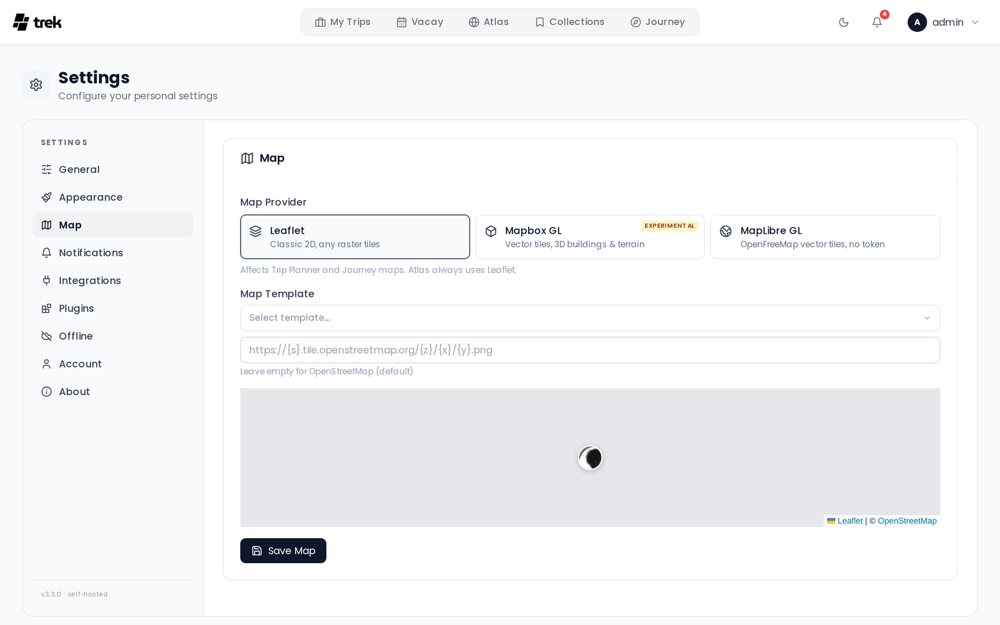

# Map Settings

The Map tab controls which map engine and tile source TREK uses in the Trip Planner and Journey maps.

> **Note:** The Atlas view always uses Leaflet regardless of this setting.

## Where to find it

Open the user menu in the top navigation bar, select **Settings**, then the **Map** tab. Unlike the General tab, changes here are not saved as you make them — click **Save Map** when you are done.

## Map provider

Choose the rendering engine:

| Provider | Description |
|----------|-------------|
| **Leaflet** | Classic 2D renderer. Works with any raster tile URL. No token. |
| **Mapbox GL** *(Experimental)* | Vector tiles with 3D buildings and terrain support. **Requires a Mapbox access token.** |
| **MapLibre GL** | Vector tiles from **OpenFreeMap**. **No access token required** — this is the reason to pick it over Mapbox GL. |

Each GL provider stores its style in its own slot (`mapbox_style` for Mapbox GL, `maplibre_style` for MapLibre GL), so switching providers never clobbers the other one's style.

## Leaflet — tile source

When Leaflet is selected, pick a preset or enter a custom tile URL.

**Built-in presets:**

| Name | URL |
|------|-----|
| OpenStreetMap | `https://tile.openstreetmap.org/{z}/{x}/{y}.png` |
| OpenStreetMap DE | `https://tile.openstreetmap.de/{z}/{x}/{y}.png` |
| OpenFreeMap Positron | `https://tiles.openfreemap.org/styles/positron` |
| OpenFreeMap Bright | `https://tiles.openfreemap.org/styles/bright` |
| CartoDB Light (needs a key) | `https://{s}.basemaps.cartocdn.com/light_all/{z}/{x}/{y}{r}.png` |
| CartoDB Dark (needs a key) | `https://{s}.basemaps.cartocdn.com/dark_all/{z}/{x}/{y}{r}.png` |
| Stadia Smooth | `https://tiles.stadiamaps.com/tiles/alidade_smooth/{z}/{x}/{y}{r}.png` |

**OpenFreeMap Positron is the default** and is what every map falls back to when the field is empty. It needs no key,
no account and has no request limit, and it is a MapLibre *style* rather than an XYZ template — TREK renders it with
MapLibre inside the Leaflet map, so markers, routes and clusters behave exactly as before.

You can also type any XYZ tile URL, or the URL of any MapLibre style document, directly into the text field.

> **Admin:** The admin can set a default map tile URL for all new users via the **User Defaults** tab in the Admin Panel. See [Admin-Panel-Overview](Admin-Panel-Overview).

## CARTO API key

Since 26 August 2026 CARTO stamps an **API KEY REQUIRED** watermark onto every basemap tile fetched without a key, so
both CartoDB presets need one. This is why CARTO is no longer the default; you only need this section if you
deliberately want the CartoDB look back. The key is free and no CARTO account is required: request it at
[carto.com/basemaps/apikey](https://carto.com/basemaps/apikey/) with an email address, the domain you run TREK on and
a one-line description of your project. It arrives by mail, there is no approval queue. The free allowance is 5
million tile requests per calendar month.

Paste it into **CARTO API key** in Settings, Map. TREK appends it as `?key=...` to every CARTO tile request, which
covers the Trip Planner, Journey maps, Collections, Atlas, Studio and the offline tile download in one go. The key is
never stored inside the tile URL itself, so switching keys later does not break a saved template.

> **Admin:** **User Defaults** in the Admin Panel has the same field as **Shared CARTO key**. It applies to every user
> who has not entered one of their own, which clears the watermark for the whole instance at once. It is stored
> encrypted at rest.

Other providers are unaffected, and a keyless CARTO template is treated as "not configured" so the map falls back to
OpenFreeMap instead of drawing watermarked tiles. Save a key and your template is kept as you entered it.

Offline pre-download works on OpenFreeMap and on CARTO. It does not work on the OpenStreetMap presets, whose tile
servers do not permit bulk downloading.

## Mapbox GL — access token and style

Enter your **public token** (`pk.*`) from [mapbox.com → Access tokens](https://console.mapbox.com/account/access-tokens/).

Required scopes are:
- STYLES:TILES
- STYLES:READ
- FONTS:READ
- DATASETS:READ
- VISION:READ

If Mapbox GL is selected but no token is saved, TREK falls back to the Leaflet renderer, so the Trip Planner and Journey maps keep working. Only the preview on this settings page stays blank, with the note *Enter a Mapbox access token to preview*.

**Built-in style presets:**

| Style | Tags |
|-------|------|
| Mapbox Standard | 3D, Apple-like |
| Standard Satellite | 3D, Satellite |
| Streets | 3D, Classic |
| Outdoors | 3D, Terrain |
| Light | 3D, Minimal |
| Dark | 3D, Dark |
| Satellite | 3D, Satellite |
| Satellite Streets | 3D, Satellite |
| Navigation Day | 3D, Apple-like |
| Navigation Night | 3D, Dark |

You can also enter a custom `mapbox://styles/USER/ID` URL directly.

### 3D Buildings & Terrain

Enables pitch and 3D buildings on all styles. `Mapbox Standard` and `Standard Satellite` ship their own building volumes, so TREK adds no extrusion layer there; every other style gets one injected. Terrain elevation (DEM-based height) is additionally applied on `Satellite`, `Satellite Streets` and `Outdoors`; `Standard Satellite` brings its own terrain from Mapbox and is left alone. The remaining styles get buildings but no terrain — including plain `Mapbox Standard`, whose built-in terrain TREK switches off — because the elevation data would cause route lines to visually drift away from the HTML place markers.

### High Quality Mode *(Experimental)*

Enables antialiasing and globe projection for sharper edges. May impact performance on lower-end devices.

## MapLibre GL — style

MapLibre GL renders OpenFreeMap vector tiles and needs **no token at all**, so there is no token field on this provider — just a style.

**Built-in style presets:**

| Style | URL |
|-------|-----|
| OpenFreeMap Liberty *(default)* | `https://tiles.openfreemap.org/styles/liberty` |
| OpenFreeMap Bright | `https://tiles.openfreemap.org/styles/bright` |
| OpenFreeMap Positron | `https://tiles.openfreemap.org/styles/positron` |

You can also type any `https://tiles.openfreemap.org/…` style URL. A style that is not an OpenFreeMap URL is rejected and replaced with Liberty when you save.

The **3D Buildings & Terrain** and **High Quality Mode** toggles are Mapbox-only and are not shown for MapLibre GL.

## Where a map opens

There is **no** default map center or zoom setting — it was removed in v3.4.0. Instead, every map works out its own opening camera from the places it is about to draw, so a trip in Japan opens on Japan instead of starting on the world view and then flying across the planet.

For each trip map — Trip Planner, Collections and shared-trip links — TREK takes the coordinates it is given and computes the center and zoom that frame them all (the Journey maps frame themselves with the renderer's own `fitBounds`, capped at zoom 16 on both engines):

- **Several places** — the camera fits their bounding box. The zoom is capped (16 on Leaflet, 15 on the GL renderers) so a tight cluster does not open absurdly far in, and the center is taken in projected (Mercator) space rather than as an average of the latitudes, so the northernmost place does not fall out of frame.
- **A single place** (or several stacked on the same spot) — there is no extent to fit, so it opens at city level: zoom 12 on Leaflet, 11 on the GL renderers.
- **Places spanning the date line** — MapLibre GL and Mapbox GL wrap the world, so a trip covering Fiji and Samoa is framed as the 10°-wide arc it really is. Leaflet does not wrap, so it takes the plain west-to-east span instead.
- **Side panels** — chrome overlaying the map shifts the center, so the places stay inside the part of the map you can actually see.
- **No usable coordinates** — a brand-new trip with nothing placed yet has nothing to frame, so the map falls back to a world view (center `0, 0` at zoom 2).

The small map preview on this settings page is the exception: it stays on a fixed city (Paris) — zoom 16 on the two GL previews, city-level zoom 12 under Leaflet — so you can judge label density, 3D buildings and satellite texture. It is not a setting and no real map opens there.

## See also

- [Map-Features](Map-Features)
- [Admin-Panel-Overview](Admin-Panel-Overview)
- [User-Settings](User-Settings)
