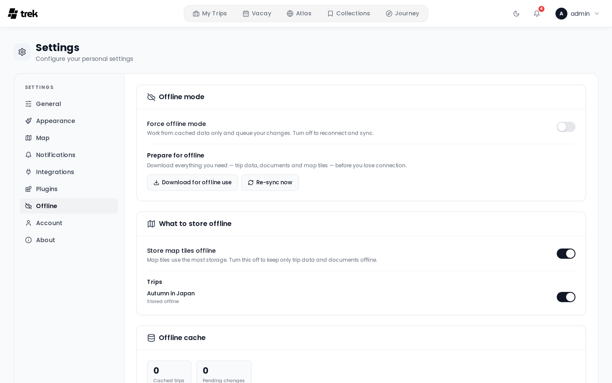

# Offline Mode and PWA

TREK can be installed as a Progressive Web App (PWA) and used without an internet connection for previously synced trips.

## Install as an app (PWA)

TREK must be served over **HTTPS** — the install prompt does not appear on plain HTTP.

**iOS (Safari):**
1. Open TREK in Safari.
2. Tap the Share button.
3. Select **Add to Home Screen**.

**Android (Chrome / Edge):**
1. Open TREK in the browser.
2. Tap the browser menu.
3. Select **Install app** or **Add to Home Screen**.

Once installed, TREK launches in **standalone** mode (fullscreen, no browser UI) using the TREK icon.

The installed app starts at the app root, so the **Start page** setting decides what you see when you tap the icon — the dashboard, or straight into your active trip on a tab of your choice. See [Display-Settings](Display-Settings).

## What works offline

TREK uses Workbox service-worker caching plus an IndexedDB database (Dexie) for structured trip data. The following content is available offline after the first sync:

**Service-worker cache (Workbox)**

| Content | Cache name | Strategy | Duration | Max entries |
|---------|------------|----------|----------|-------------|
| Raster map tiles (OpenStreetMap, CartoDB, custom XYZ) | `map-tiles` | CacheFirst | 30 days | 12 288 |
| Mapbox GL and OpenFreeMap style documents | `gl-map-styles` | NetworkFirst (5 s timeout) | 30 days | 20 |
| Mapbox GL glyphs, sprites and vector tiles | `mapbox-tiles` | StaleWhileRevalidate | 30 days | 3 000 |
| OpenFreeMap glyphs, sprites and vector tiles | `gl-map-offline` | CacheFirst | 90 days | 6 000 |
| Cover images and avatars (`/uploads/covers`, `/uploads/avatars`) | `user-uploads` | CacheFirst | 7 days | 300 |
| App shell and every page of the app (HTML / JS / CSS) | precache | Precached | Until next deploy | — |

> **Note:** API responses are **never** stored in the service-worker cache. Workbox keys its entries by URL and cannot vary them on the session cookie, so on a shared device one account's cached data could be served to the next. Offline reads come from the per-user IndexedDB cache described below instead.

> **Note:** The precache covers every page, not just the one you happen to open first. A page you have never visited still works after you lose connectivity — at the cost of a larger initial install.

**IndexedDB (Dexie) — structured trip data**

On login, when the browser comes back online, and when you lift **Force offline mode**, TREK runs a background sync that writes full trip bundles into IndexedDB — you can also start one by hand with **Re-sync now**, with **Download for offline use** for a progress-tracked run, or by re-enabling a trip's offline toggle:

- Trips, days, places, packing items, to-dos, budget items, reservations, accommodations, trip members, tags, and categories.
- File attachments that are neither photos nor videos (PDFs, documents, etc.) are downloaded and stored as blobs in IndexedDB. Videos are deliberately skipped — a single clip can be hundreds of megabytes and would evict the trip's real documents.
- Map tiles are pre-fetched into the service-worker `map-tiles` cache for zoom levels 10–16 across each trip's bounding box, stopping at the zoom level that would push the total past 12 288 tiles (roughly 180 MB).

> **Note:** A WebSocket reconnect does *not* run this sync. It replays your queued changes and then re-reads the trip you currently have open — days, places, packing items, to-dos, budget items, reservations and files — which refreshes that one trip's cached rows. It never re-downloads the bundles for your other trips, the file blobs or the map tiles; skipping the full sync there is deliberate, so a dropped socket on an otherwise online device doesn't run into the server's rate limiter.

**Sync scope and eviction**

- Only ongoing and future trips are cached (trips whose `end_date` is today or later, or has no end date).
- Trips that ended more than 7 days ago are automatically evicted from IndexedDB on the next sync.

## Settings → Offline

The **Offline** tab gives you control over what is stored on this device and lets you go offline deliberately.

### Offline mode

- **Force offline mode** — a switch that first downloads everything you need (see *Prepare for offline* below) and then routes the whole app to the local cache, queueing every change you make. Flip it back off to reconnect: queued changes are replayed and the cache is refreshed. The override is remembered across app restarts, so a session forced offline before a flight stays offline when the PWA relaunches.
- **Prepare for offline** → **Download for offline use** — a one-tap, progress-tracked download of trip data, documents and map tiles for every trip you keep offline. Unlike a background sync it *waits* for the downloads to finish, so the completion state means you really have everything.
- **Re-sync now** — refreshes the cache from the server. Disabled while offline.

### What to store offline

- **Store map tiles offline** — map tiles use the most storage by far. Turn this off to keep only trip data and documents on the device; the pre-downloaded tile cache is cleared immediately.
- **Per-trip toggle** — each trip has its own on/off switch. Turning a trip off evicts its cached read data from the device (your unsynced edits are kept and still sync).

### Sync conflicts

If a change you made offline collides with a newer change on the server, it is surfaced as a **conflict** instead of silently overwriting anything. The conflict list lets you **keep mine** or **keep theirs** per item. A default rule (*Ask me each time* / *Always keep my version* / *Always keep the server version*) is configurable under **When a conflict happens**. Conflict detection covers places and packing items.

### Stats & cache

The stats panel shows cached trips, pending changes, conflicts and failed changes. **Clear cache** removes all offline data from IndexedDB (you can re-sync any time while online). Each cached trip entry shows its date range, place/file count and last successful sync.

## Limitations

- Offline **editing** is supported for places and packing items (with conflict detection). Other entities — budget, to-dos, reservations, days — require connectivity to edit; while forced offline those edits still go to the live server when a connection is actually present.
- A change you made offline that **deletes** an item wins over a concurrent server edit of that same item ("delete wins"); only edit-vs-edit conflicts are surfaced for resolution.
- The conflict token has one-second resolution, so two edits to the same field within the same second can't be told apart and fall back to last-write-wins (only relevant to sub-second races; normal offline windows are unaffected).
- Creating a trip requires connectivity. Trip creation is not queued, so a new trip cannot be started while offline.
- Photo uploads require connectivity. Photo and video attachments are not pre-cached; every other file attachment is pre-cached automatically during sync.
- Real-time collaboration features require an active WebSocket connection.
- The Leaflet basemap is pre-downloaded, whether it is an OpenFreeMap vector style (style, sprite, glyphs and the vector tiles for the trip's area) or a raster template. Mapbox GL tiles are not pre-downloaded. With map-tile storage off, individually viewed tiles may still be cached opportunistically by the service worker.

## See also

- [User-Settings](User-Settings)
- [Display-Settings](Display-Settings)
