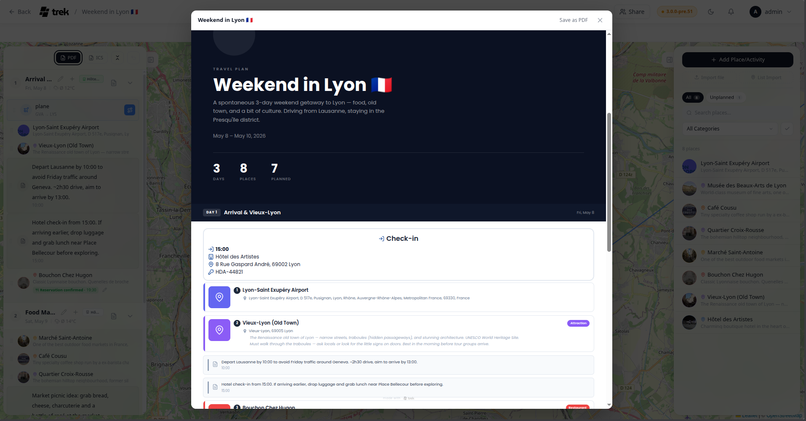

# PDF Export

TREK generates a structured **Trip Plan PDF** from your trip data. It renders as HTML in a sandboxed iframe and opens the browser's native print/save dialog — no server-side processing is involved. Journey entries no longer go through a fixed PDF template: they are laid out in **TREK Studio** and printed through the same browser mechanism (see below).

---

## Trip Plan PDF

### How to generate

Open the Day Plan sidebar in the trip planner and click the **Export** button in the toolbar at the top of the sidebar. The Export dialog opens with three groups — **Document**, **Calendar**, and **Maps & GPS**. Pick the PDF row under **Document**: a preview modal opens, and **Save as PDF** hands the document to your browser's print dialog.

### Cover page

- Faded cover image as background (if the trip has one), with the same image in a circular badge
- Trip title and description
- Date range (first day to last day)
- Stat tiles:
  - **Days** — total number of days in the trip
  - **Places** — total places in your trip's place list
  - **Planned** — number of unique places assigned to at least one day
  - **Cost** — sum of all assigned place prices, shown in the trip's currency (hidden if zero). Mixed currencies are converted at current rates and prefixed with "≈"; when a rate is missing, the tile shows a per-currency breakdown instead

### Per-day pages

Each day starts on a new page (unless you turn off **Page break per day**) with a dark header bar showing the day number, day title, date, and the day's estimated cost.

The **Page break per day** toggle sits in the preview modal's header, next to Save as PDF. It is on by default; turn it off and the days flow into each other instead, which is worth doing on a trip of short days that would otherwise print one sheet per handful of lines. The choice is remembered in that browser for the next export.

Below the header:

- **Accommodation block** (if an accommodation covers that day): action label (Check-in on the first day, Check-out on the last day, or Accommodation for intermediate days), time, place name, address, notes, and confirmation code (only shown on the check-in day)
- **Timeline items** sorted by their order in the day plan:
  - **Places** — thumbnail (or a colored category icon if no image is available), numbered badge, name, category label, address, description, time, price, and notes
  - **Notes** — icon, text, and optional time
  - **Reservations** — type icon, title, time, type-specific metadata (e.g. airline + flight number + route for flights; train number + platform + seat for trains; party size for restaurants; venue for events; operator for tours), location, and confirmation code

### Footer

Every printed page carries a small "made with TREK" logo at the bottom.

### Font

Poppins, loaded from Google Fonts at render time.

### Plugin sections

Installed plugins can append their own sections to the Trip Plan PDF via the `pdfSectionProvider` hook. A plugin returns plain text — a title, paragraphs, and an optional simple table (headers plus rows) — and TREK escapes and lays it out itself. Sections are text-only and additive: a plugin never renders into the document, and one that errors or is slow contributes nothing.

> **Plugins:** requires the `hook:pdf-section-provider` permission. See [Plugin-Development](Plugin-Development) for the hook contract.

---

## Journey photo books

The Travel Journal has no fixed-template PDF export any more. Open a Journey entry and click **Studio** in the journal header (the book icon in the top bar on phones) to open **TREK Studio**, the photo-book designer.

Studio lays the journey out as editable spreads instead of a fixed page template: five page presets (210 mm and 300 mm square, A4 landscape, A4 portrait, A5 landscape) or a custom size between 60 and 500 mm, and seven bundled font families.

Printing works the same way as the Trip Plan PDF — the sheets are written into a sandboxed `srcdoc` iframe and handed to the browser's print dialog, so nothing is rendered on the server. A browser writes no TrimBox or BleedBox, so the sheets can carry crop marks for a print shop instead. **Single pages** or **Spreads**, and crop marks on or off, are chosen in Studio's export panel.

---

## How rendering works

The Trip Plan PDF and Studio's print view use the same mechanism: the HTML document is written into a sandboxed `<iframe>` via `srcdoc`, and `iframe.contentWindow.print()` opens the browser's print dialog. There is no server-side PDF generation. The file is saved through the browser's built-in "Save as PDF" print destination.

---

## See also

- [Day-Plans-and-Notes](Day-Plans-and-Notes)
- [Journey-Journal](Journey-Journal)
- [Trip-Planner-Overview](Trip-Planner-Overview)
