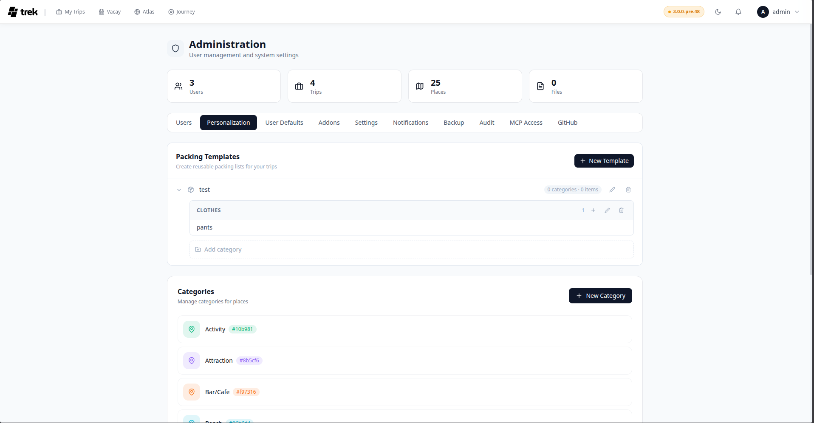

# Packing Templates

Reuse packing lists across trips using pre-built templates.

## Applying a template

In the Packing Lists panel, click the **Apply Template** button (shown with a package icon in the toolbar). A dropdown lists all available templates, each showing its name and item count. Click a template to apply it.

Applying a template copies all categories and items from the template into the current trip's packing list — existing items are not removed. Items are inserted with the same category names as defined in the template, so they appear alongside any existing items that share the same category name.

Requires the `packing_edit` permission.

On the desktop planner the **Apply Template** button appears as soon as at least one template exists — it is not permission-gated in the UI. A member without `packing_edit` still sees it; the server refuses the apply with `403 No permission` and the app shows a *Failed to apply template* toast. On mobile the packing tab does gate it: the action menu that holds Apply Template only opens for members who have `packing_edit`.

## Saving the current list as a template

In the packing panel toolbar, click the **Save as template** button (folder-plus icon) when items exist in the list. An inline name input appears in the toolbar — type a name and press **Enter** or click the confirm button. The template captures the **Shared** pool plus your own items — other members' Personal items, and the items they shared with specific people, are deliberately left out. Only each item's name and category are stored; quantities, weights, bag assignments and checked state are not.

The Save as Template button only appears when there are items in the list, you have the `packing_edit` permission, and you are an instance admin. Non-admins can apply templates but not create them; the API answers a non-admin with `403 Admin access required`.

> **Admin:** Templates are created and managed in [Admin-Packing-Templates](Admin-Packing-Templates). Each template has a three-level structure: template → categories → items.

## See also

- [Packing-Lists](Packing-Lists)
- [Admin-Packing-Templates](Admin-Packing-Templates)
