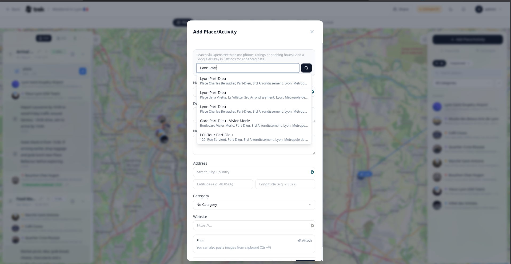

# Places and Search

Places are the building blocks of your trip. You can add them by searching, pasting a URL, entering coordinates, or importing a file.

## Adding a place

Click **+ Add Place** at the top of the Places sidebar to open the Place form. You can also **right-click anywhere on the map** to create a place at that exact location — the address is reverse-geocoded and pre-filled automatically.

## Searching for a place

Type in the search box at the top of the form. After 2 or more characters, with a 300 ms debounce, suggestions appear in a dropdown.

- Use **↑ / ↓** to navigate results, **Enter** to select, **Esc** to dismiss.
- Search results are biased toward the geographic center of your existing trip places. When those places span more than ~500 km, the bias is skipped.

### With a Google Maps API key

> **Admin:** The Google Maps API key is instance-wide, set in **Admin → Settings → API Keys**. It is stored encrypted at rest and used for every member of the instance; on managed instances the operator supplies it and the panel is hidden.

When a key is present, the autocomplete uses the Google Places API, which can return ratings, opening hours, photos, and phone numbers from Google's database.

> **API key restrictions:** TREK calls the Google Places API from the server, not the browser. If you apply **HTTP referrers** restrictions to your key in Google Cloud Console, you must also set `APP_URL` in your environment — TREK sends it as the `Referer` header on every outbound Google API request. Without it, Google will reject all server-side calls with `REQUEST_DENIED`. For server-side deployments, **IP address** restrictions are simpler and require no extra configuration. See [Troubleshooting](Troubleshooting) if photos are missing after adding a key.

### Without a Google Maps API key

TREK falls back to OpenStreetMap (Nominatim) automatically — no API key needed. A notice appears above the search box — *Using OpenStreetMap. A Google API key adds ratings and opening hours.* Results include name, address, and coordinates.

## Place details while searching

On desktop the Place form carries a **Place details** column to the left of the form. Pick a search result and it fills in on its own — no extra click, and nothing changes about the usual add-a-place flow of searching, picking and saving. If you already know the place, ignore the column and save as before.

The column shows:

- **Pictures** near or of the place. Click one to make it that place's thumbnail; click it again to clear the choice. The picture then appears everywhere the place does — list, map marker, itinerary, PDF export and shared trips — exactly like a [custom place image](#custom-place-image).
- **A description**, when one is available. It is *not* written into the place automatically. Use **Use this text** to copy it into the description field; the button is disabled while you already have a description of your own, so nothing you wrote gets overwritten.

One credit line sits under the picture grid, and it belongs to the picture in play: the tile you are hovering, or failing that the one you picked, or the first picture before you have done either. It names the author, links that name to the source page, and adds the licence with a link to its terms. The other tiles carry author and licence as a tooltip only, without the links. Google's pictures get an author line and nothing else, because Google grants no reusable licence for them. Most Wikimedia Commons pictures are CC BY or CC BY-SA, which means the credit has to travel with the picture, so once you pick one, the credit stays visible under the thumbnail in the place's detail panel too.

### Where the information comes from

Wikipedia and OpenStreetMap are always used and need no configuration:

- Pictures from **Wikimedia Commons**, resolved from the place's own tags first — the Wikidata image, the lead image of its Wikipedia article, its Commons category — and falling back to a search by coordinate only when those turn up too few.
- Descriptions from the OpenStreetMap `description` tag, or from the Wikipedia article the place is tagged with. TREK resolves the article from that tag rather than guessing it from the name, so an ambiguous name never pulls in the wrong article. A place with no such tag simply gets no description.

With a Google Maps API key, and only if the matching admin switches are on, up to three **Google Places** photos and Google's editorial summary are added on top.

Pictures are copied to your own server and served from there — nothing is loaded directly from Google or Wikimedia while you browse, so no visitor's address leaves your instance.

> **Admin:** the column is controlled by **Place Enrichment** in Admin → Settings → API Keys, and it is on by default. The Google half additionally follows **Place Photos** and **Place Details**. Turning Place Enrichment off leaves the column with a short note and makes no outbound calls.

The column is desktop-only; the mobile place sheet is unchanged.

## Pasting a Google Maps URL

Paste a `maps.app.goo.gl/…`, `goo.gl/maps/…`, or `maps.google.*/…` URL directly into the search box and press the search button. TREK resolves it server-side and populates the name, address, and coordinates.

## Entering coordinates manually

**Paste** a `lat, lng` pair (e.g. `48.8566, 2.3522`) into the **Latitude** field — comma, semicolon or space separated. TREK detects the pair and fills both coordinate fields at once. This works on paste only: the coordinate fields accept digits, a decimal point and a leading minus, so typing a pair by hand drops the separator and leaves a single invalid number (`48.85662.3522`) behind. Type the two values into their own fields instead.

## Place fields

<!-- TODO: screenshot: Place form with all fields visible -->

| Field | Notes |
|---|---|
| Name | Required |
| Description | Free text |
| Notes | Free text, max 2 000 characters |
| Address | Free text |
| Latitude / Longitude | Decimal degrees |
| Category | Pick an existing category or type a new name to create one inline (default color `#6366f1`, icon `MapPin`) |
| Start time / End time | Shown only when editing an existing place |
| Website | URL |
| File attachments | Click the Paperclip icon to attach a file, or paste an image or PDF from the clipboard. The Paperclip takes anything on the instance's **Allowed File Types** list — by default jpg, jpeg, png, gif, webp, heic, pdf, doc, docx, xls, xlsx, txt, csv, pkpass, pkpasses, md and markdown — plus video, which is exempt from that list. See [Documents-and-Files](Documents-and-Files) |

Two inline warnings are shown when editing times: one if the end time is set to a value before or equal to the start time, and one if the times overlap with another place already assigned to the same day.

## Costs for a place

With the [Costs/Budget addon](Budget-Tracking) enabled, the place form carries the same **Costs** block that bookings and transports have. **Create expense** saves the place and then opens the Costs editor for a new expense linked to it — the museum ticket, the guided tour, the entry fee. Once linked, the block shows that expense with edit and remove actions.

The expense belongs to the **place**, not to a day. Putting the same place on several days does not multiply it: you bought the ticket once. If you really pay each time, add a second expense from the Costs tab.

Deleting the place deletes its linked expense too, the same way deleting a booking does.

## Custom place image

By default a place's thumbnail is fetched automatically (from Google/OpenStreetMap when the place was imported or matched, otherwise a category icon). To use your own photo instead, open the place's detail panel and click its round thumbnail — pick an image and it becomes that place's thumbnail everywhere (list, map marker, itinerary, PDF export and shared trips). A small remove button on the thumbnail clears the custom image and restores the automatic default. Accepted formats are JPG, PNG, GIF and WebP (HEIC is converted automatically), up to 20 MB.

The same control is available on saved places in [Collections](Collections#place-detail).

## Importing multiple places

Drag a `.gpx`, `.kml`, or `.kmz` file onto the Places sidebar to import all waypoints or features at once. You can also import a saved-list share URL using the **Import list** button in the sidebar header — both Google Maps and Naver Maps list URLs are supported.

Imported tracks each get their own line colour so multiple routes stay apart on the map; you can override it per track from the place details. See [Map Features](Map-Features) for the details.

Importing the same list again does not duplicate what is already in the trip. A place is recognised by the provider id it was imported with (Google place id, Google feature id, or OSM id) before its name or its coordinates are considered, so renaming a place in TREK — or moving its pin — does not make it come back as a second copy on the next import.

> **Admin:** The Google Maps API key is set instance-wide in **Admin → Settings → API Keys**. Without it, OSM search is used automatically.

**See also:** [Day-Plans-and-Notes](Day-Plans-and-Notes) · [Map-Features](Map-Features) · [Tags-and-Categories](Tags-and-Categories)
