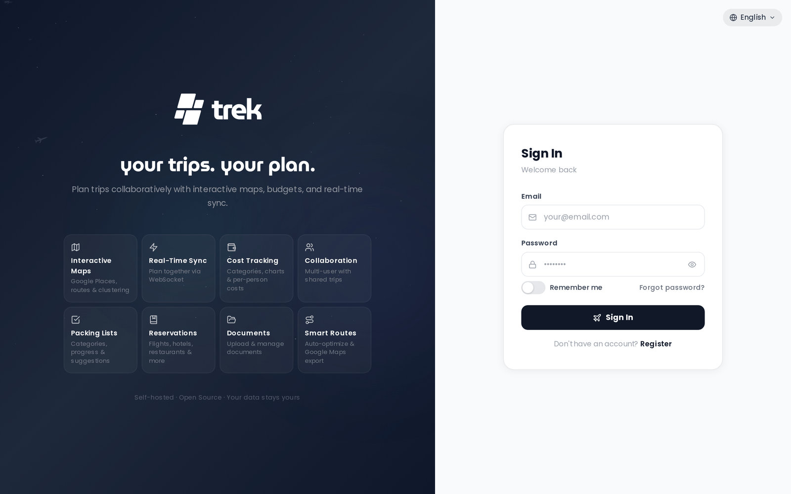

# Quick Start

Get TREK running in under five minutes with a single Docker command.



## Prerequisites

- Docker installed and running on your machine
- Port `3000` available (or choose a different host port)

## Run TREK

Generate an encryption key and start the container in one step:

```bash
docker run -d \
  --name trek \
  -p 3000:3000 \
  -e ENCRYPTION_KEY="$(openssl rand -hex 32)" \
  -v ./data:/app/data \
  -v ./uploads:/app/uploads \
  --restart unless-stopped \
  mauriceboe/trek:latest
```

**Flag breakdown:**

| Flag | Purpose |
|---|---|
| `-d` | Run in the background |
| `-p 3000:3000` | Map container port 3000 to host port 3000 |
| `-e ENCRYPTION_KEY=...` | At-rest encryption key for stored secrets |
| `-v ./data:/app/data` | Persist the database and secrets |
| `-v ./uploads:/app/uploads` | Persist uploaded files |
| `--restart unless-stopped` | Auto-restart on reboot |

**Why the encryption key?** TREK encrypts stored secrets (API keys, MFA seeds, OIDC credentials) using this key. If you skip it, TREK auto-generates one and saves it to `./data/.encryption_key`. Setting it explicitly means you control the key and can back it up separately. The key generated inline above never gets printed, but TREK writes it to `./data/.encryption_key` on first start, so `cat ./data/.encryption_key` gets it back when you want a copy elsewhere.

Generate a standalone key at any time:

```bash
openssl rand -hex 32
```

## Access TREK

Open `http://localhost:3000` in your browser.

## First User

On first boot TREK automatically seeds an admin account before any user registers. The credentials depend on how you start the container:

- **With `ADMIN_EMAIL` and `ADMIN_PASSWORD` env vars set:** those values are used directly.
- **Without those env vars:** TREK creates the account with email `admin@trek.local`, username `admin`, and a randomly generated password. The credentials are printed to the container log — run `docker logs trek` to retrieve them.

You will be prompted to change the password on first login.

> **Admin:** As admin you unlock the Admin Panel — user management, addon toggles, packing templates, backups, and API key configuration.

## Next Steps

- [Install-Docker-Compose](Install-Docker-Compose) — production setup with security hardening
- [Reverse-Proxy](Reverse-Proxy) — put TREK behind HTTPS (required for PWA install and secure cookies)
- [Environment-Variables](Environment-Variables) — full configuration reference
- [Admin-Panel-Overview](Admin-Panel-Overview) — explore what the admin panel can do
