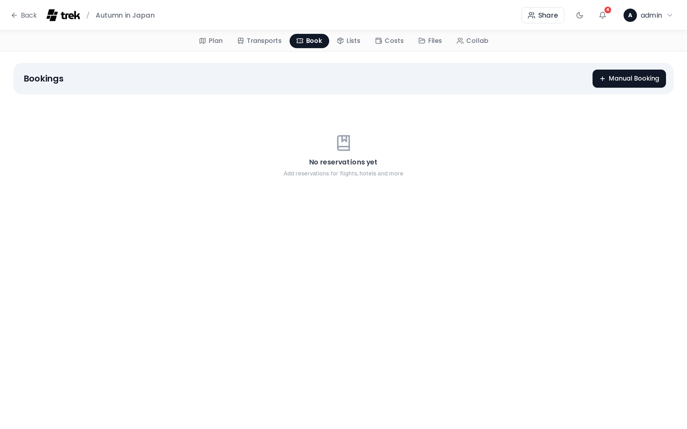

# Reservations & Bookings

Track all your trip bookings — hotels, restaurants, events, tours, and more — in one place.

## Where to find it

Open your trip in the planner and select the **Bookings** tab. The panel lists your hotel, restaurant, event, tour, parking and other bookings grouped by status, with a type filter bar at the top. Transport bookings live on their own **Transports** tab — see [Transport-Flights-Trains-Cars](Transport-Flights-Trains-Cars).

## Reservation types

TREK supports sixteen reservation types, split across the two tabs:

| Type | How to create |
|------|--------------|
| Flight | [Transport modal](Transport-Flights-Trains-Cars) |
| Train | [Transport modal](Transport-Flights-Trains-Cars) |
| Bus | [Transport modal](Transport-Flights-Trains-Cars) |
| Car | [Transport modal](Transport-Flights-Trains-Cars) |
| Taxi | [Transport modal](Transport-Flights-Trains-Cars) |
| Bicycle | [Transport modal](Transport-Flights-Trains-Cars) |
| Cruise | [Transport modal](Transport-Flights-Trains-Cars) |
| Ferry | [Transport modal](Transport-Flights-Trains-Cars) |
| Public transit | [Transport modal](Transport-Flights-Trains-Cars) |
| Other (transport) | [Transport modal](Transport-Flights-Trains-Cars) |
| Accommodation (Hotel) | Add button in Bookings panel — see [Accommodations](Accommodations) |
| Restaurant | Add button in Bookings panel |
| Event | Add button in Bookings panel |
| Tour | Add button in Bookings panel |
| Parking | Add button in Bookings panel — a fixed-location booking (e.g. airport parking) |
| Other | Add button in Bookings panel |

The ten transport types are created through the dedicated Transport modal on the **Transports** tab, where you can enter endpoint and transit-specific fields. The other six are created directly from the Bookings panel, and only those six appear there.

## Pending and Confirmed

Reservations are grouped into two collapsible sections: **Pending** and **Confirmed**. You can collapse or expand each section independently — the open/closed state is saved per trip so it persists across page reloads. Status is set when you create or edit a reservation.

On desktop, a type filter bar lets you show only specific types. Filter selections are kept for the current browser session.

Travelers are set per booking from the trip roster, guests included.

> **AI / MCP:** `set_reservation_travelers` writes that list; it replaces it wholesale and ignores anybody who is not on the trip. See [MCP-Tools-and-Resources](MCP-Tools-and-Resources).

A traveler filter sits next to it — on desktop and mobile — once the trip has more than one member and at least one booking has travelers assigned. Click an avatar to show only that person's bookings; several can be active at once. On desktop the selection is kept for the browser session like the type filter; on mobile it resets when you leave the tab.

## Reservation card contents

Each card displays:

- **Status dot** — green for Confirmed, amber for Pending
- **Type chip** — icon and label for the reservation type
- **Needs review badge** — an amber badge shown on reservations flagged by importers that may need your attention
- **Title** — the reservation name
- **Edit and delete buttons** — visible only if you have edit permission

> **Admin:** Edit and delete buttons are gated by the `reservation_edit` permission. Members without this permission see read-only cards.

- **Date and time range** — start date, and end date/time if set
- **From → To** — origin and destination endpoints, shown for transport types
- **Confirmation code** — displayed in monospace. If you have **Blur booking codes** enabled in Display Settings, the code is blurred by default and revealed on hover or tap
- **Type-specific metadata:**
  - Flights: airline name, flight number
  - Trains: train number, platform, seat
  - Hotels: check-in window, check-out time (see [Accommodations](Accommodations))
- **Location / address** — whenever the booking has one; for a hotel this is the address from its hotel block
- **Linked accommodation** — hotel name, if this reservation is linked to an accommodation record
- **Day-plan assignment** — the day and place this reservation is linked to
- **Link** — the booking URL, opened in a new tab. A link with a scheme TREK refuses to open is shown as plain text instead
- **Notes**
- **Attached files** — shown as clickable download links
- **Travelers** — avatars of the members and guests assigned to this booking, shown only when at least one is assigned

## Creating a reservation

Click **Add** (or the + button) in the Bookings panel. Fill in the form:

1. **Type** — choose Hotel, Restaurant, Event, Tour, Parking, or Other
2. **Title** — required
3. **Link to day-plan assignment** — optional; search across all days and places, grouped by day. Not available for Hotel type
4. **Start date and time** — not shown for Hotel type
5. **End date and time** — not shown for Hotel type
6. **Place / Activity** — optionally link an existing trip place to the booking. Picking one fills in the title and the location only where you left them blank. Not shown for Hotel type, which has its own hotel place picker below
7. **Location / address** — for Hotel type this field sits in the hotel-specific block instead (item 10)
8. **Confirmation code**
9. **Status** — Pending or Confirmed
10. **Hotel-specific fields** — shown only for Hotel type, immediately after status: hotel place, check-in day, check-out day, location / address, check-in time (window start and end), and check-out time. The address is pre-filled from the picked hotel place, and a hand-typed one is kept if that place has none. See [Accommodations](Accommodations)
11. **Link** — an optional booking URL, shown for every type
12. **Notes**
13. **Travelers** — assign trip members and named guests to this booking. Guests appear in the same picker as members
14. **Files** — attach from your device (PDF, Word documents, text files, images) or link an existing trip file. Files added before saving are uploaded automatically after the reservation is created
15. **Costs** — shown only when the Budget addon is enabled. Instead of a price field, the form carries a **Create expense** button: it saves the booking and then opens the Costs editor for a new expense linked to it, so the expense gets a payer, a split and a date like any other. Once linked, the block shows that expense with edit and remove actions. See [Budget-Tracking](Budget-Tracking)

<!-- TODO: screenshot: Create Reservation modal -->

## Import from booking confirmation

TREK can parse booking confirmation emails, PDFs, and pass files and create reservations automatically using [KDE Itinerary](https://apps.kde.org/itinerary/).

### Supported formats

| Format | Extension |
|--------|-----------|
| Booking confirmation email | `.eml` |
| PDF ticket or confirmation | `.pdf` |
| Apple Wallet pass | `.pkpass` |
| HTML confirmation page | `.html`, `.htm` |
| Plain-text email | `.txt` |

Up to 5 files, 10 MB each, per import.

### How to import

1. Open the **Bookings** tab — the same import button also sits in the **Transports** toolbar.
2. Click the **Import from file** (download) button in the toolbar — the button is only shown when the extractor is available on your server or the AI Parsing addon is enabled.
3. Drag and drop your files onto the upload area, or click to browse.
4. The upload dialog closes right away and a **background widget** in the bottom-right corner shows *Parsing files…*, with a running count when you uploaded more than one file. You can keep working in TREK while it parses — the widget follows you to other pages and survives a reload.
5. When parsing finishes, click the widget's **Import** button to start the review. If nothing could be extracted, the widget says so instead and offers **Try AI parsing** on the same files when the AI Parsing addon is enabled.
6. Each detected booking opens **pre-filled in the normal booking (or transport) form**, one after the other, with the file it came from already attached. Nothing is saved until you confirm each one.

Each booking appears in the panel and is broadcast to all connected trip members in real time as you save it.

### What gets created automatically

- **Hotels** — a reservation *and* a linked accommodation row in the day plan (check-in/check-out dates are read from the confirmation).
- **Hotels / Restaurants / Events** — the venue is auto-created as a place with coordinates when the extractor returns location data.
- **All types** — a budget entry is created if the Budget addon is enabled and a price is present.

### When the button is not visible

The **Import from file** button is hidden only when neither the `kitinerary-extractor` binary nor the [AI Parsing addon](AI-Booking-Import) is available. With the AI addon enabled and configured, import works without the binary — every file goes straight to the model. The binary ships inside the official TREK Docker image. If you run TREK from source, install the `libkitinerary-bin` package (Debian trixie / Ubuntu 25.04+) or set `KITINERARY_EXTRACTOR_PATH` to the binary's full path. See [Environment-Variables](Environment-Variables).

### Needs review flag

Items that the extractor could only partially parse are flagged **Needs review** — an amber badge on the card. Review these reservations after import and fill in any missing fields manually.

### AI fallback for hard-to-read files

KDE Itinerary only recognises structured tickets. For confirmations it can't read — plain-text emails, unusual PDF layouts, vendors it doesn't know — TREK can optionally hand the file to an AI model instead. The optional **AI Parsing** addon runs only for the files Itinerary returns nothing for, parses them in the background, and flags every result for review before you save it. It works with a self-hosted local model, so booking data need not leave your server. See **[AI-Booking-Import](AI-Booking-Import)**.

## Import from AirTrail

With the **AirTrail** integration addon enabled and your instance connected under **Settings → Integrations**, the **Transports** toolbar shows an **AirTrail** button. It lists the flights from your AirTrail account — flights inside the trip dates come pre-selected — and imports each one as a flight reservation that stays in sync with AirTrail both ways.

### Connecting flights (layovers)

When selected flights form a connection — each leg departs from the airport the previous one landed at, onward within 24 hours — the picker groups them and offers to **import them as one flight with a layover**. The offer is on by default; untick it to keep separate bookings. A joined booking keeps each leg's own airline, flight number, times and seat, the connection airport becomes a layover **stop** on the route, and each leg files into its own day in the planner. Since a stop is not a destination, the layover country no longer shows up as visited in Atlas.

AirTrail itself has no multi-leg flights, so a joined booking is imported **without live sync**. It keeps the blue **AirTrail** badge — hover it and the tooltip says the layover has no single AirTrail flight to sync back to. The grey *Not synced* badge means something else: that flight was removed in AirTrail. Its source flights stay recognised — the picker will not offer them for import again. The same applies when you add a stop to a synced single flight by hand: the booking detaches from AirTrail instead of syncing a shape AirTrail cannot represent.

## Editing and deleting

Each card has a pencil icon to open the edit form and a trash icon to delete. Deleting requires confirmation in a dialog before the record is removed.

## Real-time sync

Reservation changes (create, update, delete) are broadcast instantly to all connected trip members via WebSocket, so everyone sees the latest state without refreshing.

---

**See also:** [Transport-Flights-Trains-Cars](Transport-Flights-Trains-Cars) · [Accommodations](Accommodations) · [Budget-Tracking](Budget-Tracking) · [Documents-and-Files](Documents-and-Files) · [Trip-Planner-Overview](Trip-Planner-Overview)
