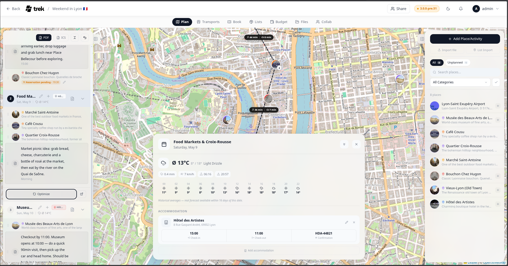

# Route Optimization

TREK calculates walking and driving times between your places and can reorder them to minimize total travel distance.

## Route calculation

TREK uses **OSRM** (Open Source Routing Machine) to calculate routes between consecutive places in the selected day. No API key is required.

The route toggle in the day-plan footer offers a **Driving** and a **Walking** profile (each routed on the matching OSRM network). Installed plugins can add further profiles: a plugin with the `routeProvider` hook — for example an e-mobility plugin that plans charging stops — appears as an extra mode next to Driving/Walking. When such a profile is selected, that plugin computes the day's route: its geometry is drawn on the map, planned stops (e.g. chargers) appear as small dots on the line, and the leg connectors show the plugin's travel times plus any note it attaches ("25 min charge"). If the plugin fails or times out, TREK falls back to straight lines exactly as it does on an OSRM outage.

That toggle sets the **day's** default travel mode. It is stored on the day, so each day of a trip can differ and the choice survives a reload.

A single leg can override the day default: click the connector row between two entries and pick **Driving**, **Walking**, or any plugin profile for that leg alone, or **Use day default** to clear the override again. The same menu sits on the connectors to and from the day's accommodation and on the connector arriving after a transport booking, where it sets the mode of the leg *arriving* at that stop. Every connector shows the icon and the time of the mode its leg was actually drawn with.

When the trip has a start and an end date and you may edit the day, that menu also carries a **Public transit** entry. It opens the automated transit search (see [Transport-Flights-Trains-Cars](Transport-Flights-Trains-Cars)) already filled in with the leg's two endpoints and the departure time of the stop you are leaving.

Route segments reset at any transport reservation (flight, train, car, bus, or cruise) between two places — that leg is not driven or walked, so no ground route is drawn across it.

## Route display

- Colored line segments connect consecutive places on the map.
- Between each pair of consecutive places, a slim connector row in the day plan carries that leg's travel time and distance, with an icon for the mode it was routed in.
- Plugins can attach time entries to the day plan (e.g. planned charging time at a stop, a security buffer before a flight). They appear as slim rows under the place or booking they belong to, and their minutes are added to the day's footer total as "+X min".

## Optimize route

The **Optimize** button in the day's route tools reorders places in the current day to minimize total travel distance. A **nearest-neighbor** pass produces a good starting order, then a **2-opt** pass untangles the crossings that pass leaves behind — both measure straight-line (Euclidean) distance.

With **Optimize route from accommodation** (Settings → General → Travel & map, on by default) the run is anchored on the day's hotel: a loop out from and back to it, or a hotel-to-hotel run on a transfer day. With the setting off, or on a day whose accommodation has no coordinates, it starts from the first place instead. A day with fewer than three places is left alone on desktop, and the mobile day sheet only offers the button from three up. The **Optimize** action in the plan screen's **Plan** mode has no such floor — two movable places with coordinates are enough, and with a hotel anchoring the run even those two can swap.

Only free places are reordered. A place keeps its slot if you locked it, or if it has a time set — a timed stop is anchored by its time. Those stops stay where they are and the reordered ones fill the gaps between them. On mobile there is no lock, so only a set time pins a stop.

The reorder can be undone immediately using the undo action that appears after it is applied.

## Open the day in a map app

Two icon buttons in the day's route tools hand the current day to an external map app, both using its places in planned order, bookended by the day's accommodation exactly the way the drawn route is.

**Open in Google Maps** builds a `https://www.google.com/maps/dir/lat,lng/lat,lng/…` URL containing all stops in order and opens it in a new tab. A day with a single stop opens as a map search on that point instead.

**Open in CoMaps** (the compass icon beside it) hands the same day to CoMaps for offline navigation and carries the day's travel mode with it — the day's own default, or the current route profile when the day has none. A day of exactly two stops goes over as a real turn-by-turn route in that mode (walking as pedestrian, cycling as bicycle, everything else as vehicle). Any other day goes over as named pins, because CoMaps' route link takes a start and a destination and nothing between them, and handing over the whole day beats quietly dropping the middle of the plan. For the full itinerary as one navigable track, use the GPX export.

Both buttons are on mobile as well, in the day sheet.

**See also:** [Day-Plans-and-Notes](Day-Plans-and-Notes) · [Map-Features](Map-Features) · [Display-Settings](Display-Settings)
