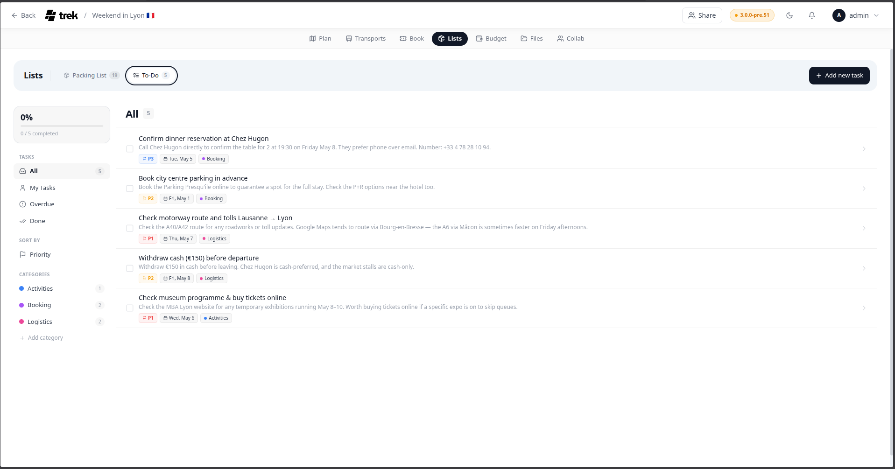

# Todos and Tasks

Manage a to-do list for trip tasks and pre-departure preparation.

## Where to find it

Open the **Lists** tab inside the trip planner and select **Todo**. The Todo feature shares the Lists addon with Packing Lists, so it is only visible when that addon is enabled.

> **Admin:** Enable the Lists/Packing addon in [Admin-Addons](Admin-Addons).

## Layout

The panel is divided into two columns by default:

- **Left sidebar** — list navigation, smart filters, sort toggle, and a completion progress card.
- **Task list** — the tasks that match the active filter.

When you click a task, a **detail pane** opens as a third column on the right side of the task list (on desktop) or slides up as a bottom sheet (on mobile). The new-task form also opens as a modal overlay.

On small screens the sidebar collapses to a narrow icon rail showing only colored dots and icons with badge counts.

## Task fields

Each task has the following fields:

| Field | Notes |
|---|---|
| Name | Required. |
| Checked | Boolean — marks the task done. |
| List | Optional grouping label. The sidebar heading is **Lists**, the button reads **Add list**, and a task without one shows **No list**. |
| Due date | Optional date. |
| Description | Optional free-text body. |
| Assignee | Optional trip member. |
| Priority | 0 (none), 1 (P1), 2 (P2), or 3 (P3). |

Click a task row to open the detail pane on the right (or a modal sheet on mobile) where you can edit all fields.

## Priority levels

| Level | Label | Color |
|---|---|---|
| 1 | P1 | Red (`#ef4444`) |
| 2 | P2 | Amber (`#f59e0b`) |
| 3 | P3 | Blue (`#3b82f6`) |

Tasks with no priority set show no badge.

## Sidebar filters

| Filter | Shows |
|---|---|
| **All** | All unchecked tasks. |
| **My tasks** | Unchecked tasks assigned to you. |
| **Overdue** | Unchecked tasks with a past due date. |
| **Done** | Checked tasks. |
| Per-list rows | All tasks in that specific list (checked and unchecked). |

## Sort by priority

Toggle the **Priority** button in the sidebar to sort the current task list from P1 → P2 → P3 (tasks with no priority appear last).

## Adding tasks

Click the **+ Add new task** button in the top-right corner of the Lists panel header (visible when the **To-Do** sub-tab is active). A new-task form opens as a modal where you can set all fields before saving. On mobile it slides up from the bottom of the screen.

## Permissions

All write operations require the `packing_edit` permission (shared with Packing Lists).

## See also

- [Packing-Lists](Packing-Lists)
- [Admin-Addons](Admin-Addons)
- [Trip-Planner-Overview](Trip-Planner-Overview)
