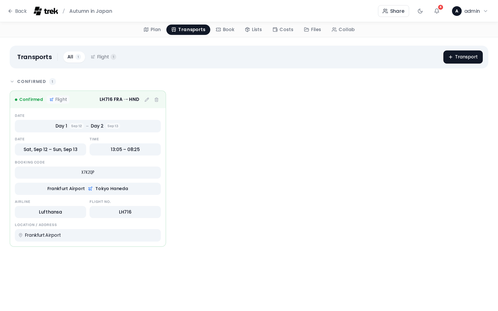

# Transport: Flights, Trains & Cars

Log flights, trains, car rentals, and cruises with departure and arrival endpoints, times, and transit-specific details.

## Where to create

Open the **Transports** tab in the trip planner and click **Add**, or open the planner from a day view and use the transport shortcut. Transport records stay on the **Transports** tab — the [Bookings](Reservations-and-Bookings) tab lists only the non-transport reservations (accommodation, restaurant, event, tour, parking, other), so the same record never shows up on both. Transports do appear next to your other bookings in two other places: inline in the day plan, and on a [public share link](Public-Share-Links), whose single **Bookings** tab lists reservations and transport together.

## Public transit search

The **Add transport** dialog has two modes: **Manual** (the classic form) and **Automated** — a public-transit route search powered by [Transitous](https://transitous.org/), free open data with no API key or paid provider. The **transit button** (tram icon) on each day header opens the dialog straight in the Automated mode. (The rename pencil this button replaced moved next to the day name in the day detail panel.)

You can also start the search from a single leg: click the travel-time connector between two stops in the day plan and pick **Public transit** from the menu. The search opens with that leg's start and end already filled in and the departure time taken from the stop you are leaving.

The mode switch only appears when the trip has a **start date and an end date** — a transit search needs real dates to depart against. On a trip without dates the dialog opens directly on the manual form; add dates in the trip settings to get the Automated mode back.

- Pick **from** and **to** (stop/station search; the day's own places and hotels appear as quick picks), a **depart/arrive** time, and filter by mode: train, subway, tram, bus, ferry, cable car.
- Rank the results by **best route**, **fewer transfers**, or **less walking**.
- Each result shows local departure/arrival times, duration, transfers, walking time and the line badges in their official colors; expand it for the stop-by-stop breakdown.
- **Add to day** saves the chosen connection as a first-class **transit** entry. It slots into the day timeline at its departure time and shows its line badges, transfers and walking time right in the plan. Clicking it opens the **journey view**: the full stop-by-stop itinerary together with the editable title and notes, a **Change route** action that re-runs the search and replaces the itinerary, and delete. In the Transports tab these journeys appear in their own **Automated public transit** section.

Self-hosters can point the `TRANSIT_API_URL` environment variable at their own MOTIS instance.

## Transport types

Nine types are available: **Flight**, **Train**, **Bus**, **Car**, **Taxi**, **Bicycle**, **Cruise**, **Ferry**, and **Other**.

> **AI / MCP:** `create_transport` accepts the same nine. Scheduled public transit is its own thing: `create_transit_journey` attaches the provider itinerary. See [MCP-Tools-and-Resources](MCP-Tools-and-Resources).

## Common fields

All transport types share these fields:

| Field | Notes |
|-------|-------|
| Title | Required |
| Departure day | Linked to a trip day |
| Departure time | Optional |
| Arrival day | Linked to a trip day (can differ from departure day) |
| Arrival time | Optional |
| Booking / confirmation code | Optional |
| Status | Pending or Confirmed |
| Notes | Optional free text |

## Endpoints

### Flights

The departure and arrival fields use the **Airport picker** — type a city name or IATA code (minimum two characters) to search. Results show the IATA code, airport name, city, and country.

Once you select an airport, the **timezone** for that airport appears next to the time field. This lets you enter local departure and arrival times without confusion across time zones.

<!-- TODO: screenshot: Transport modal for a flight with airport picker and timezone -->

### Trains, cars, and cruises

Departure and arrival fields use the **generic location picker** — type at least three characters and pick one of the search results; a name that is only typed, never picked, is not saved. Results come from the maps search service.

For the **Car** type the date fields are relabelled to match a rental: the departure side reads **Pickup** and **Pickup time**, the arrival side **Return** and **Return time**. There is no separate car-rental type — a rental and your own car are both logged as Car.

## Flight-specific fields

When the type is set to Flight, three additional fields appear on every leg:

- **Airline** — carrier name (e.g. Lufthansa)
- **Flight number** — (e.g. LH 123)
- **Seat** — seat number (e.g. 12A)

A flight with more than two airports gets a fourth per-leg field, its own **booking / confirmation code**, so each segment of a connecting itinerary can carry its own reference.

## Train-specific fields (multi-leg route)

A long-distance rail trip is often several trains on one ticket, so trains use a **multi-leg route editor** (the same one flights use), not a single flat field block. You build an ordered chain of stations:

- Search each **station** with the location picker; use **Add stop** to insert intermediate stations between the start and end.
- Each **leg** (the segment between two consecutive stations) has its own **train number**, **platform**, **seat**, and its own departure/arrival **day and time**.
- *N* stations make *N − 1* legs. A simple two-station train is just one leg — enter its train number/platform/seat there.

Trains created before this feature keep working: their existing train number/platform/seat are read as a single leg.

## On the map

Transport records with both endpoints set appear as lines on the trip map:

- **Flights**, **cruises** and **ferries** render as geodesic great-circle curves that follow the curvature of the Earth.
- **Cars**, **buses**, **taxis** and **bicycles** follow **real roads**, routed on demand via a public OSRM router (driving for car/bus/taxi, cycling for bicycle). A straight line shows while the route loads, and is kept if routing fails or the trip is over ~2000 km.
- **Trains** render as a straight polyline; a **multi-leg train** draws its full station chain (from → stop → to).

Confirmed bookings are drawn as solid lines; pending bookings use a dashed line. Each endpoint gets a pill-shaped marker with the transport icon. Turn on **Booking route labels** (Settings → General → Travel & map) to print the airport code or station name in the pill as well; the label appears once the two endpoints are far enough apart on screen.

See [Map-Features](Map-Features) for details on how these overlays work.

## In the day plan

When a transport is assigned to a day, it appears inline in the day timeline between places. Multi-day transports show phase labels depending on the type:

| Type | Start day | Middle days | End day |
|------|-----------|-------------|---------|
| Flight | Departure | In transit | Arrival |
| Car / Car rental | Pickup | Active | Return |
| Train / Cruise | Start | Ongoing | End |

A **multi-leg train** (and a multi-leg flight) instead shows **one row per leg**, each slotting into its own day at its own time and independently reorderable, rather than a single spanning row.

See [Day-Plans-and-Notes](Day-Plans-and-Notes) for details.

---

> **Faster: import the confirmation** — If you have a booking confirmation email or PDF, you can skip the form entirely. See [Import from booking confirmation](Reservations-and-Bookings#import-from-booking-confirmation) in the Reservations guide.

---

**See also:** [Reservations-and-Bookings](Reservations-and-Bookings) · [Accommodations](Accommodations) · [Map-Features](Map-Features) · [Day-Plans-and-Notes](Day-Plans-and-Notes)
