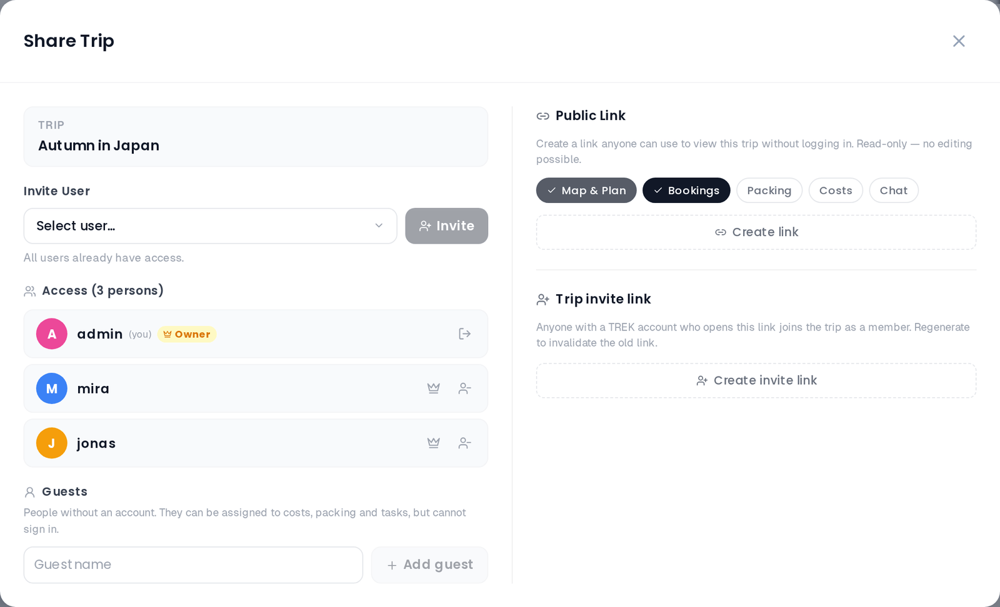

# Trip Members and Sharing



## Opening the Members Panel

- From the **trip planner**: click the Share button in the top navigation bar.
- On **mobile**: open the trip, then **More** → **Share Trip**.

When you have the `share_manage` permission the modal opens to a two-column layout on wider screens (members on the left, share link on the right). Without that permission only the members column is shown. On narrow screens the columns always stack.

## Members List

The left column lists everyone who has access to the trip.

- The **trip owner** is marked with a crown badge.
- Your own entry is labeled **(you)**.
- A remove button appears on your own row, and on every non-owner row if you have the `member_manage` permission.

### Inviting Members

If you have the `member_manage` permission (default: trip owner), an invite control appears above the list. Select a user from the searchable dropdown and click **Invite**. The user is looked up by username or email on the server, added immediately, and the list refreshes. The invited user also receives an in-app notification.

### Removing a Member

Click the remove icon next to any member's name. A confirmation prompt appears before the member is removed.

If you click the remove icon next to **your own** name, the action is labeled **Leave trip** and uses a "log out" icon. Leaving reloads the page and returns you to the dashboard.

The trip owner cannot be removed through this panel.

### Transferring Ownership

Only the current owner sees a crown button next to each non-owner member. Click it and confirm the prompt — that member becomes the trip owner, you drop to a regular member, and the page reloads so the new permissions take effect everywhere.

Guests are never listed among the members, and the server refuses to hand ownership to one.

## Guest Members

Not everyone on a trip has — or wants — a TREK account. **Guests** let you add travel companions by name only, so you can assign them to costs, packing and tasks just like a real member, without creating a login for them.

Guests appear in their own **Guests** section below the members list, each with a **Guest** badge:

> People without an account. They can be assigned to costs, packing and tasks, but cannot sign in.

### Adding a guest

Only the **trip owner** can manage guests (this is stricter than inviting members, which uses the `member_manage` permission). In the owner's view, the Guests section has a **Guest name** field and an **Add guest** button — type a name and click Add. A guest has a display name only: no email, no password, and no way to sign in.

Other members see the Guests section too (when guests exist) but cannot add, rename or remove them.

> Two guests may share the same name — TREK stores the name you type as-is and keeps the two apart by their internal id, so assignments never get confused. A guest name may be at most 50 characters.

### What a guest can be assigned to

Once added, a guest can be picked anywhere a member can:

- **Costs** — added to expense splits (see [Budget-Tracking](Budget-Tracking)).
- **Packing** — assigned to packing items and categories (see [Packing-Lists](Packing-Lists)).
- **To-dos** — set as a task assignee.
- **Day plan** — added as a participant on activities and places.

### What a guest can never do

Guests are firmly scoped to the one trip. A guest can **never**:

- sign in (they have no credentials — password, SSO and password-reset all ignore guest accounts);
- receive notifications (no email and no in-app notifications are ever sent to a guest);
- appear anywhere outside the trip (they are excluded from the global user directory, the admin user list, invite pickers, and search);
- be made the trip owner.

These limits are enforced on the server, not just hidden in the UI.

### Renaming and removing

In the owner's Guests section, each guest row has a **Rename** (pencil) and a **Remove access** (trash) button. Removing a guest is **destructive and cascading**:

> Remove this guest? Their assignments and cost shares will be removed too.

There is no limit on the number of guests per trip.

> **AI / MCP:** an assistant can do all three (`create_trip_guest`, `rename_trip_guest`, `delete_trip_guest`) and is held to the same owner-only rule. See [MCP-Tools-and-Resources](MCP-Tools-and-Resources).

## Public Share Link

The right column is only visible to users with the `share_manage` permission (default: trip owner).

A share link creates a **read-only, token-based URL**:

```
<your-instance>/shared/<token>
```

Viewers do not need to log in. The link can be shared with anyone.

### Creating a Link

Click **Create link** in the **Public Link** section. A URL is generated and shown with a copy button.

### Permission Toggles

Before or after creating the link, you can control what the link exposes. Toggle each section on or off with the pill buttons:

| Toggle | Default | What it shows |
|---|---|---|
| **Map & Plan** | Always on | Trip map, the day plan (days, activities, day notes) and the place list — cannot be disabled |
| **Bookings** | On | Reservations and accommodations |
| **Packing** | Off | Packing list |
| **Costs** | Off | Costs tab |
| **Chat** | Off | Read-only view of the trip chat (collab notes and polls are never shared) |

Changes to toggles take effect immediately for an existing link.

### Deleting a Link

Click **Delete link** (red button below the URL) to revoke access. The token is invalidated; anyone who opens the old URL now sees *Link expired or invalid*.

## Trip Invite Link

Below the public share link, users with the `share_manage` permission can also create a **trip invite link** — a single rotating link that lets people **join the trip as members**:

```
<your-instance>/join/<token>
```

Unlike the read-only share link, this one is **not anonymous**:

- Whoever opens it must have a TREK account and be **signed in**. If they are not, they are sent to the login page and returned to the invite afterwards — there is **no registration** from this link.
- Opening it while signed in shows a confirmation card naming the trip. Clicking **Join trip** adds you as a **member** (the same access a manually-added member gets) and opens the trip. The owner and existing members see the same card and are simply taken to the trip when they accept.
- To invite people who do **not** yet have an account, use an admin invite link with an optional trip binding instead — see [Invite-Links](Invite-Links).

### Creating and revoking

- Click **Create invite link** to generate the link, then copy it with the copy button.
- Click **Regenerate** to rotate the token — the previous link stops working immediately.
- Click **Disable** to remove the link entirely.

> **Admin:** To invite users who do not yet have an account, create invite links in the admin panel. See [Invite-Links](Invite-Links).

## Related Pages

- [Public-Share-Links](Public-Share-Links)
- [Invite-Links](Invite-Links)
- [Creating-a-Trip](Creating-a-Trip)
- [Trip-Planner-Overview](Trip-Planner-Overview)
