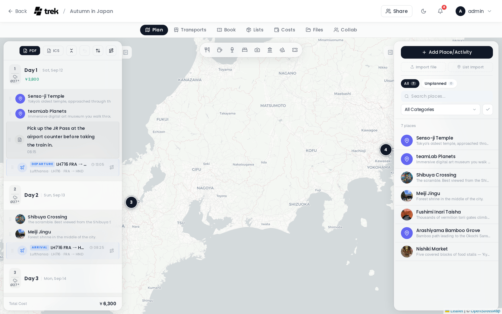

# Trip Planner Overview

The trip planner is the main workspace for building your itinerary. You open it by clicking a trip card on the dashboard.


## Layout

The planner uses a **three-pane resizable layout** on desktop:

```
┌─────────────────┬──────────────────────────┬──────────────────┐
│  Day Plan       │                          │  Places          │
│  Sidebar        │       Interactive        │  Sidebar         │
│  (left)         │          Map             │  (right)         │
│                 │        (center)          │                  │
└─────────────────┴──────────────────────────┴──────────────────┘
```

- **Left sidebar** — Day plan: your list of days, assigned places, notes, and transport entries. Collapsible via the panel toggle button.
- **Center** — Interactive map showing all place markers and day routes.
- **Right sidebar** — Places list: search, category filters, and bulk actions. Collapsible.

Each sidebar has a drag handle on its inner edge for resizing.



A **Day Detail panel** floats over the map area when you open a specific day, showing the weather forecast, that day's reservations, and the accommodation block. It can be collapsed to a slim header bar without closing it.

## Tabs

The tab bar sits directly below the main navigation bar.

| Tab | Description |
|---|---|
| **Plan** | The three-pane map view described above. Always visible. |
| **Transports** | Flights, trains, cars, cruises, and buses. |
| **Bookings** | Hotels, restaurants, events, tours, and other bookings. |
| **Lists** | Packing list and to-do list. |
| **Costs** | Expense tracking, splitting, and settlement. |
| **Files** | Document manager for receipts, tickets, and other files. |
| **Collab** | Real-time chat, shared notes, and polls. |

> **Admin:** The **Lists**, **Costs**, **Files**, and **Collab** tabs only appear when the corresponding addon is enabled. See [Admin-Addons](Admin-Addons).

The active tab is saved in `sessionStorage` per trip, so switching between trips preserves your last position.

## Mobile Layout

On screens narrower than 768 px, TREK does not squeeze the three-pane layout — it opens a dedicated mobile trip screen instead: a day-chip rail under the top bar, a switch between the day plan and a full-screen map, and a bottom dock for the other tabs. Tablets and desktops (768 px and up) get the three-pane layout described above.

## Undo

The planner tracks your recent actions — adding places, assigning them to days, reordering, and removing assignments — in a short undo ring. The **Undo** button sits in the Day Plan Sidebar toolbar (at the top of the sidebar); it is greyed out until an undoable action is available. It shows the name of the last action as a tooltip on hover and reverses it when clicked.

## Splash Screen

When you first open a trip, a brief loading screen appears while the planner data and place photos are fetched. This screen shows the trip title and a loading animation. Once data is ready and a short grace period for photos has elapsed, the planner workspace appears.

## Getting Around

| Task | Where to go |
|---|---|
| Add and search places | [Places-and-Search](Places-and-Search) |
| Organize days and notes | [Day-Plans-and-Notes](Day-Plans-and-Notes) |
| Map features and routes | [Map-Features](Map-Features) |
| Weather forecasts | [Weather-Forecasts](Weather-Forecasts) |
| Reservations and bookings | [Reservations-and-Bookings](Reservations-and-Bookings) |

## Related Pages

- [Places-and-Search](Places-and-Search)
- [Day-Plans-and-Notes](Day-Plans-and-Notes)
- [Map-Features](Map-Features)
- [Weather-Forecasts](Weather-Forecasts)
- [Reservations-and-Bookings](Reservations-and-Bookings)
- [Admin-Addons](Admin-Addons)
