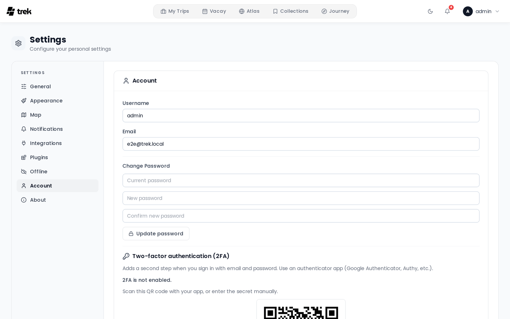

# Two-Factor Authentication

## What it is

TREK supports Time-based One-Time Password (TOTP) two-factor authentication, compatible with Google Authenticator, Authy, 1Password, and any standard TOTP app. When 2FA is active, you enter a 6-digit code (or a backup code) after your password on each login.

## Setting up 2FA

Go to **Settings → Account**, find the **Two-factor authentication (2FA)** section and click **Set up authenticator**.

1. A QR code and a text secret are displayed. Scan the QR code with your authenticator app.
   > **Note:** The setup session expires after **15 minutes**. If you do not complete setup within that window, start again.
2. Enter the 6-digit code shown in your authenticator app and click **Enable 2FA**.
3. Save your **10 backup codes**. These are single-use codes shown only once — store them somewhere safe (a password manager, printed paper). Each code has the format `XXXX-XXXX`.
4. 2FA is now active on your account.

## Logging in with 2FA

After entering your email and password, TREK shows a second prompt for your TOTP code. You have **5 minutes** to complete this second step before the intermediate session token expires. Enter either:

- The current 6-digit code from your authenticator app, or
- One of your backup codes (format `XXXX-XXXX`). Each backup code can only be used once.

## Disabling 2FA

Go to **Settings → Account** and use the **Disable 2FA** form. You must provide both:

- Your current account **password**
- A valid **TOTP code** from your authenticator app

> **Note:** You cannot disable 2FA while the admin has required it for all users (see below). Owning a passkey does not lift that restriction.

## Admin-enforced 2FA

An admin can require 2FA for all users. Before enabling this setting the admin must have secured their own account with either an authenticator app or a passkey — the server rejects the change otherwise with *Secure your own account with two-factor authentication or a passkey before requiring it for all users.*

If the setting is active and your account has neither 2FA nor a passkey, any API request after login returns a 403 error and the client redirects you to **Settings → Account** with a prompt to complete 2FA setup. You cannot use the app until setup is complete. See [Admin-Permissions](Admin-Permissions).

A user-verified **passkey** satisfies this policy the way a TOTP authenticator does: with at least one passkey on your account the API stops blocking you and you never need an authenticator app. That holds even if an admin later turns passkey login off again — an existing passkey keeps satisfying the policy. Real-time sync is the one exception: the WebSocket handshake accepts only TOTP, so a passkey-only account under this policy can use TREK normally but never receives live updates from other members. Nothing tells you — the client simply keeps retrying the connection.

Whether enrolling a passkey is a way *out* of the lockout depends on the instance. Passkey login is off by default (see [Passkeys](Passkeys)); where an admin has turned it on, the enrolment endpoints stay reachable while the rest of the API is blocked, so you can add a passkey from **Settings → Account** instead of setting up an authenticator app. Where it is off, TOTP setup is the only way to unblock yourself — or ask an admin to reset your 2FA.

> **Admin:** You can reset 2FA for a locked-out user from the admin panel. See [Admin-Users-and-Invites](Admin-Users-and-Invites).

## Rate limits

TREK enforces IP-based rate limits to protect against brute-force attacks:

| Endpoint | Limit |
|---|---|
| Login (`/api/auth/login`) | 10 attempts per 15 minutes |
| MFA code verification (`/api/auth/mfa/verify-login`) | 5 attempts per 15 minutes |

Exceeding a limit returns HTTP 429. Wait for the window to reset before retrying.

## Demo users

The demo user account cannot enable or disable MFA.

---

**See also:** [Login-and-Registration](Login-and-Registration) · [Passkeys](Passkeys) · [Admin-Permissions](Admin-Permissions) · [Admin-Users-and-Invites](Admin-Users-and-Invites) · [User-Settings](User-Settings)
