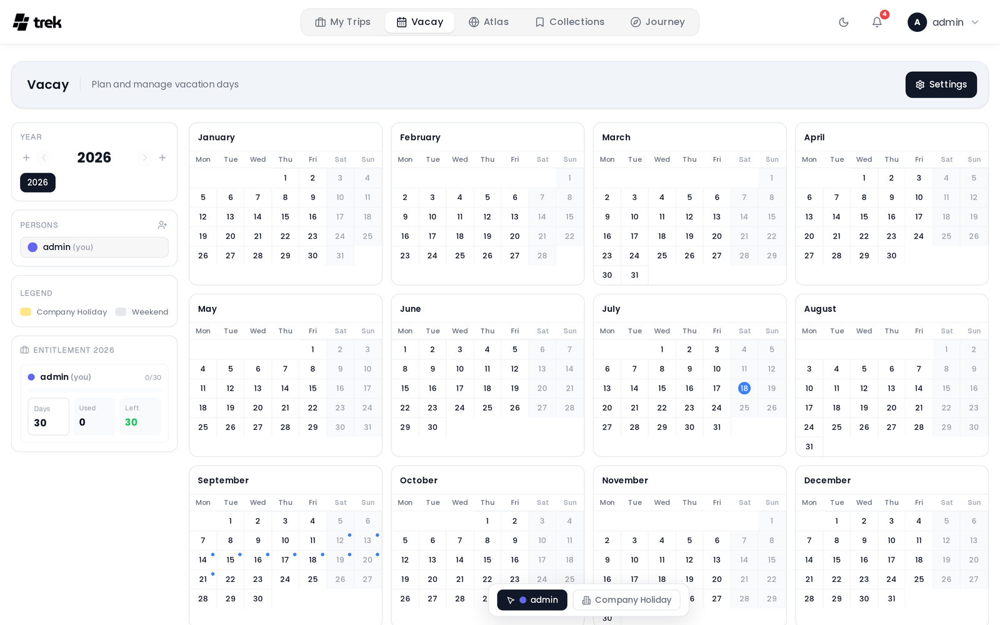

# Vacay

Vacay is a personal vacation day planner that lives separately from your trip planning. It tracks how many vacation days you have per year, how many you have used, and what remains.

> **Admin:** enable Vacay in [Admin-Addons](Admin-Addons).

## What Vacay is

While trips in TREK represent specific travel plans, Vacay tracks your annual leave entitlement — the number of vacation days granted by your employer or contract, which days you have already logged, and the balance left. It is personal by default, but you can fuse your plan with another TREK user to see each other's calendars side by side.

## Accessing Vacay

When the admin has enabled the Vacay addon, a **Vacay** entry appears in the main navigation. Each user gets their own plan automatically when they first open the page.

## Year plans

Vacay is organised by year. You can have multiple years active at once and navigate between them with the year selector in the sidebar.

For each year, your entitlement panel shows:

- **Entitlement days** — your vacation allowance for that year (editable inline by clicking the field).
- **Used** — days you have logged on the calendar.
- **Remaining** — entitlement plus any carried-over days, minus used days.

**Carry-over** — when `carry_over_enabled` is on, unused days from the previous period are automatically added to the next one's total. When you toggle this setting, the carry-over amount is recalculated across all existing year records. Turn it off to zero out all carry-over balances.

## Leave year

Not every leave year runs January to December, so you can set yours in Settings under **Vacation year**:

- **Calendar** — 1 January to 31 December. The default, and what every existing plan uses.
- **Fiscal** — starts on a month and day you choose, for example 1 July to 30 June.
- **Hire date** — starts on the anniversary of the date you were hired.

Entitlement, used days and carry-over are all counted over that period rather than the calendar year, and the calendar grid renders its twelve months accordingly — a July start shows Jul–Jun and rolls over the year boundary in the middle. The active period is spelled out under the entitlement heading so a card labelled "2026" is never ambiguous.

This is a **personal** setting. In a fused plan each person keeps their own leave year and their own numbers; the grid follows whoever is looking at it, so everyone still sees the same days off.

> If your leave year starts partway through a month (6 April, say), the twelve month cards are aligned to whole months while the day counting stays exact. The first days of the starting month are drawn but belong to the previous period.

## Calendar view

The main area shows a full 12-month grid. Each cell represents one day. Click a day to log or remove a vacation entry. Logged days are colour-coded by person when collaborators are fused into your plan.

Days that overlap with any of your existing TREK trips are marked with a small blue dot in the corner.

You can also switch the calendar toolbar to **Company** mode to mark shared company holidays, which are highlighted in amber and do not deduct from personal allowances.

### Half days and comp days

Two toggles in the toolbar change what a click logs. They are independent, so they combine:

- **Half day** — logs the day as 0.5 instead of a full day. Half days keep the person's colour and carry a small orange dot in the corner.
- **Comp / flex** — logs the day as time off in lieu (flextime, overtime taken back). It costs **nothing** from the vacation entitlement. Comp days render as a diagonal hatch of the person's colour instead of a solid fill, and are counted separately beside the entitlement tiles.

Each toggle's icon in the toolbar is the marker it places, so you can see what a click will do before you make it. Clicking a day again with the same settings clears it; clicking with different ones converts it in place.

**Settings** (gear icon) let you configure:

- **Block weekends** — prevents logging on weekend days. You choose which days count as the weekend.
- **Week start** — Monday or Sunday.
- **Carry-over** — toggle as described above.
- **Vacation year** — Calendar, Fiscal or Hire date, as described under Leave year above. Unlike the rest of this panel it is personal to you rather than to the plan.
- **Company holidays** — enable a shared company holiday layer that any fused user can edit.
- **Public holidays** — add one or more country/region holiday calendars so that public holidays appear on the grid. Holiday data is fetched from the nager.at public holiday API. Each calendar has a label, a colour, and a country or region selector (sub-national regions such as German states or Swiss cantons are supported).
- **School holidays** — a second holiday layer with its own toggle, independent of the public one and purely visual. Each calendar has an optional label, a colour and a country; where the source splits a country up you also pick a region (a German state, a Swiss canton, a French académie) or a school holiday group (Belgium, the Netherlands), and the calendar cannot be added until you have. A few countries publish a single national calendar (Estonia, Ireland, Serbia) and need nothing beyond the country. School holiday data comes from the OpenHolidays API rather than nager.at and covers fewer countries, so only the supported ones appear in the picker. On the grid a school holiday day gets a coloured band along the bottom of the cell, split into up to three segments when several calendars cover the same day, and a day inside a break that carries nothing else (no logged entry, no company holiday, no public holiday) is washed in the calendar colour. School holidays never deduct from anyone's allowance.

## Inviting collaborators

You can invite other TREK users to fuse their Vacay plan with yours. Once a user accepts, your plans are merged: you see each other's logged days in distinct colours, and you can log days on behalf of the other person if needed.

To invite someone, click the **+** icon in the **Persons** panel in the sidebar, choose a user, and send the invite. The recipient receives a notification and must accept before the fusion takes effect.

To undo a fusion, open Settings and use the **Dissolve** action. Each user's logged entries return to their own separate plan.

## Sharing your calendar (view only)

Fusion merges two plans into one — everyone can edit everything. If you only want someone to *see* when you are off (different employers, different company holidays, separate allowances), share your calendar instead.

Sharing is one-directional and read-only:

- Click the share icon in the **Shared Calendars** panel in the sidebar, pick a user, and share. No acceptance step is needed — the recipient gets a notification and can remove the calendar from their list at any time.
- Calendars shared with you appear in the same panel. Each one overlays the grid as a coloured **ring** around the sharer's days off (vacation days, half days and their plan's company holidays), clearly distinct from the filled cells of your own plan. Hover a ringed day to see who is off and how much.
- The eye toggle hides or shows a shared calendar without removing the share; **Stop sharing** revokes a calendar you shared out.

Shared calendars never grant edit rights, keep both users' settings and allowances separate, and work independently of fusion — you can be fused with one person and share with others at the same time.

## Live sync

Changes — logged days, settings updates, fusions, invites — sync in real time to all fused collaborators via WebSocket events (`vacay:update`, `vacay:settings`, `vacay:invite`, `vacay:accepted`, `vacay:declined`, `vacay:cancelled`, `vacay:dissolved`). Read-only shares push their own events (`vacay:share`, `vacay:share-removed`, `vacay:shared-update`), so shared overlays update live too. You do not need to refresh the page.

## See also

- [Addons-Overview](Addons-Overview)
- [Admin-Addons](Admin-Addons)
