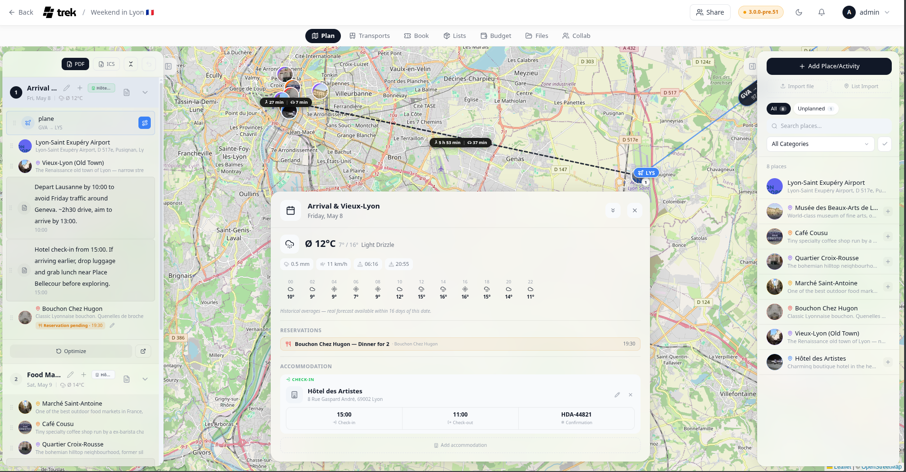

# Weather Forecasts

TREK shows weather forecasts and historical climate estimates for each day in your trip, powered by Open-Meteo — no API key required.

## Where forecasts appear

Click any day header in the left sidebar to open the **Day Detail panel**. The weather widget appears at the top of that panel.

A compact weather badge (icon + temperature) also appears inline on each day row in the sidebar.

## What is shown

The Day Detail panel weather widget displays:

- Weather icon and condition label
- Min / max temperature for the day
- Precipitation probability and total amount
- Wind speed (km/h, or mph when Fahrenheit is selected)
- Sunrise and sunset times
- **Hourly strip** — icon and temperature shown in 2-hour intervals; slots with precipitation probability above 50 % are highlighted

## Data source and time windows

| Date range | Data source | Cache TTL |
|---|---|---|
| Within 16 days (today −1 day to today +16 days) | Open-Meteo forecast API | 1 hour |
| More than 1 day in the past | Open-Meteo archive API (actual historical data), for the compact sidebar badge. The Day Detail panel asks the forecast API for past days too | 24 hours (1 hour in the Day Detail panel) |
| More than 16 days in the future | Climate estimate from the same date in the prior year | 24 hours |

Far-future estimates are labeled with a **Ø** prefix (e.g. "Ø 18 °C") to make it clear they are climate estimates, not a real forecast. The compact sidebar badge re-fetches silently in the background if a cached climate estimate could be upgraded to a live forecast.

## Temperature and wind units

Temperature follows your setting in [Display-Settings](Display-Settings) — switch between °C and °F there. Wind speed is shown in km/h (°C mode) or mph (°F mode).

## Session cache

The compact sidebar weather badge caches fetched data in `sessionStorage` for the duration of your browser session, so navigating between days does not trigger repeated network requests for data you have already loaded. The Day Detail panel fetches fresh detailed weather data each time it is opened.

**See also:** [Day-Plans-and-Notes](Day-Plans-and-Notes) · [Display-Settings](Display-Settings)
